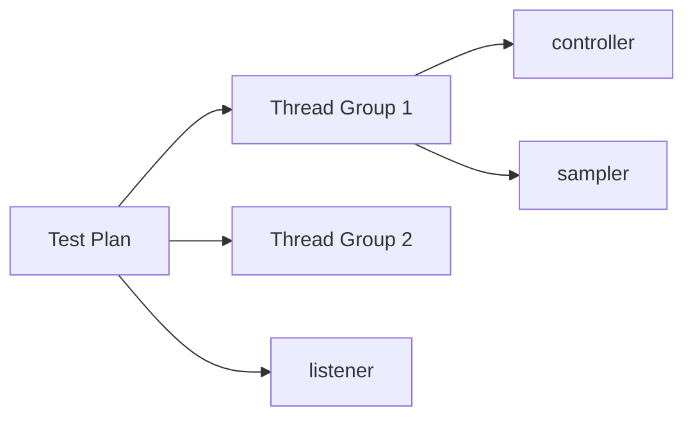

- https://jmeter.apache.org/usermanual

## Test Plan

### Elements
#### Thread Group

`Thread Group elements` 是任何 `Test Plan` 的起点。所有 `controllers` 和 `samplers` 都必须位于 `thread group` 下。其他 `elements`，例如 `listeners`，可以直接放置在 `test plan` 下， 在这种情况下，它们将应用于所有 `thread groups`。

#### Controllers

JMeter 有两种类型的 `Controllers`：`Samplers` 和 `Logical Controller`。

##### Samplers

`Samplers` 执行 JMeter 的实际工作。`Samplers` 告诉 JMeter 向 `server` 发送 `requests` 并等待 `response`。每个 `sampler` 都会生成 `sample results`，可以在各种 `listeners` 中查看。

**HTTP Request**：该 `sampler` 允许您向 Web 服务器发送 HTTP/HTTPS 请求。配置项包括：
- Name：为该采样器所取的名字。非必填。
- Protocal：HTTP 或 HTTPS。默认为 HTTP，非必填。
- HTTP Request Method：GET 或 POST。必填。
- Path：例如 `servlets/myServlet`。
- Content Encoding：编码方式。非必填。

#### Listeners

网页返回内容位于 `Response Data/Response Body`。想要保存相应内容到文本，需要在 `Configure` 中同时选中 `Save As XML` 和 `Save Response Data (XML)`。

#### Pre-Processor Elements

`Pre-Processor` 在执行 `Sampler Request` 之前执行一些操作。

#### Post-Processor Elements

`Post-Processor` 在执行 `Sampler Request` 之后执行一些操作。`Post-Processor` 最常用于处理 `response data`，通常用于从中提取 `values`。

### 执行顺序

1. Pre-Processors
2. Timers
3. Sampler
4. Post-Processors
5. Assertions
6. Listeners
