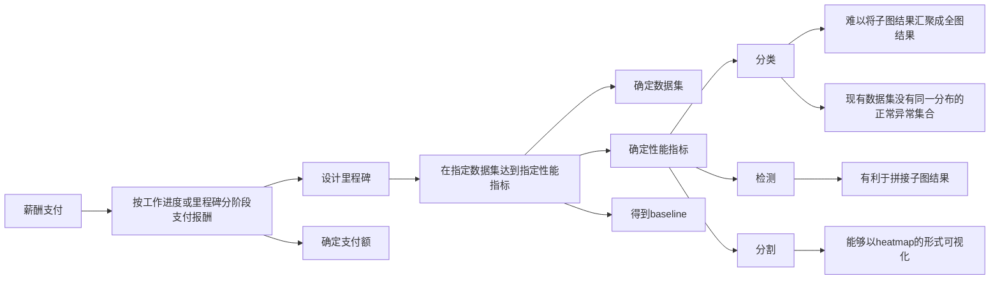

```mermaid
graph LR;
薪酬支付-->按工作进度或里程碑分阶段支付报酬-->设计里程碑-->在指定数据集达到指定性能指标-->确定数据集;
按工作进度或里程碑分阶段支付报酬-->确定支付额;
在指定数据集达到指定性能指标-->确定性能指标-->分类-->难以将子图结果汇聚成全图结果;
分类-->现有数据集没有同一分布的正常异常集合;
确定性能指标-->检测-->有利于拼接子图结果;
确定性能指标-->分割-->能够以heatmap的形式可视化;
在指定数据集达到指定性能指标-->得到baseline;
```