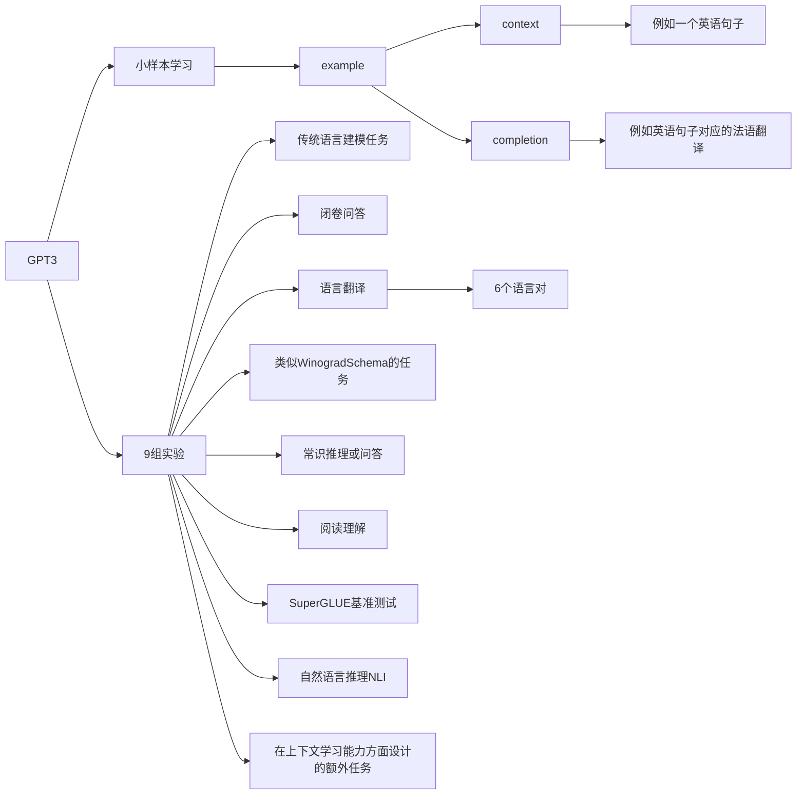

[[2005.14165 Language Models are Few-Shot Learners.pdf]]

```mermaid
graph LR;
	GPT3-->小样本学习-->example-->context;
	context-->例如一个英语句子;
	example-->completion;
	completion-->例如英语句子对应的法语翻译;
	GPT3-->9组实验;
	9组实验-->传统语言建模任务;
	9组实验-->闭卷问答;
	9组实验-->语言翻译;
	语言翻译-->6个语言对;
	9组实验-->类似WinogradSchema的任务;
	9组实验-->常识推理或问答;
	9组实验-->阅读理解;
	9组实验-->SuperGLUE基准测试;
	9组实验-->自然语言推理NLI;
	9组实验-->在上下文学习能力方面设计的额外任务;
```