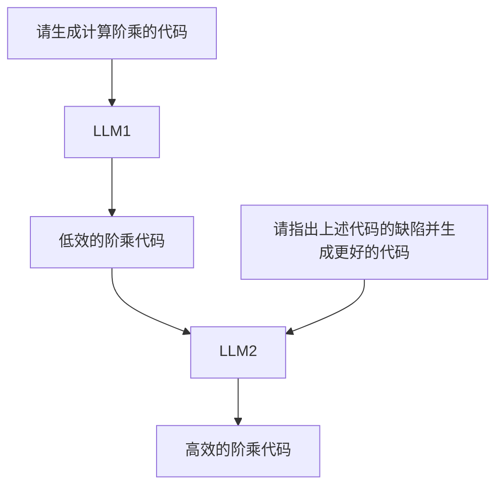

- Self-Refine: Iterative Refinement with Self-Feedback
- [Self-Refine: Iterative Refinement with Self-Feedback (selfrefine.info)](https://selfrefine.info/)
- [madaan/self-refine: LLMs can generate feedback on their work, use it to improve the output, and repeat this process iteratively. (github.com)](https://github.com/madaan/self-refine)
	- 462 stars
- [[2303.17651 Self-Refine.pdf]]
### Abstract
现有的LLM通常不能再第一次就能给出最好的答案。对于人类来说，也是如此。
