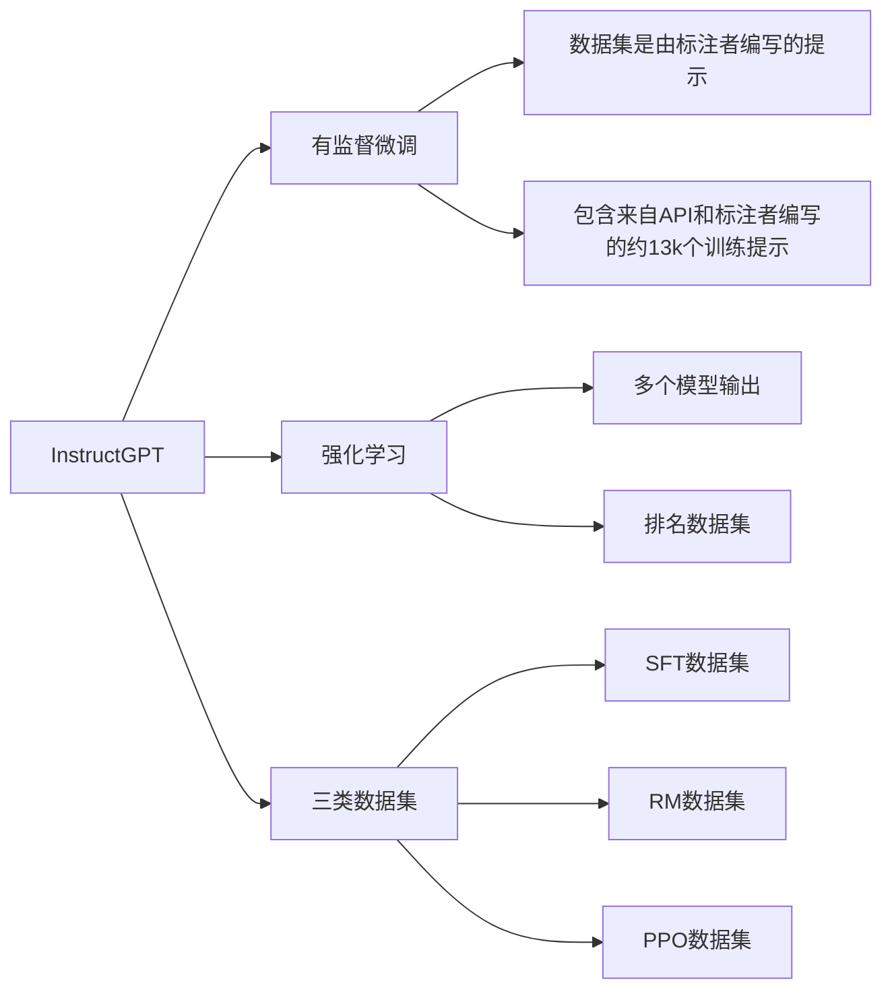

[[2203.02155 Training language models to follow instructions with human feedback.pdf]]

alignment：大型语言模型可能会生成不真实、有毒或对用户无益的输出。换句话说，这些模型与其用户的目标没有“对齐”。

本文通过人类反馈对语言模型进行微调，使得模型与用户进行“对齐”：
- 使用监督学习方法进行微调
- 使用 RLHF（reinforcement learning from human feedback）进行微调
- 微调 GPT-3（175B参数）
- 得到 InstructGPT（1.3B参数）

我们首先收集了一组“标注者编写的提示（labeler-written prompts）”和“通过OpenAI API提交的提示”，这些提示展示了期望的模型行为。然后，我们使用这些数据对GPT-3进行有监督学习的微调。接下来，我们收集了模型输出的排名数据，并使用这些数据通过人类反馈的强化学习进一步微调模型。我们称这些经过微调的模型为InstructGPT。

在本文中提到的"a dataset of rankings of model outputs"（模型输出$\textbf{排名数据集}$）是指研究者们收集的一组数据，其中包含了人类标注者对“$\textbf{多个模型输出}$”进行比较和排序的结果。这个过程是为了训练奖励模型（Reward Model，简称RM），该模型能够预测哪些模型输出更可能受到人类标注者的偏好。

具体来说，研究者们首先使用一组已经通过监督学习微调（Supervised Fine-Tuning，简称SFT）的模型来生成一系列输出。然后，他们让人类标注者对这些输出进行评估，标注者需要根据一定的标准（如相关性、准确性、可读性等）对这些输出进行排名。这样，对于每一个输入提示，都会有“$\textbf{多个模型输出}$”，并且每个输出都会被标注者按照偏好程度进行排序。这个$\textbf{排名数据集}$随后被用来训练奖励模型。

#### Introduction
现有大模型基于无监督进行训练，训练目标是：预测下一个文本。这与“遵循（follow）用户的指令（instructions）”这一目标不同。
