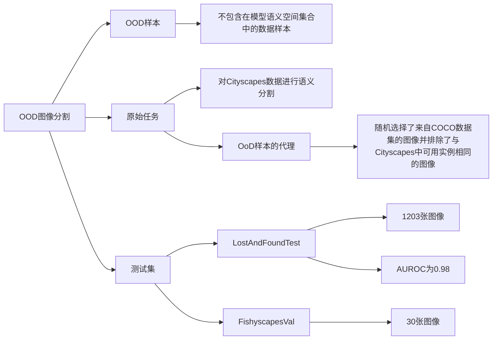

## 摘要

用于图像语义分割的深度神经网络（DNNs）通常被训练以在预定义的一组对象类别上运行。这与“开放世界”设置形成对比，DNNs被设想用于部署。从功能安全的角度来看，检测所谓的“超出分布”（OoD）样本的能力，即DNN语义空间之外的对象，对于许多应用（如自动驾驶）至关重要。对于OoD检测的一个自然基线方法是对像素级的softmax熵进行阈值设定。我们提出了一个两步过程，显著改进了该方法。首先，我们利用来自COCO数据集的样本作为OoD代理，并引入第二个训练目标，以最大化这些样本上的softmax熵。从预训练的语义分割网络开始，我们在不同的分布数据集上重新训练了多个DNN，并在完全不同的OoD数据集上评估时一致观察到改进的OoD检测性能。其次，我们执行透明的后处理步骤，通过所谓的“元分类”来丢弃错误的阳性OoD样本。为此，我们将线性模型应用于从DNN的softmax概率推导出的一组手工制作的度量标准。在我们的实验中，我们一贯观察到OoD检测性能的明显额外增益，当比较最佳基线与我们的结果时，将检测错误数量减少了52%。我们实现了这种改进，只在原始分割性能上牺牲了少量性能。因此，我们的方法有助于更安全的DNN，具有更可靠的整体系统性能。

## 介绍

近年来，深度学习在计算机视觉任务语义分割方面取得了巨大进步。深度卷积神经网络（CNNs）被设想用于实际应用，而这些应用很可能暴露于与模型训练数据大不相同的数据。我们将不包含在模型语义空间集合中的数据样本视为超出分布（OoD）样本。然而，用于语义分割的最先进的神经网络通常被训练以识别预定义的一组对象类别，例如，用于自动驾驶系统的环境感知系统。在开放世界设置中，可能会出现无数的对象。定义额外的类别需要大量注释的数据，并且甚至可能导致性能下降。一个自然的方法是为不属于任何预定义类别的对象引入一个“未知”输出。从功能安全的角度来看，神经网络能够可靠地指示它们何时处于适当的领域之外，即检测OoD对象，这是一个关键但缺失的先决条件，以启动备用策略。

由于日常场景的图像通常包含许多不同的对象，其中只有一些可能是超出分布的，因此希望了解OoD对象出现的位置以便于实际应用。因此，我们解决了在图像中检测异常区域的问题，如果存在OoD对象，则会出现这种情况，并且这是一个高度感兴趣的研究领域。我们通过包含复杂的不确定性估计或将额外的类别添加到模型的可学习类别集合中等方法来追求这种所谓的异常分割。

在这项工作中，我们采用了不同的方法来检测语义分割中的OoD对象，该方法由两个步骤组成：作为第一步，我们重新训练分割CNN以在OoD输入上预测低置信度分数的类标签，通过强制模型输出高预测不确定性。为了量化不确定性，我们计算了softmax熵，当模型在所有类别上输出均匀的概率分数时，该熵被最大化。通过有意将已知的OoD对象包含到重新训练过程中，并采用修改后的多目标损失函数，我们观察到分割CNN将学习的不确定性推广到看不见的OoD样本（未知未知），而在主要任务上原始性能并没有显著牺牲。初始的语义分割模型是在Cityscapes数据上训练的。

作为OoD样本的代理，我们随机选择了来自COCO数据集的图像，排除了与Cityscapes中可用实例相同的图像。

我们通过熵阈值化评估像素级OoD检测性能，其中使用了来自LostAndFound和Fishyscapes数据集的OoD样本，这两个数据集与Cityscapes具有相同的设置，但包含OoD对象。

第二步包括一个元分类器，类似于在语义分割中检测假阳性实例中提出的方法。在增加了对预测OoD对象的灵敏度之后，我们的目标是删除由先前的熵提升产生的错误预测。基于聚合分散度度量和段（像素的连通组件）内的几何特征，且所有信息仅来自CNN的softmax输出，我们移除了错误的阳性OoD对象预测。作为元分类器，我们采用了一个简单的线性模型，它允许我们跟踪和理解每个度量标准的影响。

总之，我们的贡献在于，我们首次成功地修改了分割CNN的训练，使其在LostAndFound和Fishyscapes中更有效地检测到OoD样本。使用特定选择的来自COCO的OoD图像重新训练CNN，明显优于简单的softmax熵阈值化的自然基线方法，以及来自图像分类的许多最先进的方法。此外，我们首次证明了基于熵的语义分割中的OoD对象预测可以可靠地进行元分类，即，无需访问地面真相就能分类考虑的OoD预测是真阳性还是假阳性。对于这个元任务，我们采用简单的逻辑回归。因此，结合熵最大化和元分类是一种高效而轻量级的方法，特别适用于基于深度学习的安全关键实际应用的集成监控系统。

## 相关工作

先前工作中的方法已经证明了它们在识别图像数据的OoD输入方面的效率。所提出的方法要么是修改训练过程的变体，要么是调整估计置信度的后处理技术。然而，这些工作中大多数将整个图像视为OoD。

当考虑到语义空间是固定的时，对异常分割的一种可能方法是估计CNN的不确定性，我们在这里也进行了探索。早期的不确定性估计方法涉及到贝叶斯神经网络（BNNs），产生了模型权重参数的后验分布。在实践中，像蒙特卡罗dropout或随机批次归一化这样的近似主要是由于更便宜的计算成本。使用dropout进行不确定性估计的框架应用于语义分割已经在其他研究中得到了发展。模型不确定性的其他方法包括使用神经网络集成和密度估计。基于分类不确定性和仅处理单眼图像的语义分割中的OoD检测方法已经在其他研究中进行了分析。

在深度神经网络中使用BNNs来估计不确定性涉及到计算成本的限制。由多个模型或多个前向传播生成的不确定性估计与基于单一推理的估计相比，仍然具有很高的计算成本。在我们的方法中，我们将语义分割和OoD检测合并到一个模型中，而无需对基础CNN的架构进行任何修改。因此，我们的重新训练方法甚至可以与现有的OoD检测技术结合使用，并潜在地提高它们的效率。

与我们的训练方法相似的作品使用了不同的OoD代理，并在其他研究中进行了介绍。他们使用Cityscapes中未标记的对象来训练神经网络作为OoD的近似。然而，在我们的实验中，我们观察到Cityscapes中未标记的数据缺乏多样性，因此往往过于特定于数据集。关于我们在LostAndFound和Fishyscapes上进行实验的其他OoD数据集，我们观察到这些方法在泛化方面失败。此外，与那些工作相比，我们还加入了一个后处理步骤，显著改善了OoD检测性能。

另一条线的工作通过整合自动编码器来检测语义分割中的OoD样本。训练这样一个模型仅针对来自一组封闭类别的特定样本，假定当输入来自以前未见过的类别时，自动编码器模型的性能会较差。对OoD输入的识别则依赖于重建质量。通过这种方式，除了进一步调整方法的灵敏度外，不需要任何OoD数据。

自动编码器实际上是深度神经网络本身，并且通常不包括分割模型。对于安全的实时语义分割目标，例如自动驾驶，更轻量级的方法更为有利。我们避免了完全引入深层辅助模型，仅使用轻量级的线性模型。通常情况下，模型越复杂，解释性越差。由于监控系统旨在使深度学习模型更安全，因此人们寻求更简单、更易解释的方法。我们通过逻辑回归后处理我们的熵增强语义分割CNN输出，其计算开销可以忽略不计。这个线性模型是透明的，因为它允许我们分析输入模型的每个单一特征的影响，并且在我们的实验中证明了它有效地减少了OoD检测错误的数量。

## 基于熵的OoD检测

在本节中，我们提出了一种训练方法，通过空间熵热图来改善语义分割中OoD像素的检测。

### 3.1. 高熵训练OoD样本

设 $f(x) \in (0, 1)^q$ 表示经过某个深度学习模型 $f: X \to (0, 1)^q$ 处理输入图像 $x \in \mathcal{X}$ 后的 softmax 概率，其中q = |C| ∈ N表示类别的数量。为简洁起见，在本节中我们省略了对图像像素的考虑。我们通过如下公式计算softmax熵：
$$E(f(x)) = -\sum_{j\in \mathcal{C}}f_j (x) \log(f_j (x))$$我们用（x，y(x)) ∼ Din表示“内部分布”示例，其中y(x) ∈ C是输入x的地面真实类别标签，用x0 ∼ Dout表示“外部分布”示例，其中没有给出地面真实标签。我们的目标是最小化总体目标L := (1 − λ) E(x,y)∼Din[`in(f(x), y(x))] + λEx0∼Dout[`out(f(x0))]，其中λ ∈ [0, 1]，其中`in(f(x), y(x)) := −∑j∈C1j=y(x)log(fj(x))，`out(f(x0)) := −∑j∈C1 q log(fj(x0))，其中指示函数1j=y(x) ∈ {0, 1}等于1，如果j = y(x)，否则为零。换句话说，对于内部分布样本，我们应用常用的经验交叉熵损失，即目标类别的负对数似然。对于外部分布样本，我们考虑所有类别的平均负对数似然。通过选择外部分布损失函数，最小化`out(f(x0))等价于最大化softmax熵E(f(x))。由于softmax定义意味着fj(x) ∈ (0, 1)且Pj∈C fj(x) = 1，Jensen不等式得到了`out(f(x)) ≥ log(q)和E(f(x)) ≤ log(q)，等式（对于两个不等式）当且仅当fj(x) = 1/q ∀ j ∈ C时成立，即如果softmax概率在所有类别上均匀分布。为了控制每个单一目标对总体目标L的影响，我们包括了期望内部分布损失和期望外部分布损失之间的凸组合，可以通过调整参数λ来调整，见方程（2）。

### 3.2. 通过熵阈值化进行语义分割中的OoD对象预测

语义分割的CNN的softmax概率输出f(x) ∈ (0, 1)|Z|×q，x ∈ X ⊆ [0, 1]|Z|×3可以被视为像素级概率分布，表达了在给定像素z ∈ Z处，每个潜在类别j = 1，...，q的可能性，根据模型f。

让 $f^z (x) \in (0, 1)^q$ 表示我们在整个前面的部分中隐含地考虑的像素位置 $z$ 处的 softmax 输出。在语义分割中，通过图像上的平均像素级分类损失进行优化，参见方程（2）。

为简单起见，我们在下文中考虑了像素位置 $z$ 处的归一化熵 $\bar{E}(f^z (x))$，即 $E(f^z (x))$ 除以 $\log(q)$。

然后，如果像素位置 $z$ 处的归一化熵 $\bar{E}(f^z (x))$ 大于阈值 $t \in [0, 1]$，则假设一个像素为OoD，即如果z ∈ Zˆout(x) := {z0 ∈ Z：E¯(fz0(x)) ≥ t}。

通过在熵热图上简单地设定阈值（在本例中为t = 0.7，得到OoD预测掩码中的红色像素），可以获得OoD对象预测。

由满足方程（5）中条件的相邻像素组成的一个连通分量k ∈ Kˆ(x) ⊆ P(Zˆout(x))（后者是Zˆout(x)的幂集）给出了一个OoD分段/对象预测。图2中可看到一个示例。显然，通过熵将内部分布像素与外部分布像素区分开得越好，OoD对象预测就越准确。

## 实验设置

我们考虑对Cityscapes数据进行语义分割作为原始任务，即我们将Cityscapes视为分布Din的一部分。训练集包含2975张像素标注的城市街景图像。作为原始模型，我们使用了由Nvidia训练的最先进的DeepLabv3+语义分割模型，其背后采用了WideResNet38的骨干结构。该模型初始化使用公开可用的权重，并作为我们的基线模型。

对于测试，我们评估了两个包含街景图像和意外对象的数据集上的OoD检测性能。我们考虑来自LostAndFound测试集的图像，其中包含1203张带有道路和（自我）车辆前面的小障碍物的注释，并且Fishyscapes Validation，其中包含从Pascal VOC提取的带有注释的异常对象的30张图像，然后叠加在Cityscapes图像中。这两个数据集与Cityscapes具有相同的设置，但包含一些未知的道路对象。

为了执行第3.1节中提出的OoD训练，我们通过来自COCO数据集的图像近似外部分布。该数据集包含了在日常场景中捕获的对象的图像。此外，我们仅考虑COCO图像中不包含在Cityscapes中的实例（没有人、没有汽车、没有交通灯等），并且具有至少480个像素高度和宽度的最小高度和宽度的图像。经过筛选，剩余46751张图像作为我们的Dout代理。每个类别的像素频率如图3所示。我们强调，测试数据中的任何OoD对象在我们的OoD训练期间都没有被观察到，因为我们使用了训练和测试的不相交数据集，这些数据集最初也是为完全不同的应用而设计的。所使用的OoD代理是真实未知的混合物（例如，塔顶、膨胀的塑料袋、聚苯乙烯等）以及在视觉相似性方面的已知未知（例如，测试数据中有狗，并且与OoD代理中的猫共享一些视觉特征）。将此COCO子集用作Dout的近似是受到OoD检测研究的启发，该研究中使用8000万个微小图像作为所有可能图像的代理。

我们使用方程（3）和方程（4）的损失函数对DeepLabv3+模型进行微调。作为训练数据，我们每个时期随机从我们的COCO子集中抽样297张图像，并将它们混合到所有2975个Cityscapes训练图像中（以1:10的比例将OoD图像混合到内部分布图像中）。我们将模型的权重参数训练为总共4个时期，并将高度/宽度为480像素的随机正方形裁剪作为输入。我们将（外部分布）损失权重λ设为0.9。作为优化器，我们使用Adam，学习率为10的-5次方。

## 像素级评估

基于softmax概率，我们计算了在各自测试数据集中所有像素的归一化熵E¯。这为我们提供了每个像素的异常/OoD分数，我们将其与地面真实的异常分割进行比较。为了清晰起见，在本节中，我们将内部分布像素称为负类别的样本，将外部分布像素称为正类别的样本。

### 6.1. 曲线下面积分析

根据图4中的小提琴图，我们已经注意到我们的OoD训练对于在内部分布和外部分布像素之间进行分离的有益效果，因为相应类别的分布大量重叠的情况可以在更大范围的熵阈值下很好地分离。可以进一步通过受试者工作特征（ROC）曲线和精确率-召回率（PR）曲线来量化这种效果。曲线下面积（AUC）表示分离程度。AUC越高，分离效果越好。除了基线外，我们还包括了标准OoD检测方法的其他得分。具体来说，这些是：MSP [21]，MC dropout [18]，ODIN [31]和马氏距离 [30]。

通过比较LostAndFound的ROC曲线（图5（a）左），我们观察到在应用OoD训练时相比基线模型有性能提升。基线曲线表明，对应的模型在不同固定的假阳率情况下具有较低的真阳率，即我们经过OoD训练后的模型为OoD样本分配了更高的不确定性/熵值，这对于OoD检测是有益的。此外，就所有其他测试方法而言，经过OoD训练后的熵阈值化显示出最好的分离程度，通过ROC曲线的AUC（AUROC）得分为0.98。
