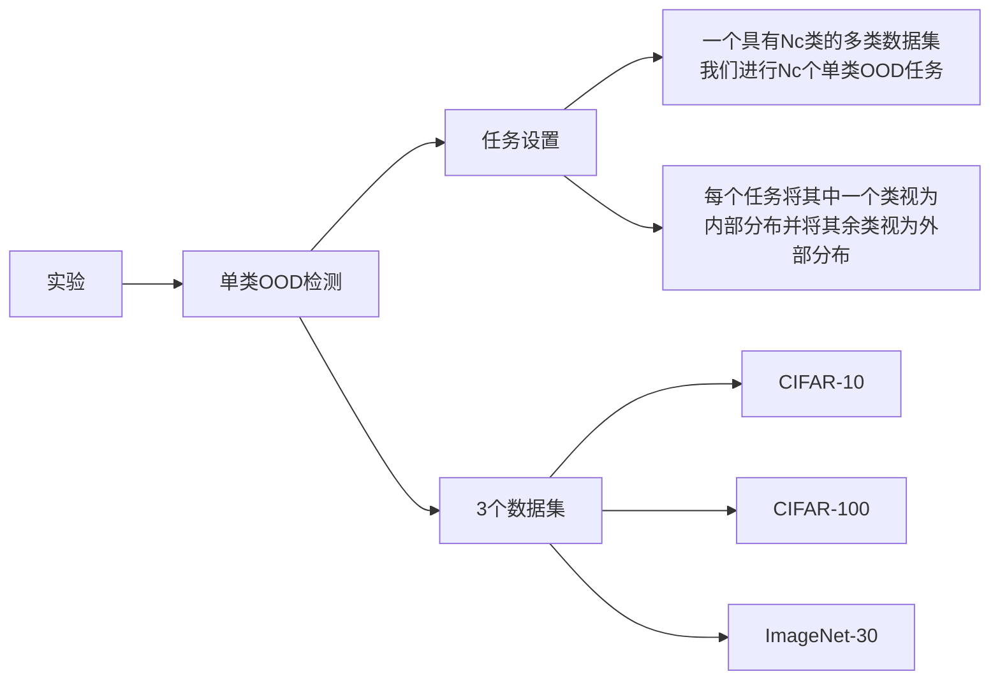

## 摘要

外分布（OOD）检测的核心是学习与OOD样本可区分的内分布（ID）表示。先前的工作应用了基于识别的方法来学习ID特征，这些方法倾向于学习捷径而不是全面的表示。在这项工作中，我们惊讶地发现，简单地使用**基于重构的方法**可以显著提升OOD检测的性能。我们深入探讨了OOD检测的主要贡献者，并发现**基于重构的前置任务**具有提供普遍适用和有效的先验的潜力，这有利于模型学习ID数据集的内在数据分布。具体而言，我们采用了遮罩图像建模作为我们的OOD检测框架（MOOD）的前置任务。不添加任何花哨的东西，MOOD在一类OOD检测方面的性能超过了先前的SOTA 5.7％，多类OOD检测超过了3.0％，接近分布OOD检测超过了2.1％。它甚至击败了每类10个样本的离群暴露OOD检测，尽管我们不包括任何OOD样本进行检测。代码可在 https://github.com/lijingyao20010602/MOOD 找到。

## 简介

可靠的视觉识别系统不仅能够在已知情境（也称为内分布数据）上提供正确的预测，还能检测未知的外分布（OOD）样本，并将它们拒绝（或转移）到人类干预以进行安全处理。这激发了在将输入提供给下游网络之前应用异常检测器的应用，这是OOD检测的主要任务，也称为新奇性或异常检测。OOD检测是识别测试样本是否远离内分布（ID）数据的任务。它是各种关键安全应用的基石，包括医疗诊断、欺诈检测、自动驾驶等。

许多先前的OOD检测方法依赖于离群暴露来提高OOD检测的性能，这将OOD检测转变为一个简单的二元分类问题。我们声称OOD检测的核心是学习有效的ID表示，以便在没有任何已知的离群暴露的情况下发现OOD样本。

在这篇论文中，我们首先提出了我们的惊人发现，即简单地使用基于重构的方法可以显著提高各种OOD检测任务的性能。我们这方面的先驱工作甚至在不包含任何OOD样本的情况下，优于先前的少样本离群暴露OOD检测。

现有方法执行对比学习或在大型数据集上预训练分类来检测OOD样本。前者根据伪标签对图像进行分类，而后者根据地面真实进行图像分类，它们的核心任务都是完成分类目标。然而，对后门攻击的研究表明，当学习通过对数据进行分类来表示时，网络倾向于采取捷径来对图像进行分类。

然而，学习这些模式对于OOD检测是无效的，因为网络无法理解ID图像的内在数据分布。因此，通过对ID数据进行分类来学习表示可能不尽如人意。例如，当类似于某些ID类别的模式出现在OOD样本中时，网络可能会轻易地将这些OOD样本解释为ID数据，并将其错误分类到错误的ID类别中。

为了解决这个问题，我们引入了基于重构的前置任务。与现有OOD检测方法中的对比学习不同，我们的方法迫使网络实现图像的重构训练目的，从而使其学习像素级的数据分布。

具体来说，我们采用了遮罩图像建模（MIM）作为我们的自监督前置任务，该任务在自然语言处理和计算机视觉中均表现出极大的潜力。在MIM任务中，我们将图像分成补丁，并在将损坏的输入提供给视觉变换器之前随机遮罩一定比例的图像补丁。然后，我们使用离散VAE的令牌作为训练期间监督网络的标签。通过这个过程，网络从剩余的补丁中学习信息，来猜测被遮盖的补丁并恢复原始图像的令牌。重构过程使模型能够从基于图像的内在数据分布的先验中学习，而不仅仅是在分类过程中学习各种类别之间的不同模式。

在我们的广泛实验中，值得注意的是，用于OOD检测的遮罩图像建模（MOOD）在一类OOD检测、多类OOD检测、接近分布OOD检测以及甚至少样本离群暴露OOD检测的所有四个任务上都优于当前的SOTA，如图1所示。一些统计数据如下。

1. 对于一类OOD检测（表6），MOOD将当前SOTA的AUROC，即CSI [58]，提高了5.7％至94.9％。
2. 对于多类OOD检测（表7），MOOD超过了SSD+ [53]的当前SOTA 3.0％，达到了97.6％。
3. 对于接近分布OOD检测（表2），MOOD的AUROC达到了98.3％，比当前SOTA的R50+ViT [15]高了2.1％。
4. 对于少样本离群暴露OOD检测（表9），MOOD（99.41％）令人惊讶地击败了R50+ViT [15]的当前SOTA（99.29％），后者使用了每类10个OOD样本。值得注意的是，我们甚至不包括任何OOD样本在MOOD中。

## 相关工作

## 2.1. 外分布检测 

一种直接的离群（OOD）处理方法是估计内分布（ID）密度[10, 63, 67, 72]并拒绝偏离估计分布的测试样本。

**基于图像重构[1, 17, 33]的方法**学习内外分布数据之间的决策边界[27, 37, 68]，计算训练和测试特征之间的距离[40, 53, 56, 58, 59]等等。

相比之下，我们的工作侧重于**基于距离的方法**，同时将**基于重构的方法**作为一种前提任务包括在内。

**基于距离的方法**的关键思想是OOD样本在特征空间中被认为远离内部分布（ID）数据的中心[65]。代表性方法包括K最近邻[59]、基于原型的方法[40, 56]等等。

我们将在本文后面解释我们的工作与之前的OOD检测方法之间的区别。

## 2.2. 视觉变换器 

变换器在计算机视觉和自然语言处理领域取得了良好的性能。现有的OOD检测研究在ImageNet-21k上对视觉变换器（ViT [13]）进行了分类预训练。它主要探讨了不同结构对OOD检测任务的影响，而我们深入探讨了OOD检测的四个维度的影响，包括各种前置任务、架构、微调过程和OOD检测指标。

## 2.3. 自监督前置任务 

长期以来，社区一直在各种自监督方式下预训练视觉网络，包括生成学习、对比学习和对抗学习。我们的方法属于生成学习，其中代表性的方法包括自回归、基于流、自编码和混合生成方法。

我们框架中的自监督前置任务是遮罩图像建模（MIM）。它通常属于自编码生成方法。MIM最初在自然语言处理中提出[2]。其语言建模任务随机遮盖文本中不同比例的标记，并从其余文本的编码结果中恢复遮罩的标记。后续研究[11, 20]将类似的思想从自然语言处理转移到计算机视觉，遮罩图像的不同比例的图像补丁以恢复结果。

多种现有方法利用自监督任务来引导OOD检测表示的学习。最新的工作[53, 58]提出了对比学习模型作为特征提取器。然而，根据对比学习对转换后的图像进行分类的现有方法存在类似的限制——即，模型倾向于学习类别的特定模式，这对分类有利，但并不帮助理解ID图像的内在数据分布。[15]的研究也提到了这个问题。然而，我们观察到，引入的大规模预训练变换器[15]可能不会跳出这个循环，因为前置任务仍然是分类。在我们的工作中，我们通过执行遮罩图像建模任务来解决这个问题，用于OOD检测。

# 3. 方法

在这一部分，我们首先解释帮助OOD检测的主要因素，最后提出我们的框架以实现这一目标。

我们首先定义符号。对于给定的数据集 $X_\text{ID}$，外分布（OOD）检测的目标是建模一个检测器，用于确定输入图像 $x \in X_{\text{ID}}$ 还是 $x \notin X_{\text{ID}}$（即 $x \in X_{\text{OOD}}$）。大多数现有的 OOD 检测方法定义了一个 OOD 分数函数 $s(x)$。其异常高或低的值表示 $x$ 来自于外分布。

### 3.1. 选择前置任务

在这一部分中，我们选择可以为OOD检测任务提供内在先验的前置任务。大多数先前的OOD方法通过分类[15, 23]或对比学习[53, 58]在ID样本上学习ID表示，这利用了地面真实或伪标签来监督分类网络。

另一方面，[50, 51]的工作表明，分类网络只学习训练类别之间的不同模式，因为这是完成分类的一种捷径。这表明网络实际上并不了解ID图像的内在数据分布。

相比之下，基于重构的前置任务迫使网络在训练过程中学习ID图像的真实数据分布，以重构图像而不是用于分类的模式。受益于这些先验，网络可以学习更具代表性的ID数据集特征。它扩大了OOD和ID样本之间的差异。

在我们的方法中，我们使用遮罩图像建模（MIM）预训练模型，使用大型数据集，并在ID数据集上进行微调。我们比较了MIM和对比学习前置任务MoCov3 [8]的性能，结果见表1。结果显示，MIM的性能大大提高了13.3%，达到了98.66%。

### 3.2. 探索架构

为了探索有效的架构[15]，我们评估了BiT（大规模迁移[31]）和MLP-Mixer在ViT上的OOD检测性能。我们采用CIFAR-100和CIFAR-10 [32]作为ID-OOD对。由于它们的语义和构造相似，它们的分布相近。结果见表2。

R50 + ViT [13, 22]是当前在接近分布OOD检测[15]上的SOTA，它将模型大小和测试时间增加了一倍，但只达到了96.23%（比ViT高0.70%）。然而，MIM在单个ViT上显着提高了其AUROC至98.30%（高出2.07%）。

### 3.3. 关于微调

一类微调。对于单类OOD检测，我们首先对MIM模型进行预训练，然后按照BEiT的建议，在ImageNet-21k上进行微调[49]。特别是，在ImageNet-30上执行单类OOD检测时，由于在训练过程中不包括OOD标签，因此我们仅在ImageNet-21k上进行预训练，而没有进行中间微调。因此，我们利用标签平滑[57]来帮助模型从ID数据集上的单类微调任务中学习，如下所示：...

其中，�c 是类别的索引；��Nc​ 是类别数量；�α 是确定平滑级别的超参数。如果 �=0α=0，则获得原始的 one-hot 编码 ��yc，如果 �=1α=1，则得到均匀分布。标签平滑用于解决普通微调过程中的过拟合和过度自信。相反，我们发现它可以用于单类微调。在一类微调之前和之后，模型的性能如表3所示。很明显，模型实际上从单类微调操作中学习到了信息。这可能有违直觉，因为标签是相等的。原因是，由于标签平滑，损失大于0，说服模型更新参数，尽管准确度达到1。

多类微调。对于多类OOD检测，我们预先对MIM模型进行预训练，在ImageNet-21k上进行中间微调，然后再次在ID数据集上进行微调。我们进行实验来验证表5中每个阶段的有效性。结果证明，所有阶段对OOD检测的性能都有很好的贡献。

### 3.4. OOD检测度量的重要性

在这里，我们比较了几种常用的OOD检测度量的性能，包括Softmax [23]、Entropy [23]、Energy [38]、GradNorm [26] 和Mahalanobis距离 [34]。我们使用每个度量来执行带有MIM预训练任务的OOD检测，结果显示在表5中。它们证明了Mahalanobis距离是MOOD的更好度量。

### 3.5. MOOD的最终算法

总而言之，在本节中，我们探讨了对OOD检测的贡献者的影响，包括各种预训练任务、架构、微调过程和OOD检测度量。总的来说，我们发现，在ViT上进行细致调整的MOOD使用Mahalanobis距离获得了最佳结果。MOOD的出色性能表明，一个高效的预训练任务本身就足以产生可区分的表示，而不需要更大的模型或多模型。在第4节中，我们将展示多个现有的OOD检测方法中使用的少样本异常暴露也是不必要的。MOOD的算法显示在附录中。主要包括以下几个阶段：

1. 在ImageNet-21k上对Masked Image Modeling ViT进行预训练。
    
2. 在ImageNet-21k上进行中间微调ViT。
    
3. 对预先训练的ViT在ID数据集上进行微调。
    
4. 从训练后的ViT中提取特征，并计算用于OOD检测的Mahalanobis距离度量。
    
## 5. 实验

在本节中，我们将Masked Image Modeling用于OOD检测（MOOD）与当前SOTA方法在单类OOD检测（第4.1节）、多类OOD检测（第4.2节）、接近分布OOD检测（第4.3节）和少样本异常暴露OOD检测（第4.4节）进行比较。我们的MOOD在所有四个OOD检测任务上明显优于所有先前的方法。

我们在以下数据集上进行实验：（i）CIFAR-10 [32]，包含 50,000 个训练图像和 10,000 个测试图像，共有 10 个图像类别；（ii）CIFAR-100 [32] 和 CIFAR-100（超类）[32]，分别包含 50,000 个训练图像和 10,000 个测试图像，其中有 100 个图像类别和 20 个（超类）图像类别；（iii）ImageNet-30 [49]，包含 39,000 个训练图像和 3,000 个测试图像，共有 30 个图像类别；（iv）ImageNet-1k [49]，包含约 120k 和 50k 个测试图像，共有 1k 个图像类别。有关训练设置的更多细节请参见附录。

### 4.1. 单类OOD检测

我们从单类OOD检测开始。对于一个具有 Nc 类的多类数据集，我们进行 Nc 个单类OOD任务，其中每个任务将其中一个类视为内部分布，将其余类视为外部分布。我们在三个数据集上运行我们的实验，分别是 CIFAR-10、CIFAR-100（超类）和 ImageNet-30，这遵循了之前的工作 [3, 16, 25]。

表6总结了结果，表明MOOD在所有测试案例上明显优于当前的CSI [58]，平均改善率为 5.7% 到 94.9%。在ImageNet-30 Tab. 6c 上，改善相对较小。这是因为我们没有在ImageNet-30上对模型进行中间微调。详细的类别-wise AUROC 在附录中展示。

### 4.2. 多类OOD检测

对于多类OOD检测，我们假设 ID 样本来自特定的多类数据集。它们在各种外部数据集上进行测试，作为外部分布。我们在 CIFAR-10、CIFAR-100、ImageNet-30 和 ImageNet-1k 上执行 MOOD。

- 对于 CIFAR-10，我们将 CIFAR-100 [32]、SVHN [41] 和 LSUN [36] 视为OOD数据集。

- 对于 CIFAR-100，我们将 CIFAR-10 [32]、SVHN [41] 和 LSUN [36] 视为OOD数据集。

- 对于ImageNet-30，OOD样本来自CUB-200 [62]、斯坦福狗 [28]、牛津宠物 [43]、牛津花卉 [42]、Food-101 [4]、Places-365 [70]、Caltech-256 [19] 和可描述纹理数据集 (DTD) [9]。

- 对于ImageNet-1k，我们利用非自然图像作为OOD数据集，其中包括 iNaturalist [61]、SUN [64]、places [70]、Textures [9]。

如表7所示，MOOD将当前SOTA的SSD+ [53]在ImageNet-1k上的性能提升了3.0%，达到了97.6%，将GradNorm [26]的性能提升了2.8%，达到了89.1%。我们指出，当在ImageNet30和Food上检测困难的（即接近分布的）OOD样本时，MOOD仍然表现出了良好的性能，而以前的方法往往会失败。

可视化。在图2中，我们根据三种OOD检测方法的度量，即基线OOD检测 [23]、SSD+ [53] 和 MOOD，说明了测试样本的概率分布。基线OOD检测使用 softmax 作为其OOD检测度量，其中ID样本倾向于具有比OOD样本更大的值。MOOD 和 SSD+ 使用 Mahalanobis 距离作为其度量。

正如图中所示，大多数测试ID样本到训练数据的距离接近零，表明训练和测试ID样本具有类似的表示。相反，大多数OOD样本到训练数据的距离要大得多，特别是在CIFAR-10和ImageNet-30上。

此外，在图2中，我们揭示了MOOD相对于其他方法[23, 53]在ID和OOD样本的分布上的差异明显更大。这表明MOOD可以更清晰地区分ID和OOD样本。为了说明每个ID和OOD数据集中图像的外观，我们在附录中以几个图像作为示例，并附带其对应的距离。

4.3. 接近分布OOD检测

与现有的普通OOD检测任务相比，接近分布OOD检测的SOTA结果要差得多——一些ID-OOD对的AUROC [53, 58] 甚至低于70%。因此，改进接近OOD检测的SOTA对于应用于真实世界数据至关重要。

在表2中，我们将MOOD与当前的SOTA在接近分布的CIFAR10-CIFAR100 (ID-OOD)对上进行了比较，R50+ViT [15]，MOOD明显优于后者，提高了2.07%，达到了98.30%。在本节中，我们专注于从第4.1节和第4.2节中具有类似语义的难以检测的对。