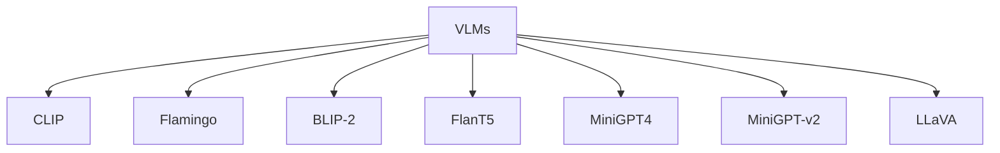

![[Pasted image 20240508111903.png]]

## 本文要点

- 微调多模态大模型，超越 [[LoRA]]。
- 在2024年AI城市挑战[28] - 交通安全描述和分析中获得了第一名
## 摘要

在城市环境的广阔而动态的景观中，交通安全描述和分析在从保险检查到事故预防等各种应用中起着至关重要的作用。本文介绍了一种名为CityLLaVA的新型微调框架，用于设计用于城市场景的视觉语言模型（VLMs）。CityLLaVA通过以下方式增强模型的理解和预测准确性：
- （1）利用边界框进行最佳视觉数据预处理，包括视频最佳视角选择和在训练和测试阶段期间进行视觉提示工程；
- （2）构建简洁的问题-答案序列，并设计文本提示来提高指令理解；
- （3）实施块扩展以有效地微调大型VLMs；以及
- （4）通过独特的顺序问答式预测增强提高预测准确性。

通过展示出顶尖的性能，我们的方法在排行榜上取得了33.4308的基准分数，稳居领先位置。代码可在以下链接找到：https://github.com/alibaba/AICITY2024_Track2_AliOpenTrek_CityLLaVA

## 引言

随着大型语言模型（LLMs）的快速发展，越来越多的领域开始探索这些模型的能力，研究它们对行业标准和社会实践的潜在影响。特别是在跨越计算机视觉（CV）和自然语言处理（NLP）等研究领域，如交通视频分析，这些模型不仅显著提高了自动化分析精度的标准，而且还开启了前所未有的应用领域。存在诸如GPT4-V [20]、Qwen-VL-Chat [2]、LLaVA [14]等诸多基础视觉语言模型（VLMs），这些模型证明了CV和NLP的协同潜力。

尽管这些大型模型在一系列任务中展现出强大的能力，但当直接应用于高度专业化的领域，如交通安全场景的标题，它们往往无法达到预期。显然，这些模型需要进行重要的微调以充分捕捉领域特定的细微差别。

对大型模型进行微调以满足特定应用的细粒度需求涉及解决复杂的挑战，如构建有效的问题-答案对、设计适当的提示以及选择关键的微调参数。此外，创建能够捕捉现实世界事件多方面特性的注释可能需要大量工作。

鉴于这些挑战，本文旨在介绍一种有效和全面的大型视觉语言模型微调范式，包括提示工程、连续训练和推理增强。图1展示了这种有效范式的细节，它在我们的行业实践中不断积累。为了证明所提出方法的有效性，我们在WTS [9]数据集上进行了详细实验。具体而言，所提出的范式在2024年AI城市挑战[28] - 交通安全描述和分析中获得了第一名，提供了宝贵的见解，并为未来研究增强或调整LLMs以应对类似复杂的领域特定任务提供了途径。

总之，本文的贡献总结如下：

- 提出了一种有效和全面的大型视觉语言模型微调范式，用于领域特定任务。
- 探索了视觉和文本提示工程，构建了训练和推理的信息丰富且精细的输入。
- 研究了VLMs中块扩展的适应性，在性能上超越了LoRA [8]。
- 在WTS数据集上实现了最先进的性能，并详细探讨了影响微调效果的因素。

## 相关工作 

### 2.1. 视觉语言模型 

视觉语言模型（VLMs）同时利用图像和文本数据，并将不同领域的知识融合在一起以提高性能。CLIP [22]是一项开创性的工作，通过设计一个与文本标题匹配的预训练任务来对齐语言和图像。它在多个下游任务之间展示了惊人的零-shot转移能力。近年来，随着大型语言模型[2, 21, 27]的发展，将视觉编码器与自回归语言解码器相结合成为了视觉语言任务中流行的方法。这种方法可以从视觉感知和语言表达中受益，并实现更加多功能的模型。在这个领域的早期研究是Flamingo [1]，它利用门控交叉注意力接受交错的视觉和语言数据作为输入，然后生成文本作为输出。BLIP-2 [10]引入了一个轻量级但功能强大的模块Qformer，以有效地弥合图像和文本之间的模态差距，而FlanT5 [6]则作为语言模型。基于BLIP-2的预训练视觉组件，MiniGPT4 [35]利用一个单一的投影层来将视觉特征与文本特征对齐，并输入到Vicuna [5]语言模型中。改进版MiniGPT-v2 [4]采用了一个更简单的策略，直接将来自ViT [7]编码器的视觉标记投影到大型语言解码器的特征空间中。LLaVA [14]采用了类似的模型结构，在编码后的视觉特征之后使用一个投影层。通过提出的两阶段训练策略，LLaVA在视觉语言任务中展示出令人印象深刻的能力，并有许多后续工作基于它[11, 13, 15, 17, 26]。

### 2.2. 驾驶中的VLMs 

许多研究人员尝试将视觉语言模型应用于驾驶中，因为它们在视觉信号感知和语言理解方面展现出了显著的能力。一项先前的研究[29]在自动驾驶场景中对最先进的视觉语言模型GPT4-V [20]进行了详尽评估，实验结果表明其性能优越。Dolphins [18]是一种新颖的视觉语言模型，其中预训练的OpenFlamingo [1]作为基本结构，展示了在驾驶领域的独特行为。DriveGPT4 [31]可以处理文本查询和多帧视频作为输入，并生成相应的响应，同时还能够预测低级别的车辆控制动作和信号。实验结果表明，DriveGPT4在某些情况下与GPT4-V相比具有相当甚至更好的能力。

## 方法论 

### 3.1. 概述 

CityLLaVA引入了一个旨在增强城市环境中的时空理解并提供细粒度感知的高效微调流程。如图2所示，所提出的范式由三个主要模块组成：视觉提示工程、文本提示工程（即文本问答构建）和针对大型视觉语言模型的高效微调。我们将依次介绍每个模块的详细内容。 

### 3.2. 数据集构建 

在本节中，我们详细阐述数据过滤和监督微调（SFT）的视觉语言指令微调数据集的构建细节。对于微调，用于训练的项H可以被构建为一个元组： H = (Xv, Xq, Xt) (1) 其中Xv、Xq、Xt分别表示视觉输入、文本指令和文本响应。它们的最佳构建将在随后的部分中探讨。 

#### 3.2.1 边界框引导的视角选择 

WTS数据集包括两部分：a. WTS数据，这是一个多视角数据集，其中包含不确定数量的车辆视角和俯视图；b. 从BDD100K [32]数据中筛选的以行人为中心的视频，仅包含车辆视角。鉴于在WTS数据的某些视角中，相关车辆和行人可能不太清晰可见或者尺寸微不足道，直接在多视角数据上进行视觉语言模型（VLMs）的微调是一个挑战。