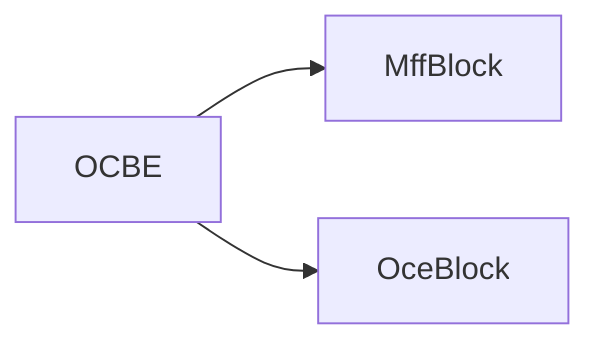

- 当查询为异常样本时，期望**学生模型** $D$ 生成与**教师模型** $E$ 非常不同的表示
- $D$ 在训练期间旨在模仿 $E$ 的行为
- $E$ 的输入是图像，输出是特征图
- $\phi$ 是向量，是 OCE 模块的输出
- $\phi$ 的目的，即 OCE 模块的目的，是保留正常信息，剔除异常信息
- $D$ 的输入是 $\phi$，输出是特征图
- 训练损失是 $D$ 的输出特征图和 $E$ 的输出特征图之间的距离
- $E$ 的所有参数在训练期间都被冻结

## 摘要

知识蒸馏（KD）在具有挑战性的无监督异常检测（AD）问题上取得了令人满意的结果。教师-学生（T-S）模型中异常的表示差异为AD提供了重要证据。然而，在先前的研究中，使用类似或相同的架构构建教师和学生模型会阻碍异常表示的多样性。为了解决这个问题，我们提出了一种新颖的T-S模型，由教师编码器和学生解码器组成，并相应地引入了一种简单而有效的“反向蒸馏”范式。学生网络不直接接收原始图像，而是以教师模型的 **one-class embedding** 作为输入，并目标恢复教师的多尺度表示。本研究中的知识蒸馏从抽象的高层表达开始，逐渐转向低级特征。此外，我们在T-S模型中引入了一个可训练的单类瓶颈嵌入（OCBE）模块。获得的紧凑嵌入有效地保留了关于正常模式的基本信息，但放弃了异常扰动。对AD和单类新奇检测基准的大量实验表明，我们的方法超过了SOTA性能，证明了我们提出的方法的有效性和普适性。

## 1.  引言 

异常检测（AD）是指在有限甚至没有先验异常知识的情况下识别和定位异常。AD的广泛应用，如工业缺陷检测[3]、医疗领域的分布外检测[50]和视频监控[24]，使其成为一项关键任务和焦点。在无监督AD的背景下，没有异常的先验信息可用。相反，提供一组正常样本作为参考。为了解决这个问题，先前的努力尝试在这些无异常样本上构建各种自监督任务。这些任务包括但不限于样本重构[2,5,11,16,26,34,38,48]、伪异常增强[23,42,46]、知识蒸馏[4,33,39]等。在本研究中，我们从知识蒸馏的角度来解决无监督异常检测的问题。在知识蒸馏（KD）[6,15]中，知识在教师-学生（T-S）对中进行传递。在无监督AD的背景下，由于学生在训练过程中只接触正常样本，当查询异常时，它可能会生成与教师不同的表示。这一假设构成了基于KD的异常检测方法的基础。然而，在实践中，由于（1）教师和学生网络具有相同或相似的架构（即，非区分性滤波器[33]）以及（2）知识传输/蒸馏过程中T-S模型中的相同数据流，这一假设并不总是成立。尽管使用较小的学生网络部分地解决了这个问题[33,39]，但浅层架构的较弱表示能力阻碍了模型对异常的准确检测和定位。

为了全面解决上述问题，我们提出了一种新的知识蒸馏范式，即逆向蒸馏，用于异常检测。我们使用简单的图表在图2中突出显示了传统知识蒸馏和提出的逆向蒸馏之间的系统差异。首先，与传统知识蒸馏框架不同，其中教师和学生都采用编码器结构，我们的逆向蒸馏中的T-S模型由异构架构组成：一个教师编码器和一个学生解码器。其次，学生解码器不直接将原始数据同时输入T-S模型，而是将低维嵌入作为输入，目标是通过恢复教师模型在不同尺度上的表示来模拟教师的行为。从回归的角度来看，我们的逆向蒸馏使用学生网络来预测教师模型的表示。因此，“逆向”在这里既指教师编码器和学生解码器的反向形状，又指与传统知识蒸馏顺序不同的明显知识蒸馏顺序，即首先进行高级别表示的蒸馏，然后是低级别特征。值得注意的是，我们的逆向蒸馏提供了两个重要优势：i）非相似结构。在所提出的T-S模型中，可以将教师编码器视为下采样滤波器，将学生解码器视为上采样滤波器。这种“逆向结构”避免了上述非区分性滤波器[33]造成的混淆。ii）紧凑嵌入。输入到学生解码器的低维嵌入作为正常模式重建的信息瓶颈。让我们将异常特征形式化为正常模式的扰动。然后，紧凑的嵌入有助于阻止这种异常扰动传播到学生模型，并因此提高了T-S模型对异常的表示差异。值得注意的是，传统的基于自动编码器（AE）的方法[5,11,16,26]利用像素差异检测异常，而我们则使用密集的描述性特征进行判别。作为区域感知描述符的深度特征提供比图像中的像素更有效的判别信息。

此外，由于瓶颈嵌入的紧凑性对于异常检测至关重要（如上所述），我们引入了一个单类瓶颈嵌入（OCBE）模块来进一步压缩特征代码。我们的OCBE模块由多尺度特征融合（MFF）块和 **one-class embedding block** 组成，两者与学生解码器一起进行联合优化。值得注意的是，前者聚合低和高级别特征，构建丰富的嵌入以进行正常模式重建。后者旨在保留有利于学生解码教师响应的基本信息。

我们在公共基准上进行了大量实验。实验结果表明，我们的逆向蒸馏范式与先前的艺术水平相当。所提出的OCBE模块进一步提高了性能，达到了新的SOTA记录。我们的主要贡献总结如下：

- 我们提出了一种简单但有效的逆向蒸馏范式用于异常检测。编码器-解码器结构和逆向知识蒸馏策略全面解决了传统KD模型中的非区分性滤波器问题，增强了T-S模型对异常的判别能力。
- 我们提出了一个单类瓶颈嵌入模块，将教师的高维特征投影到紧凑的 **one-class embedding** 空间。这一创新有助于保留丰富而紧凑的代码，以便学生进行无异常表示重建。
- 我们进行了大量实验，并展示了我们的方法达到了新的SOTA性能。

## 我们的方法

问题阐述：设 ={1,...,}It​={It1​,...,Itn​} 是一组可用的无异常图像，={1,...,}Iq​={Iq1​,...,Iqm​} 是一个包含正常和异常样本的查询集。目标是训练一个模型来识别和定位查询集中的异常。在异常检测设置中， It​ 和 Iq​ 中的正常样本遵循相同的分布。超出分布范围的样本被视为异常。

系统概述：图3描述了用于异常检测的提出的逆向蒸馏框架。我们的逆向蒸馏框架由三个模块组成：一个固定的预训练教师编码器 E、一个可训练的单类瓶颈嵌入模块，以及一个学生解码器 D。给定一个输入样本 ∈I∈It​，教师 E 提取多尺度表示。我们建议训练一个学生 D 来从瓶颈嵌入中恢复特征。在测试/推断期间，教师 E 提取的表示可以捕获异常、超出分布范围的特征。然而，学生解码器 D 无法从相应的嵌入中重建这些异常特征。在提出的T-S模型中异常表示的低相似性表明高异常分数。我们认为异构的编码器和解码器结构以及逆向知识蒸馏顺序对异常的不一致表示起到了很大作用。此外，可训练的OCBE模块进一步将多尺度模式压缩到极低维空间，用于下游正常表示重建。这进一步提高了我们T-S模型中对异常的特征差异度，因为教师模型生成的异常表示可能会被OCBE抛弃。在本节的其余部分，我们首先详细说明了逆向蒸馏范式。然后，我们详细介绍了OCBE模块。最后，我们描述了使用逆向蒸馏进行异常检测和定位。

### 3.1. 逆向蒸馏 

在传统的KD中，学生网络采用与教师模型相似或相同的神经网络，接受原始数据/图像作为输入，并目标是匹配其特征激活与教师的[4,33]。在无监督AD的一类蒸馏环境中，**当查询为异常样本时，期望学生模型生成与教师模型非常不同的表示**[11,26]。然而，有时异常样本上的激活差异会消失，导致异常检测失败。我们认为这个问题是由于教师和学生网络的相似架构以及在T-S知识传输期间相同的数据流引起的。为了提高T-S模型在未知、超出分布范围样本上的表示多样性，我们提出了一种新颖的逆向蒸馏范式，其中T-S模型采用编码器-解码器架构，并且知识从教师的深层传输到其早期层，即，首先传递高级、语义知识给学生。为了进一步促进一类蒸馏，我们设计了一个可训练的OCEB模块来连接教师和学生模型（第3.2节）。 在逆向蒸馏范式中，教师编码器  E 旨在提取综合表示。我们遵循以前的工作，并使用在ImageNet[21]上预训练的编码器作为我们的骨干  E。为了避免T-S模型收敛到平凡解，教师 $E$ 的所有参数在知识蒸馏期间都被冻结。我们的消融研究表明，ResNet[14]和WideResNet[44]都是不错的候选模型，因为它们能够从图像中提取丰富的特征。 为了匹配  E 的中间表示，学生解码器  D 的架构与  E 相似但相反。逆向设计有助于消除学生网络对异常的响应，而对称性使其具有与教师网络相同的表示维度。例如，当我们将ResNet作为教师模型时，学生  D 由几个残差状解码块组成，以实现镜像对称。具体来说，在ResNet中，下采样是通过一个卷积层实现的，其核大小为1，步幅为2[14]。学生  D 中相应的解码块采用了具有2的卷积层[47]来实现步幅为2的反卷积。有关学生解码器设计的更多细节，请参见补充材料。 

在我们的逆向蒸馏中，学生解码器  D 在训练期间旨在模仿教师编码器  E 的行为。在这项工作中，我们探索了基于多尺度特征的异常检测蒸馏。这背后的动机是神经网络的浅层提取了局部描述符用于低级信息（如颜色、边缘、纹理等），而深层具有更广阔的感受野，能够描述区域/全局语义和结构信息。也就是说，在T-S模型中低级别和高级别特征的低相似性表明局部异常和区域/全局结构异常，分别。 

从数学上讲，令 ϕ 表示从原始数据  I 到单类瓶颈嵌入空间的投影，我们的T-S模型中的成对激活对应是 {    =   (  ) ,    =   (  ) f k E ​ =E k ​ (I),f k D ​ =D k ​ (ϕ) }，其中   E k ​ 和   D k ​ 分别表示教师模型和学生模型中的第 k 个编码和解码块，    ,    ∈    ×   ×   f k E ​ ,f k D ​ ∈R C k ​ ×H k ​ ×W k ​ ，其中   ,   C k ​ ,H k ​ 和   W k ​ 分别表示第 k 层激活张量的通道数、高度和宽度。对于T-S模型中的知识传输，余弦相似性被作为KD损失，因为它更准确地捕获了高和低维信息的关系。

具体来说，对于特征张量    f k E ​ 和    f k D ​ ，我们沿着通道轴计算它们的向量级余弦相似性损失，并得到一个二维的异常地图   M k ，其中  k 表示实验中使用的特征层的数量。   ( ℎ ,  ) = 1 − (    ( ℎ ,  ) )  ⋅    ( ℎ ,  ) ∥    ( ℎ ,  ) ∥ ∥    ( ℎ ,  ) ∥ M k (h,w)=1− ∥f E k ​ (h,w)∥∥f D k ​ (h,w)∥ (f E k ​ (h,w)) T ⋅f D k ​ (h,w) ​   ( ℎ ,  ) M k (h,w) 中的大值表示该位置的高异常。

考虑到多尺度知识蒸馏，学生的优化的标量损失函数通过累积多尺度异常地图获得：    = ∑  = 1  { 1     ∑ ℎ = 1   ∑  = 1     ( ℎ ,  ) } L KD ​ = k=1 ∑ K ​ { H k ​ W k ​ 1 ​ h=1 ∑ H k ​ ​ w=1 ∑ W k ​ ​ M k (h,w)} 其中，  K 表示实验中使用的特征层的数量。

### 3.2. 单类瓶颈嵌入

在我们的逆向知识蒸馏范式中，由于学生模型 D 试图恢复教师模型 E 的表示，因此可以直接将主干网中最后一个编码块的激活输出传递给 D。然而，这种简单的连接有**两个缺点**。

首先，KD中的教师模型通常具有较高的容量。尽管高容量模型有助于提取丰富的特征，但所获得的高维描述符可能存在相当多的冗余。表示的高自由度和冗余性对于学生模型解码关键的无异常特征是有害的。

其次，主干网中最后一个编码器块的激活通常表征输入数据的语义和结构信息。由于知识蒸馏的逆向顺序，直接将这种高级别表示传递给学生解码器对低级别特征重建设置了挑战。先前关于数据重建的工作通常引入跳跃连接来连接编码器和解码器。然而，在知识蒸馏中，这种方法不起作用，因为在推断过程中跳跃连接会将异常信息泄漏给学生。

为了解决上述单类蒸馏中的**第一个缺点**，我们引入了一个可训练的 one-class embedding block，将教师模型的高维表示投影到低维空间。让我们将异常特征形式化为正常模式的扰动。然后，紧凑的嵌入充当信息瓶颈，并帮助阻止异常扰动传播到学生模型，从而提高了T-S模型对异常的表示差异。在本研究中，我们采用了ResNet [14]的第四个残差块作为one-class embedding block。

为了解决解码器 D 中的低级特征恢复问题，MFF块在单类嵌入之前连接多尺度表示。为了在特征连接中实现表示对齐，我们通过一个或多个3×3的卷积层进行浅层特征下采样，步幅为2，然后进行批量归一化和ReLU激活函数。然后，通过一个步幅为1的1×1卷积层和一个批量归一化与ReLU激活函数，用于生成丰富而紧凑的特征。我们在图4中描述了OCBE模块，其中MFF聚合低级和高级特征以构建丰富的嵌入，用于正常模式重建，而OCE旨在保留有利于学生解码教师响应的基本信息。图4中灰色的卷积层和绿色的ResBlock在知识蒸馏过程中与学生模型 D 联合优化，用于在正常样本上进行训练。