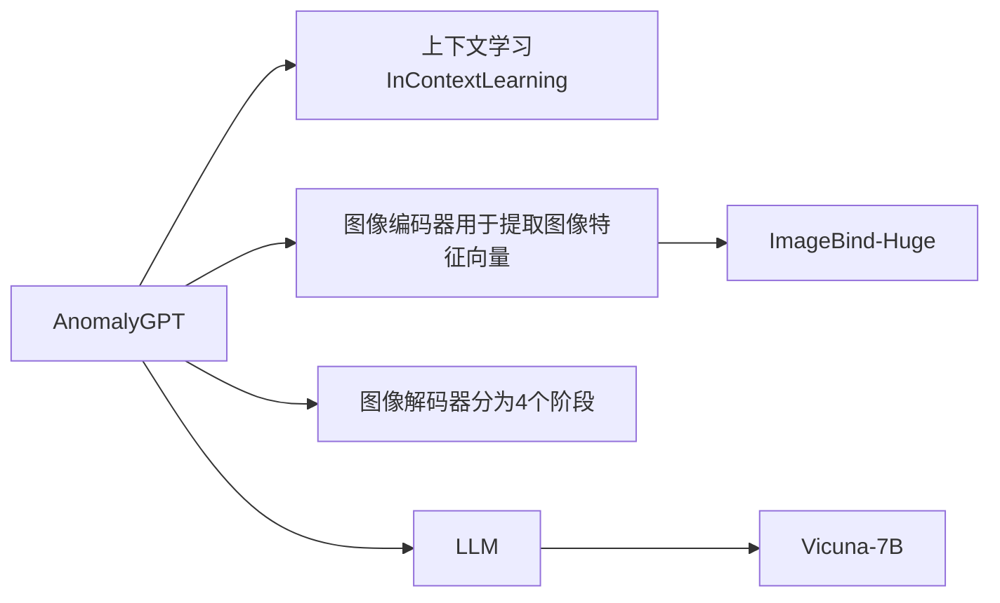

#### Related Work
##### Industrial Anomaly Detection
- Reconstruction-based methods
	- [[RIAD]]
	- [[SCADN]]
	- [[InTra]]
	- [[AnoDDPM]]
- Feature embedding-based methods
	- [[PatchSVDD]]
	- [[Cflow-AD]]
	- [[PyramidFlow]]
	- [[PatchCore]]
	- [[CFA]]
#### Method
##### Model Architecture
一幅查询图像：$x\in \mathbb{R}^{H\times W\times C}$
图像特征向量：$F_{img} \in \mathbb{R}^{C_1}$
将图像特征向量送入线性层得到图像嵌入：$E_{img} \in \mathbb{R}^{C_{emb}}$，被送入 LLM