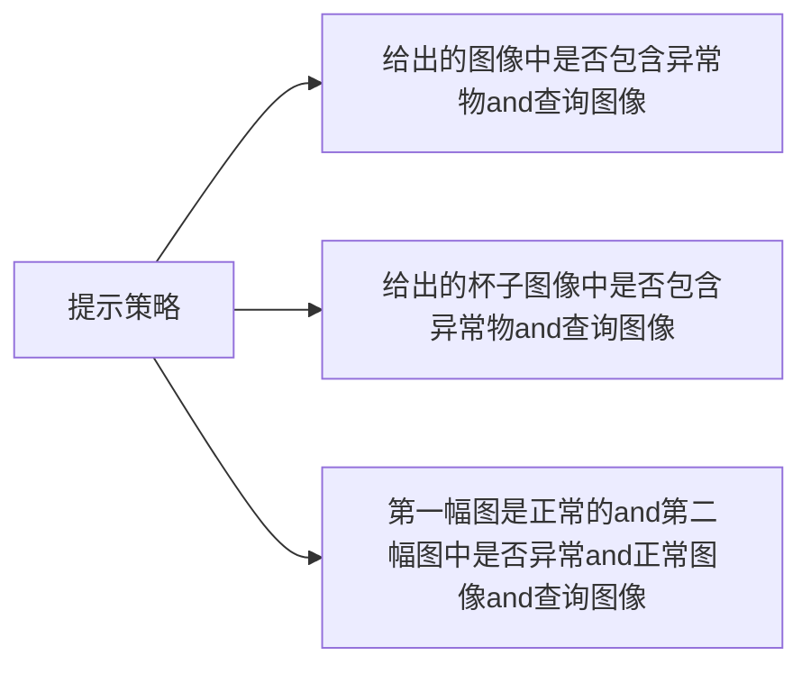

[[2403.11083 Customizing Visual-Language Foundation Models for Multi-modal Anomaly Detection and Reasoning.pdf]]
https://github.com/Xiaohao-Xu/Customizable-VLM
#### 参考文献
[[A Survey on Visual Anomaly Detection]]

## III. EXPERIMENT

### A. Evaluation Metrics

【准确率（ACC）】准确率定义为正确预测的实例（即真正例和真负例）与总实例数之比。

【精度-召回率曲线下面积（AUPR）】AUPR评估了模型在不同召回率水平上的精度。AUPR通过在整个范围内将精度作为召回率的函数进行积分来计算。

接收器操作特征曲线下面积（AUC）】AUC量化了区分正例和负例的能力。它通过在不同阈值上对真正例率与假正例率进行积分来计算。

### B. Implementation Details

### D. Quantitative Results of Anomaly Detection

【基准结果】在表I中，我们展示了基于自定义基础模型的异常检测性能，该模型是从通用模型中使用文本和正常图像案例的提示进行了调整，在MVTec-AD [1]数据集上进行了评估。具体来说，我们观察到改进后的基础模型（GPT4-V）在没有任何训练或针对每个类别的提示调整的情况下实现了更高的性能，达到了84%的准确率。

【提示策略的影响】在图4中，我们使用Gemini Vision Pro 1.0基础模型分析了在MVTec-AD数据集 [1]上采用不同提示策略的影响。视觉提示利用参考正常图像，而语言提示捕捉正常规则。结果显示，当同时结合来自参考正常图像和正常规则的提示时，大多数子类别的性能显著提高。此外，我们的发现表明，在使用简单提示时，“网格”、“瓷砖”和“木材”等子类别的准确率最低。然而，我们观察到，结合额外的视觉和语言提示可以显著提升它们的性能。