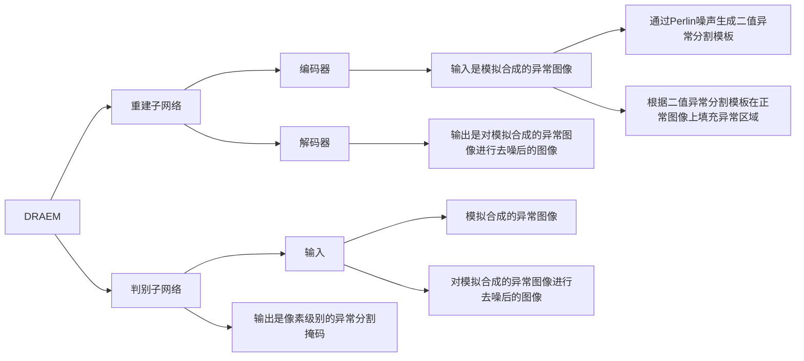

## 摘要

视觉表面异常检测旨在检测与正常外观明显偏离的局部图像区域。最近的表面异常检测方法依赖于生成模型，以准确重建正常区域并在异常上失败。这些方法仅在无异常的图像上进行训练，并经常需要手工制作的后处理步骤来定位异常，这禁止了对特征提取进行最大检测能力优化。除了重建方法之外，我们将表面异常检测主要视为一个判别问题，并提出了一个经过判别训练的重建异常嵌入模型（DRÆM）。所提出的方法学习了异常图像及其无异常重建的联合表示，同时学习了正常和异常示例之间的决策边界。该方法使得直接异常定位成为可能，无需对网络输出进行额外复杂的后处理，并且可以使用简单通用的异常模拟进行训练。在具有挑战性的MVTec异常检测数据集上，DRÆM在非监督方法中表现出色，甚至在广泛使用的DAGM表面缺陷检测数据集上，其检测性能接近完全监督方法，同时在定位精度方面明显优于它们。

## 1. Introduction

表面异常检测解决了定位与正常外观有所不同的图像区域（见图1）。一个密切相关的一般性异常检测问题将异常视为与非异常训练集图像显著不同的整个图像。相比之下，在表面异常检测问题中，异常仅占图像像素的一小部分，并且通常接近训练集分布。这是一项特别具有挑战性的任务，常见于质量控制和表面缺陷定位应用中。

在实践中，异常的外观可能会显著变化，在质量控制等应用中，出现异常的图像很少，手动注释可能会耗费大量时间。这导致训练集高度不平衡，通常只包含无异常的图像。因此，近年来在设计健壮的表面异常检测方法上投入了大量的工作，这些方法最好需要最少的手动注释监督。

重建方法，例如自动编码器和生成对抗网络，因为它们仅使用无异常图像就能学习到强大的重建子空间而得到广泛研究。依赖于在训练中未观察到的异常区域的差劣重建能力，异常可以通过阈值化输入图像与其重建之间的差异来检测。然而，确定与正常外观没有明显不同的异常的存在仍然具有挑战性，因为这些异常通常在重建时表现良好。

最近的改进考虑了从通用网络和专门用于无异常图像的网络中提取的深度特征之间的差异。判别也可以被形式化为在深度子空间内非异常纹理的稠密聚类中的偏离，因为形成这样一个紧凑的子空间可以防止异常被映射到接近无异常样本的位置。

生成方法的一个常见缺点是它们仅从无异常数据中学习模型，并且并没有明确优化用于判别性异常检测，因为在训练时无法获得正例（即异常）。可以考虑使用合成异常来训练判别性分割方法，但这会导致对合成外观的过拟合，并且导致学习的决策边界在实际异常上的泛化能力较差。

我们假设通过在联合重建和原始外观上训练判别模型可以大大减少过拟合。这样，模型不会对合成外观过拟合，而是学习原始和重建异常外观之间的局部外观条件距离函数，这在一系列真实异常上具有很好的泛化性能。

为了验证我们的假设，我们提出了一个新的深层表面异常检测网络，以端到端的方式在合成生成的超出分布模式上进行判别训练，这些模式不必忠实地表示目标域异常。该网络由一个重建子网络和一个判别子网络组成。重建子网络被训练用于学习无异常重建，而判别子网络学习在原始和重建图像的联合外观上的判别模型，产生高保真度的逐像素异常检测地图。

与学习替代生成任务的相关方法不同，所提出的模型是判别性训练的，但在测试时并不需要合成的异常外观与实际异常紧密匹配，并且在性能上大大优于最近更复杂的最先进方法。

## 2. Related work

许多表面异常检测方法专注于图像重建，并基于图像重建误差来检测异常。自动编码器通常用于图像重建。在一些研究中，自动编码器通过对抗损失进行训练。然后，图像的异常分数基于图像重建质量，或者在对抗训练的自动编码器中，基于判别器的输出。在另一些研究中，使用生成对抗网络（GAN）来训练生成符合训练分布的图像。在这些研究中，还额外训练了一个编码器网络，以找到输入图像的潜在表示，使其作为预训练生成器的输入时，最小化重建损失。然后，异常分数基于重建质量和判别器的输出。在另一项研究中，训练了一个插值自动编码器来学习密集表示空间的分布，然后基于判别器来评估输入-输入和输入-输出联合分布之间的距离，异常分数基于此。然而，这些方法仍然是生成性的，因为判别器评估了重建质量。

除了常用的图像空间重建外，预训练网络特征的重建也可以用于表面异常检测。异常是基于这样一个假设来检测的，即另一个仅在无异常图像上训练的网络不会对预训练网络的特征进行忠实的重建。另外，一些研究将表面异常检测提出为识别与预训练网络的无异常特征拟合的高斯分布有显著偏差的问题。然而，这需要无异常视觉特征的单峰分布，这在多样的数据集上是有问题的。另外，有一项研究提出了一种单类变分自动编码器梯度注意力图的方法作为输出异常图。然而，这种方法对接近正常样本分布的微小异常敏感。

最近，基于补丁的单类分类方法已被考虑用于表面异常检测。这些方法基于一类方法，试图估计围绕无异常数据的决策边界，通过假设无异常数据的单峰分布将其与异常样本分开。然而，这种假设在表面异常数据中经常被违反。

## 3. DRÆM

提出的判别性联合重建异常嵌入方法（DRÆM）由一个**重建子网络**和一个**判别子网络**组成（见图3）。重建子网络被训练以隐式检测和重建异常，保持语义上合理的无异常内容，同时保持输入图像的非异常区域不变。同时，判别子网络学习联合重建异常嵌入，并从重建和原始外观的连接中生成精确的异常分割图。通过一个概念上简单的过程，创建了异常训练样本，该过程在无异常图像上模拟异常。这种异常生成方法提供了任意数量的异常样本，以及像素级的完美异常分割图，可用于在没有真实异常样本的情况下训练所提出的方法。

### 3.1. Reconstructive sub-network

重建子网络被构建为一个编码器-解码器架构，将输入图像的局部模式转换为更接近正常样本分布的模式。该网络被训练以从由模拟器生成的人工损坏版本Ia中重建原始图像I（见第3.3节）。 在基于重建的异常检测方法中，通常使用l2损失[1, 2]，但这假设相邻像素之间相互独立，因此还额外使用基于补丁的SSIM[27]损失。

### 3.2. Discriminative sub-network
  
判别子网络采用类似于U-Net [21]的架构。子网络的输入Ic被定义为重建子网络输出Ir和输入图像I的逐通道连接。由于重建子网络具有恢复正常性质，因此在异常图像中，I和Ir的联合外观显著不同，提供了进行异常分割所需的信息。在基于重建的异常检测方法中，使用相似性函数（如SSIM [27]）比较原始图像与其重建来获取异常图，然而，难以手工设计出一种适用于表面异常检测的相似性度量。相反，判别子网络自动学习适当的距离度量。网络输出与I大小相同的异常分数图Mo。对判别子网络输出应用焦点损失 [14]（Lseg）以增强对硬样本的准确分割的鲁棒性。

考虑到两个子网络的分割和重建目标，DRÆM在训练中使用的总损失为 L(I, Ir, Ma, M) = Lrec(I, Ir) + Lseg(Ma, M), 其中Ma和M分别是地面实况和输出异常分割掩模。

### 3.3. Simulated anomaly generation

DRÆM不需要通过模拟来真实地反映目标领域中的实际异常外观，而是生成刚好超出分布的外观，这允许学习适当的距离函数，通过与正常情况的偏离来识别异常。所提出的异常模拟器遵循这一范例。通过Perlin噪声生成器[18]生成噪声图像以捕获各种异常形状（图4，P），并通过在随机均匀采样的阈值下进行二值化（图4，Ma），将其转换为异常图Ma。异常纹理源图像A从与输入图像分布无关的异常源图像数据集中采样（图4，A）。然后，通过从集合中随机采样的3个随机增强函数（集合为：{posterize，sharpness，solarize，equalize，brightness change，color change，auto-contrast}），应用随机增强采样，灵感来自RandAugment [10]。增强的纹理图像A与异常图Ma进行遮罩，并与I混合，以创建刚好超出分布的异常，从而帮助在训练网络中收缩决策边界。因此，增强的训练图像Ia被定义为 Ia = Ma ⊙ I + (1 − β)(Ma ⊙ I) + β(Ma ⊙ A),（4） 其中Ma是Ma的反转，⊙是逐元素乘法操作，β是混合中的不透明度参数。该参数从区间[0.1, 1.0]中均匀采样。随机的混合和增强使得能够从仅一个纹理生成多样的异常图像（见图5）。 因此，上述描述的模拟器生成包含原始无异常图像I、包含模拟异常的增强图像Ia以及像素级异常掩模Ma的训练样本三元组。

### 3.4. Surface anomaly localization and detection

判别子网络的输出是像素级别的异常检测掩模Mo，可以直接用于图像级别的异常评分估计，即判断图像中是否存在异常。首先，通过均值滤波器卷积层对Mo进行平滑处理，以汇总局部异常响应信息。最终的图像级别异常评分η通过取平滑后的异常评分图的最大值来计算。