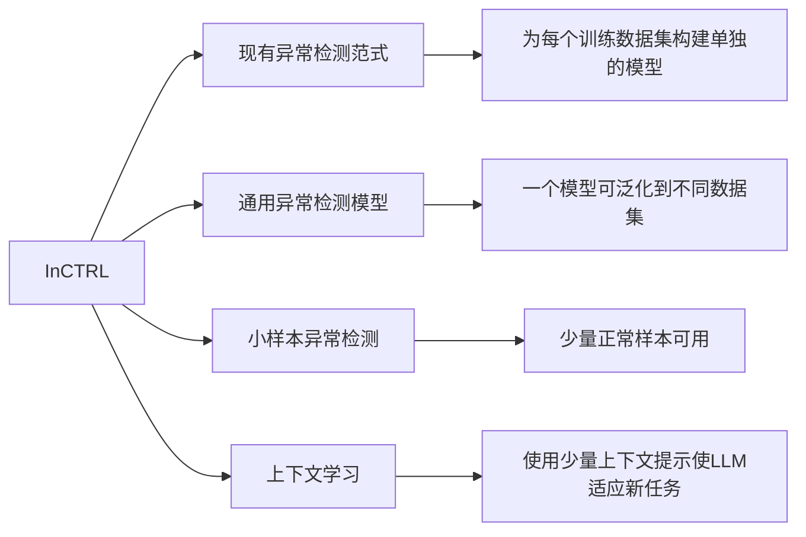

- Toward Generalist Anomaly Detection via In-context Residual Learning with Few-shot Sample Prompts
#### 术语对译
- In-Context Learning：上下文学习
- In-Context Prompts：上下文提示
#### 参考文献
[[A Survey on Visual Anomaly Detection]]

## 摘要 

本文探讨了通用异常检测（GAD）的问题，旨在训练一个单一的检测模型，该模型能够在不需要对目标数据进行进一步训练的情况下，泛化到不同应用领域的多样数据集中检测异常。一些最近的研究表明，像CLIP这样的大型预训练视觉语言模型（VLMs）在检测来自各种数据集的工业缺陷方面具有很强的泛化能力，但它们的方法严重依赖于关于缺陷的手工制作的文本提示，这使得它们难以推广到其他应用中的异常，例如，医学图像异常或自然图像中的语义异常。在这项工作中，我们提出使用少量正常图像作为样本提示动态地训练一个GAD模型。为此，我们引入了一种新颖的方法，该方法学习了一种上下文残差学习模型，称为InCTRL。它在辅助数据集上训练，以根据查询图像与少量正常样本提示之间的残差的整体评估来区分异常和正常样本。无论数据集如何，根据异常的定义，异常的残差预期比正常样本的残差要大，从而使InCTRL能够在不进行进一步训练的情况下在不同领域泛化。我们在九个AD数据集上进行了综合实验，建立了一个GAD基准，涵盖了工业缺陷异常、医学异常和语义异常的检测，在一对所有和多类别设置下，InCTRL表现最佳，并显著优于最先进的竞争方法。代码可在[https://github.com/mala-lab/InCTRL获取。](https://github.com/mala-lab/InCTRL%E8%8E%B7%E5%8F%96%E3%80%82)

## 引言 

异常检测（AD）是一项至关重要的计算机视觉任务，旨在检测与数据集中大部分样本明显不同的样本。由于其广泛的实际应用，如工业检测、医学图像分析和科学发现等，AD当前的范式侧重于在训练数据上单独构建模型，例如，目标数据集的无异常样本集，例如数据重建方法、一类分类和知识蒸馏方法。尽管这些方法在各种AD基准测试中显示出了显著的检测性能，但它们需要大量的训练数据和对每个数据集的检测模型的熟练训练。

因此，它们在目标数据集上不允许训练的应用场景中变得不可行，例如由于数据隐私问题，例如由于机器取消学习而使用这些数据在训练模型时产生的问题，或者在部署新应用程序时大规模训练数据不可用。

为了解决这些挑战，本文探讨了学习通用异常检测（GAD）模型的问题，旨在训练一个单一的检测模型，该模型能够在不同应用领域的多样数据集中检测到异常，而无需对目标数据进行训练。

由于预先在网络规模的图像文本数据上进行了训练，大型视觉语言模型（VLMs）如CLIP展示了近年来出色的泛化能力，实现了在不同数据集上的准确视觉识别，而无需在目标数据上进行任何微调或适应。更重要的是，一些最近的研究（例如WinCLIP）表明，这些VLMs也可以用于在不同的缺陷检测数据集上实现显著的泛化。

然而，这些模型的一个显著限制是它们依赖于一个大型的手工制作的与缺陷相关的提示集。这种依赖性限制了它们的适用性，使得将它们用于检测其他数据领域的异常变得具有挑战性，例如，医学图像异常或在一对所有或多类设置中的语义异常。

为了解决这个问题，我们提出了一种GAD模型，旨在利用任何目标数据集中的少量正常图像作为样本提示来支持即时的GAD，如图1（顶部）所示。少样本设置的动机在于在现实世界的应用中通常很容易获得少量正常图像。

此外，这些少量样本不用于模型训练/调整；它们只是在推断期间用作样本提示，以启用测试图像的异常评分。

这种表述与当前的少样本AD方法不同，这些方法使用这些目标样本及其广泛的增强版本来训练检测模型，这可能导致对目标数据集的过度拟合，并且无法泛化到其他数据集，如图1（底部）所示。

然后，我们引入了一种GAD方法，这是第一种根据CLIP学习上下文残差学习模型的方法，称为InCTRL。它训练了一个GAD模型，通过学习识别查询图像与辅助数据中的一组少量正常图像之间的残差/差异来区分异常和正常样本。

少量样本图像，即上下文样本提示，用作正常模式的原型。根据异常的定义，与这些正常模式的特征相比，在不同领域的数据集中通常会对异常样本期望更大的残差，因此学习的上下文残差模型可以泛化到检测不同类型的异常。

为了更好地捕捉残差，InCTRL在图像和补丁级别模拟上下文残差，获得了对构成异常的内容的深入上下文理解。

此外，我们的上下文残差学习还可以实现正常/异常文本提示引导的先验知识无缝地纳入检测模型，从而为从文本-图像对齐语义空间进行检测提供了额外的优势。

因此，我们做出以下主要贡献。 
• 我们引入了一个GAD任务，以评估AD方法在识别各种情景中的异常时的泛化能力，而无需对目标数据集进行训练/调整。据我们所知，这是首个致力于异常检测的通用方法的研究，涵盖了工业缺陷、医学异常和语义异常。 
• 然后，我们提出了一种针对GAD的上下文残差学习框架，称为InCTRL。它旨在通过检测测试图像和来自任何目标数据集的上下文少量正常样本提示之间的残差来区分异常和正常样本。InCTRL在辅助数据上进行了优化，以实现一模型适用于各种数据集的目标，而无需对目标数据进行任何训练。 
• 对九个不同的AD数据集进行了全面的实验，建立了一个GAD基准，涵盖了三种流行的AD任务类型，包括工业缺陷异常检测、医学图像异常检测以及在一对所有和多类设置下的语义异常检测。我们的结果表明，InCTRL明显优于最先进的竞争方法。

## 3. InCTRL：上下文残差学习 

### 3.1. 问题陈述 

GAD的目标是训练一个单一的AD模型，能够在来自不同应用领域的测试数据集上有效检测异常，而无需对目标数据进行任何训练。因此，假定训练集与测试集来自不同的分布。

形式上，设 $\mathcal{D}_{train} = \{X_{train}, Y_{train}\}$ 为一个辅助训练数据集，具有正常和异常类别标签，其中 $X_{train} = \{x_i\}^N_{i=1}$ 包含 $N$ 个正常和异常图像，$Y_{train} = \{y_i\}^N_{i=1}$，其中 $y_i = 0$ 表示正常，$y_i = 1$ 表示异常。给定一组测试集 $\mathcal{T} = \{\mathcal{D}^1_{test}, \mathcal{D}^2_{test}, \cdots, \mathcal{D}^M_{test}\}$，其中 $D^j_{test} = \{X^j_{test}, Y^j_{test}\}$，来自 $M$ 个不同应用领域的各种类型的异常。这些测试集来自与 $\mathcal{D}_{train}$ 不同的分布。然后，目标是训练一个通用的异常评分函数：$\mathcal{D}_{train} \to \mathbb{R}$，以便在任何测试数据集中将异常样本的异常评分分配得比正常样本高。

在具有少量正常样本的GAD上下文中，推断过程中会提供一小组少量从目标域中随机抽取的正常图像，记为 $\mathcal{P} = \{p_1, p_2, \cdots, p_K\}$，其中 $K$ 通常是一个小数字，例如 $K ≪ N$，但在训练通用检测模型期间，$\mathcal{P}$ 无法以任何方式获得。 

### 3.2. 我们方法InCTRL的概述 

我们的方法InCTRL旨在有效地建模查询图像与一组少量正常样本提示之间的上下文残差，利用CLIP的泛化能力来检测来自不同应用领域的异常的异常残差。CLIP是一个包含文本编码器ft(·)和视觉编码器fv(·)的VLM，通过在网络规模的文本-图像数据上进行预训练，这些编码器产生的图像和文本表示是对齐的。InCTRL通过在图像编码器上进行上下文残差学习来优化辅助数据Dtrain，通过文本编码器引导的先验知识增强了学习。 

具体而言，如图2所示，我们首先模拟一个包含一个查询图像 $x$ 和一组少量从辅助数据 $\mathcal{D}_{train}$ 中随机抽取的正常样本提示 $\mathcal{P}'$ 的上下文学习示例。然后，通过视觉编码器，我们进行多层面向补丁和图像的残差学习，分别捕捉查询图像与少量正常样本提示之间的局部和全局差异。此外，我们的模型允许根据文本提示嵌入与查询图像的相似性，无缝地将文本提示引导的正常和异常先验知识结合到模型中。InCTRL的训练是通过在视觉编码器附加几个投影/适应层来进行的，以学习在Dtrain中对异常样本比正常样本有更大的异常评分，同时保持两个编码器的原始参数不变；在推断过程中，一个测试图像，以及来自目标数据集的少量正常图像提示和文本提示，通过我们经过调整的基于CLIP的GAD网络，其输出是测试图像的异常评分。接下来我们详细介绍这些模块。

### 3.3. Multi-Layer Patch-Level Residual Learning

对于一个 training query image $x$，我们提取一系列 patch token embedding maps $\{T_x^l\}_{l=1}^n$ 和 $\{T_{x'}^l\}_{l=1}^n$，其中 $T_{(\cdot)}^l \in \mathbb{R}^{h\times w \times d}$，$x' \in \mathcal{P}'$，$h,w,d$分别是特征图 $T$ 的高、宽、通道数。

对于一个查询图像 $x$，其在 $l$ 层的 patch-level in-context residual map $\textbf{M}_x^l \in \mathbb{R}^{h\times w}$ 定义为：$$\textbf{M}_x^l(i,j) = 1 - \langle T_x^l (i,j), h(T_x^l (i,j)|\mathcal{P}')\rangle$$其中$h(T_x^l (i,j)|\mathcal{P}')$ 返回 $\mathcal{P}'$ 中所有 image tokens 中与 $T^l_x(i,j)$ 最接近的 patch token 的 embedding。

最终的 patch-level residual map $\textbf{M}_x \in \mathbb{R}^{h\times w}$ 定义为： $$\textbf{M}_x = \frac{1}{n} \sum^n_{l=1} \textbf{M}_x^l$$

### 3.6. Training and Inference

#### In-Context Residual Learning

查询图像 $x$ 的 holistic in-context residual map 定义为：$$\textbf{M}_x^+ = \textbf{M}_x \oplus s_i(x) \oplus s_a(x)$$

设 $\phi$ 是一个打分函数，$\Theta_\phi$ 是其参数，则最终的异常得分定义为：
$$s(x) = \phi(\textbf{M}^+ ; \Theta_\phi) + \alpha s_p (x)$$

最终，我们使用 $X_{train}$ 优化最终的异常得分 $s(x)$：
$$\mathcal{L}_h = \frac{1}{N} \sum_{x\in X_{train}} \mathcal{L}_b (s(x), y_x)$$
## 4. 实验 

### 4.1. 实验设置 

【数据集】为验证我们方法InCTRL的效率，我们在九个真实世界的AD数据集上进行了全面的实验，包括五个工业缺陷检测数据集（MVTec AD [7]，VisA [75]，AITEX [47]，ELPV [18]，SDD [48]），两个医学图像数据集（BrainMRI [43]，HeadCT [43]），以及两个语义异常检测数据集：MNIST [28] 和 CIFAR-10 [27] 在一个对全部和多类别的协议下[11, 42]。

在对全部和多类别的协议下，一个类别被用作正常，而其他类别被视为异常；而在多类别协议下，来自MNIST的偶数类别和来自CIFAR-10的与动物相关的类别被视为正常，而其他类别的图像被视为异常（更多细节请参见附录A）。

为了评估GAD的性能，我们将MVTec AD的训练集和测试集的组合用作辅助训练数据，GAD模型在这上面进行训练，并随后在其他八个数据集的测试集上进行评估，而无需进一步训练。

我们在评估MVTec AD的性能时，在VisA上训练模型。用于目标数据的少量正常提示是从目标数据集的训练集中随机抽取的，并对所有模型保持不变，以进行公平比较。

我们将性能评估设置为少量正常提示集的数量为K = 2、4、8。报告的结果是在三个具有不同随机种子的独立运行中进行平均的。 竞争方法和评估指标。由于我们的目标是实现一个通用的AD模型，比较焦点在具有类似通用检测能力的检测器上。

根据[25]，我们将InCTRL与三种传统的全量AD方法进行比较，包括SPADE [16]、PaDiM [17] 和PatchCore [41]，它们都通过根据少量正常样本进行距离-based异常评分来适应少量样本设置。我们还将其与最新技术（SotA）的传统少量AD方法RegAD [23] 和基于CLIP的方法WinCLIP [25] 进行比较。我们使用流行的提示学习方法CoOp [72] 作为额外的基准，与InCTRL一样，在辅助数据上进行训练后，它使用WinCLIP中的少量异常评分策略进行异常检测。 

至于评估指标，我们遵循先前的作品[11, 23, 25, 38, 41]，使用两个流行的指标AUROC（受试者工作特征曲线下的面积）和AUPRC（精确率-召回率曲线下的面积）来评估AD的性能。我们还评估了基于CLIP的方法的参数数量和每个图像推理时间，这些信息在我们的附录C.1中呈现。 

【实现细节】默认情况下，对于基于CLIP的模型，包括WinCLIP、CoOp和我们的InCTRL，我们在实验中采用相同的CLIP实现OpenCLIP [24]，以及其公共预训练的骨干ViT-B/16+。我们使用Adam作为优化器，默认情况下初始学习率设置为1e-3。在InCTRL中使用的文本提示与WinCLIP完全相同。为了使模型能够识别正常和异常对象，同时防止过度拟合，训练 epoch 设置为10，批量大小为48，在单个GPU（NVIDIA GeForce RTX 3090）上进行。SPADE、PaDiM 和 WinCLIP1 使用与InCTRL相同的图像提示以进行公平比较，PatchCore、RegAD 和 CoOp 的官方实现也是如此。更多细节请参见附录B。 

### 4.2. 主要结果 

表1和表2分别展示了InCTRL与六种SotA竞争方法在九个真实世界的AD数据集上的AUROC和AUPRC比较结果。请注意，对于MVTec AD、VisA以及MNIST和CIFAR-10的全部对一和多类别设置的结果代表了各自数据子集的平均结果（有关详细结果，请参见附录C）。下面我们详细分析这些结果。 

对工业缺陷的泛化能力。通常，对于五个工业缺陷AD数据集，InCTRL在几乎所有情况下都显著优于所有竞争模型，而且在三种少量样本设置下，所有方法的性能通常都会提高。具体而言，Patchcore的性能优于SPADE、PaDiM 和 RegAD，但所有这些方法在这些数据集上泛化能力都不佳。WinCLIP获得了相当好的泛化性能，并超越了Patchcore，这要归功于CLIP的卓越识别能力。由于上下文残差信息在数据集之间具有良好的可传递性，InCTRL表现出了卓越的性能，在具有挑战性的数据集（如ELPV和SDD）上特别是在这些数据集上，InCTRL模型分别比最佳竞争方法提高了11.3％、6.5％、3.7％的AUROC和6.4％、5.6％、6％的AUPRC。 

对医学图像异常的泛化能力。应用于医学图像AD数据集时，InCTRL在所有少量样本设置下一致优于SotA模型。显然，除了WinCLIP外，所有竞争方法的表现都不佳。令人印象深刻的是，仅使用两个正常图像提示，InCTRL在BrainMRI上可以获得超过97.3％的AUPRC，尽管它没有在医学数据上进行任何训练。平均而言，对于K = 2、4、8设置，InCTRL分别比最佳竞争模型提高了3.9％、3.4％、3.9％的AUROC和0.6％、1％、1％的AUPRC。 

在全对一和多类别设置下对语义异常的泛化能力。在检测语义异常时，InCTRL再次一致优于所有SotA模型。值得注意的是，InCTRL在之前的SotA方法只能获得50%-65% AUROC时，可以获得90%以上的AUROC，展示了非常有前景的GAD性能。值得注意的是，WinCLIP在CIFAR-10上获得了良好的性能。相反，CoOp的性能经历了显着下降，可能是在适应辅助数据时失去了关键的语义知识，该知识与语义AD任务显著不同。总的来说，我们的InCTRL在K = 2、4、8设置下分别比最佳竞争者提高了8.2％、5.1％、4.4％的AUROC和2.3％、1.9％、2.5％的AUPRC。