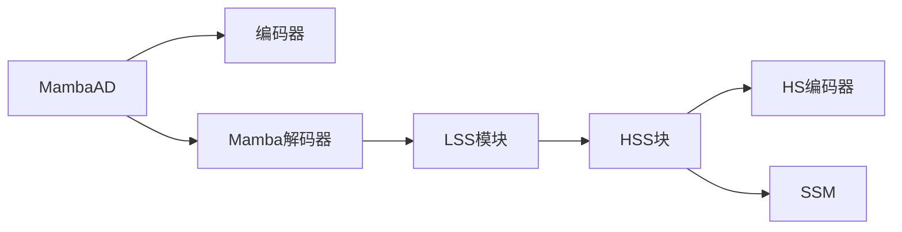

## 摘要

异常检测的最新进展已经证明了基于CNN和转换器的方法的有效性。然而，CNN在长期依赖性方面苦苦挣扎，而 Transformer 则受到二次计算复杂性的负担。基于曼巴的模型（Mamba-Based Models）凭借其卓越的远程建模和线性效率，引起了广泛关注。本研究开创了将 Mamba 应用于多类无监督异常检测的先河，提出了 MambaAD，它由一个预训练的编码器和一个 Mamba 解码器组成，具有多尺度的（局部增强状态空间）LSS 模块。所提出的LSS模块集成了并行级联（混合状态空间）HSS模块和多核卷积操作，可有效捕获远程和本地信息。HSS 模块利用（混合扫描）HS 编码器将特征图编码为五种扫描方法和八个方向，从而通过（状态空间模型）SSM 加强全球连接。希尔伯特扫描和八方向的使用显著改进了特征序列建模。对六个不同的异常检测数据集和七个指标的综合实验证明了最先进的性能，证实了该方法的有效性。代码和模型可在 https://lewandofskee.github.io/projects/MambaAD 上获得。

## 引言

智能制造的出现显著提高了工业视觉异常检测（AD）在生产过程中的重要性。该技术有望提高效率，降低人工检测成本，提高产品质量以及生产线的稳定性。目前，大多数方法主要使用**单类设置**（Single-Class Setting），其中**为每个类训练和测试一个单独的模型**，从而大大增加了训练和内存使用量。尽管最近在引入多类AD技术方面取得了进展，在准确性和效率权衡方面仍有很大的进步潜力。

目前的无监督异常检测算法大致可分为三种方法：基于嵌入，基于合成和基于重建。尽管基于合成和嵌入的方法在 AD 中都取得了可喜的结果，但这些方法通常需要广泛的设计和不灵活的框架。

**基于重建的方法（Reconstruction-Based Methods）**，如 RD4AD 和 UniAD，表现出卓越的性能和更好的可扩展性。RD4AD 采用预先训练的师生模型，**比较多尺度特征级别的异常**。虽然基于 CNN 的 RD4AD 可以有效地捕获本地上下文，但它缺乏建立长期依赖关系的能力。[[UniAD]] 是第一个多类 AD 算法，它依赖于**预训练的编码器和 transformer 解码器**架构。尽管 Transformer 具有卓越的全局建模能力，但**二次计算复杂性**会阻碍 UniAD 在最小的特征图上进行异常检测，这可能会影响其性能。

最近，Mamba 在大型语言模型中表现出卓越的性能，与 transformer 相比，**线性复杂度**显着降低，同时保持相当的有效性。最近的许多研究已将 Mamba 纳入视觉领域，引发了研究的热潮。本文率先将 Mamba 应用于异常检测领域，引入了 MambaAD。MambaAD 结合了全局和局部建模功能，利用其线性复杂性来计算跨多个尺度的**异常图（Anomaly Map）**。值得注意的是，它拥有较低的参数数量和计算需求，使其非常适合实际应用。

具体来说，MambaAD 采用金字塔结构的自动编码器来**重建**多尺度特征，利用**预训练的编码器和基于 Mamba 架构的新型解码器**。这种基于 Mamba 的解码器由不同规模和数量的局部增强状态空间（LSS）模块组成。每个 LSS 模块由两个组件组成：一系列用于全局信息捕获的混合状态空间（HSS）模块和用于建立本地连接的并行多核卷积操作。由此产生的输出特征将曼巴结构的全局建模能力与 CNN 的局部相关强度相结合。所提出的HSS模块研究了五种不同的扫描方法和八种扫描方向，（混合扫描）HS编码器和解码器分别将特征映射为各种扫描方法和方向的序列。HSS 模块增强了多个方向的全局感受野，并使用了希尔伯特扫描方法希尔伯特和希尔伯特 （1935);江等人（2014)特别适合集中工业产品的特点。通过计算和求和不同特征图尺度的异常图，MambaAD 在多个具有代表性的 AD 数据集上实现了 SoTA 性能，在图像和像素级别具有七个不同的指标，同时保持较低的模型参数计数和计算复杂性。我们的贡献如下：

- 我们介绍了 MambaAD，它创新地应用了 Mamba 框架来解决多类无监督异常检测任务。这种方法能够以最小的模型参数和计算复杂性实现多尺度训练和推理。
- 我们设计了一个局部增强状态空间（LSS）模块，该模块由基于Mamba的级联块和并行的多核卷积组成，提取了全局特征相关性和局部信息关联，实现了全局和局部模式的统一模型。
- 我们探索了一个混合状态空间（HSS）模块，包括五种方法和八种多向扫描，以增强各种类别和形态的复杂异常检测图像的全局建模能力。
- 我们展示了 MambaAD 在多类异常检测任务中的优越性和效率，在六个不同的 AD 数据集上实现了具有七个指标的 SoTA 结果，同时保持了极低的模型参数和计算复杂性。

## 相关工作

### 无监督异常检测

【无监督异常检测】现有的AD方法主要可以分为三种类型：

- 基于嵌入的方法专注于将RGB图像编码成多通道特征[32, 7, 3, 8, 6, 34]。这些方法通常使用在ImageNet上预训练的网络[9]。PatchCore [32]使用内存库提取正常的补丁特征以测量马氏距离。DifferNet [34]将潜在的多通道特征映射到多尺度的多元高斯分布上。[3]基于学生-教师框架，其中学生网络被训练来回归教师网络的输出，该网络是在自然图像补丁的大型数据集（例如ImageNet）上预先训练的。然而，用于这些预训练模型的数据集与工业图像相比存在显著的分布差异。
- 基于合成的方法在正常图像上合成异常[44, 20, 35, 16]。DREAM [44]中的伪异常是利用Perlin噪声和纹理图像生成的。DREAM将异常掩码作为输出，包括一个重建网络和一个判别网络。NSA [35]利用泊松图像编辑来通过混合来自不同图像的缩放补丁创建逼真的合成异常。尽管这些方法的性能还不错，但合成的异常与真实世界的异常仍然存在一定的差距。
- 基于重建的方法[8, 22, 47]通常专注于自我训练**编码器**和**解码器**来重建图像，减少对预训练模型的依赖。自编码器 [31]、Transformers [29]、生成对抗网络（GANs）[22, 42]和扩散模型 [14, 41] 可作为异常检测中重建网络的骨架。虽然模型的泛化有时可能会导致对异常区域的不准确定位。

【多类别异常检测】大多数当前的作品是在单独的类别上进行训练的，随着类别数量的增加，这导致了时间和内存消耗的增加，并且对于具有大量内类别差异的情况不太适合。最近，为了解决这些问题，多类别无监督异常检测（MUAD）方法引起了很多兴趣。UniAD [43]首次为异常检测制定了一个统一的重建框架。HVQ-Trans [27]利用向量量化框架，以防止学习“相同的快捷方式”。DiAD [14]研究了一种基于扩散模型的异常检测框架，引入了一个语义引导网络以确保重建图像语义的一致性。ViTAD [46]进一步探讨了普通Vision Transformer（ViT）在多类别异常检测上的有效性。

## 方法

### MambaAD

MambaAD框架被提出用于多类异常检测。它由三个主要组件组成：
- 一个基于 CNN 的预训练编码器
- 一个 Half-FPN 瓶颈
- 一个基于 Mamba 的解码器

在训练过程中，编码器提取三种不同比例的特征图，并将其输入到 H-FPN 瓶颈进行融合。然后将熔断输出馈入 Mamba 解码器，深度配置为 $[3,4,6,3]$。**最终损失函数**是在三个尺度上跨**特征图**计算的**均方误差 （MSE）** 的总和。在 **Mamba 解码器**中，我们引入了局部增强状态空间 （LSS） 模块。LSS 可以配置不同的阶段 � 我 ，其中每个阶段表示数字 � 模块内的混合状态空间 （HSS） 块。在这个实验中，我们使用 LSS � 我 = 3 和 � 我 = 2 作为主要模块。LSS 模块处理输入 � 我 通过捕获全局信息的 HSS 模块和捕获局部信息的两种不同尺度的深度卷积层。通过串联和卷积操作恢复原始输入特征维度。拟议的HSS模块具有混合扫描（HS）编码器和HS解码器，可容纳五种不同的扫描方法和八种扫描方向。

### 局部增强状态空间模块

Transformer 在全局建模和捕捉长距离依赖方面表现出色，但在处理高分辨率特征时往往忽视局部语义信息，并且在计算复杂度方面表现出较高的复杂性。相反，CNNs通过从相邻位置捕获信息有效地建模局部语义，但缺乏长距离建模能力。为了解决这些限制，我们提出了图2（b）中的LSS模块，该模块结合了基于Mamba的级联HSS块用于全局建模和并行多核深度卷积操作用于捕获局部信息。

具体而言，对于**输入特征** $X_i \in \mathbb{R}^{H\times W\times C}$，**全局特征** $G_i \in \mathbb{R}^{H\times W \times C}$ 进入 HSS 块，而**局部特征** $L_i \in \mathbb{R}^{H\times W\times C}$ 通过卷积网络进行处理。全局特征Gi经过一系列N个HSS块以获得全局信息特征Go。 Go = HSSn(...(HSS2(HSS1(Gi)))), (5)其中n∈N是HSS块的数量。在本研究中，我们主要使用N = 2和N = 3，并在第4.3节中提出了进一步的消融实验。局部特征Li由两个并行深度卷积块处理，每个块包括一个1×1卷积块，一个k×k深度卷积块和另一个1×1卷积块。 Lm = ConvB1×1(DWConvBk×k(ConvB1×1(Li)), (6)其中k是深度卷积的内核大小。在这个实验中使用k = 5和k = 7，并在第4.3节中进行了进一步的消融实验。每个卷积模块包括一个卷积2D层，一个实例规范化2D规范化层，以及一个SiLU激活函数，如图2（d）所示。局部和全局特征通过在通道维度上进行串联来聚合。该块的**最终输出** $X_o$ 通过 1×1 2D 卷积，从而使其通道数与**输入特征** $X_i$ 的通道数保持一致，并带有一个残差连接。 Xo = Conv2D1×1(Concat(Go, Lk5 , Lk7 )) + Xi

### 混合状态空间块

#### 混合扫描方向

本研究支持八种基于希尔伯特的扫描方向，遵循先前扫描方向的设置：
- （i）正向，
- （ii）反向，
- （iii）宽度-高度
- （wh）正向，
- （iv）wh反向，
- （v）旋转90度正向，
- （vi）旋转90度反向，
- （vii）wh旋转90度正向，和
- （viii）wh旋转90度反向。

多种扫描方向增强了特征序列的编码和建模能力，使其能够处理各种类型的异常特征，进一步消融见第4.3节。HS编码器旨在根据不同的扫描方法和方向结合和编码输入特征，然后将其馈送到SSM以增强特征向量的全局建模能力。然后，HS解码器将由SSM输出的特征向量解码回原始输入特征的方向，并通过求和获得最终输出。
## 实验

### 设置：数据集、指标和详细信息

#### 实现细节

所有输入图像的大小都调整为统一大小 256×256 无需额外的增强以保持一致性。预训练的 ResNet34 充当特征提取器，而与 ResNet34 具有等效深度 [3,4,6,3] 的 Mamba 解码器充当训练的学生模型。在 Mamba 解码器中，第二个 LSS 模块中的级联 HSS 块数设置为 2，而所有其他 LSS 模块都使用 3 个级联 HSS 块。该实验采用希尔伯特扫描技术，利用八个不同的扫描方向。AdamW 优化器的学习率0.005衰减率$1 \times 10^{−4}$。该模型在单个 NVIDIA TESLA V100 32GB GPU 上进行了 500 个 epoch 的多类设置训练期。在训练过程中，不同尺度的 MSE 总和被用作**损失函数**。在测试阶段，将不同尺度的余弦相似度之和用作**异常图（Anomaly Map）**。