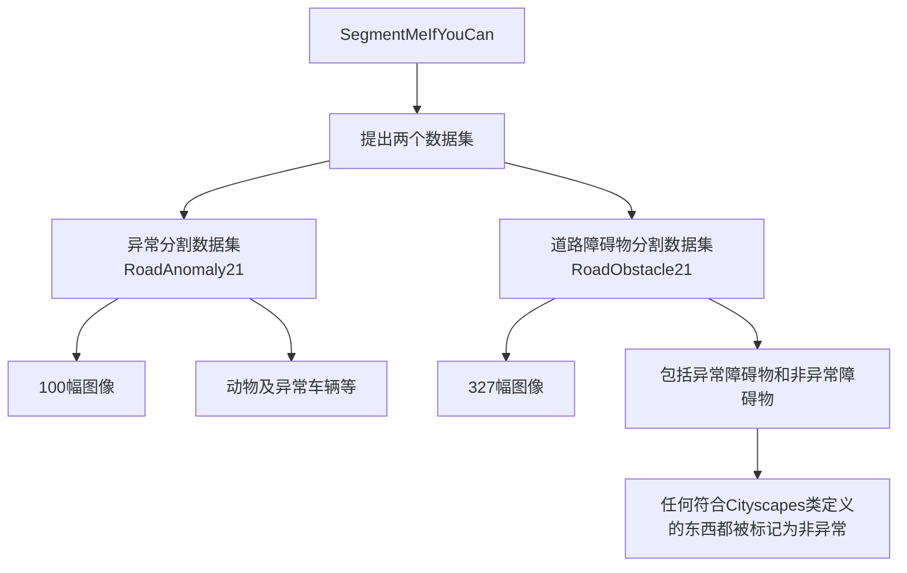

## 摘要

目前最先进的语义分割或实例分割深度神经网络（DNNs）通常是在一组封闭的语义类别上进行训练的。因此，它们无法处理以前未见过的对象。然而，检测和定位这些对象对于诸如自动驾驶感知之类的安全关键应用至关重要，特别是如果它们出现在前方道路上。虽然一些方法已经解决了异常或分布之外的对象分割任务，但进展仍然缓慢，主要是由于缺乏可靠的基准；现有数据集要么由合成数据组成，要么受到标签不一致性的影响。在本文中，我们通过引入“SegmentMeIfYouCan”基准来弥补这一差距。我们的基准解决了两个任务：异常对象分割（anomalous object segmentation），考虑任何以前未见过的对象类别；和道路障碍物分割（road obstacle segmentation），专注于道路上的任何对象，无论是已知的还是未知的。我们提供了两个相应的数据集，以及一个进行深入方法分析的测试套件，考虑到既有的像素级性能指标和最近的组件级性能指标，后者对对象大小不敏感。我们在我们的数据集上以及在公共数据集上对多种最先进的基准方法进行了实证评估，包括几种专门用于异常/障碍物分割的模型，使用我们的测试套件。异常和障碍物分割结果表明，我们的数据集增加了数据景观的多样性和难度。

## 1 引言

高质量的公开可用数据集的出现，例如Cityscapes [1]，BDD100k [2]，A2D2 [3]和COCO [4]，极大地促进了语义分割的进展。然而，虽然最先进的深度神经网络（DNNs）在这些数据集上取得了出色的表现，但它们通常对一组封闭的语义类别提供预测。因此，它们无法将一个对象分类为已知类别之外的类别。相反，即使在出现以前未见过的对象时，它们往往对其预测过于自信，这阻碍了使用不确定性来识别相应的异常区域。

然而，在存在未知对象的情况下的可靠性对于那些不得不面对现实世界多样性的应用的成功至关重要，例如自动驾驶中的感知。这促使了Fishyscapes [7]或CAOS [8]等基准的创建。虽然这些基准使得有趣的实验成为可能，但是Fishyscapes中有限的现实世界多样性，CAOS中公共排行榜和基准套件的缺乏，以及在这两个基准中对合成图像的依赖，阻碍了对最先进方法的适当评估和比较。

在本文中，受现有异常分割数据集的局限以及这个方向上新出现的作品的启发 [7, 9, 10, 11, 12, 13, 14, 15, 16]，我们引入了SegmentMeIfYouCan2基准。它配备有两个数据集，包含各种多样的手动注释的真实图像，一个公开的排行榜和一个评估套件，提供了深入的分析和比较，以促进道路异常分割方法的发展。

我们的基准涵盖了两个单独的任务。第一个任务包括严格的异常分割，其中任何以前未见过的对象都被视为异常。此外，受到已知和未知类别之间边界有时可能模糊的观察的启发，例如对于汽车与货车，我们引入了障碍物分割任务，其目标是识别道路上的所有对象，无论它们来自已知类别还是未知类别。

对于异常异常分割，我们提供了一个包含100个图像的数据集，其像素级别的注释分为两个类别（异常，非异常）和一个空类别，类似于Cityscapes，该类别标记了从评估中排除的像素。我们将任何严格不能在Cityscapes数据中看到的对象都视为异常，可以出现在图像的任何地方。

对于障碍物分割，我们的数据集包含327张图像，具有类似的注释（障碍物，非障碍物，空），并且仅关注道路作为感兴趣区域。这个跟踪的重点更加实用，例如用于自动驾驶系统，针对可能导致危险街道情况的障碍物，参见图1。我们的数据集的所有图像都可以公开下载，配备了一个基准套件，可以计算已建立的像素级指标和最近的组件级指标。

在本文的其余部分，我们首先详细回顾了现有的异常检测数据集、方法和评估指标。然后，我们描述了我们的新基准，并在我们的数据集和其他相关数据集上对最先进的道路异常/障碍物分割方法进行了广泛的实验，显示了这些方法在提出的基准上的困难程度。

## 相关工作

在本节中，我们首先回顾了先前用于异常检测的数据集，其中一些设计用于道路异常分割。然后我们简要描述了一些关于异常和障碍物分割的方法。

### 2.1 数据集和基准

现有的异常检测方法通常被评估其分离来自两个不同来源分布的图像的能力，例如分离MNIST和FashionMNIST [17, 18, 19]，NotMNIST [19]，或Omniglot [20]，以及分离CIFAR-10和SVHN [18, 19, 21]或LSUN [18, 21, 22]。这样的实验可以在许多作品中找到，包括[17, 18, 19, 21, 22, 23]。

存在异常数据集的主要属性（前三行）和障碍物数据集（后三行）的主要属性如表1所示。我们的主要贡献在于异常类别和场景的多样性。

在RoadAnomaly21中，异常可能出现在图像的任何地方，这与Fishyscapes LostAndFound [7]和CAOS BDD-Anomaly [8]相似。尽管后两个数据集更大，但它们的图像只显示有限多样性的异常类型和场景，因为它们通常是从单个场景的视频中抽取的帧。相反，在我们的数据集中，每个图像都显示一个独特的场景，至少有一个26种不同类型的异常对象之一，而且每个样本在大小上都有很大差异，范围从图像的0.5%到40%。

在RoadObstacle21中，所有异常（或障碍物）都出现在道路上，使得该数据集与LostAndFound [25]和LiDAR引导的Small Obstacle数据集 [26]可比。同样，后两个数据集包含的图像比我们的更多，但是高数量的图像是由于从视频中密集采样帧。因此，这两个数据集在对象多样性上缺乏（分别为9和6个类别，而我们的数据集为31个）。此外，这些视频是在完美的天气条件下录制的，而RoadObstacle21显示了各种情况下的场景，包括夜晚、脏路和雪天。

### 2.2 异常和障碍物分割

异常检测最初是在图像分类的背景下解决的，通过开发后处理技术来调整分类DNN生成的置信值 [6, 18, 21, 22, 23]。尽管最初设计用于图像级别的异常检测，但大多数这些方法可以很容易地适应异常分割 [7, 9]，方法是将图像中的每个像素视为潜在异常。

另一种相关方法是估计预测的不确定性，利用这样的直觉：异常图像区域应该与高不确定性相关。其中一种做法是贝叶斯（深度）学习 [27, 28]，其中将模型参数视为分布。由于计算复杂性，已经开发了贝叶斯推断的近似方法 [29, 30, 31, 32]，并将其扩展到语义分割 [33, 34, 35]。除了推理不确定性之外，其他非贝叶斯方法通过修改其架构或利用额外数据来调整先前训练过的模型以执行异常检测的任务。例如，在[36]中，通过向DNN添加单独的分支来学习异常分数。除了修改DNN的架构之外，其他方法 [18, 37] 在训练过程中通过使用与实际训练数据集不重叠的辅助“离群”（OoD）数据集来进行异常检测。这些想法已经在[11, 13, 38]中用于异常分割。

最近的一系列工作通过生成模型来进行异常分割，这些模型重建/重新合成原始输入图像。直觉是重建图像将更好地保留包含已知对象的区域的外观，而不是那些具有未知对象的区域。然后通过识别原始图像与重建图像之间的差异来执行像素级别的异常检测。这种方法不仅用于异常分割 [14, 39, 40]，而且特别用于道路障碍物检测 [41, 42, 43]。

值得注意的是，还有一些具有不同异常分割定义的相关工作。例如，[44]评估工业生产异常（如划痕）的分割，而在医学背景中，异常分割可以理解为检测例如断层扫描图像 [45]或脑部MRI [46]上的疾病部分。我们下一节将详细讨论我们所定义的异常分割。

## 基准描述

我们的基准旨在达到两个目标。一方面，通过提供具有一致标注的多样化数据，我们旨在促进普通语义异常分割研究的进展。另一方面，通过专注于道路场景，我们期望我们的基准能加速实现对于安全自动驾驶所需的分割/障碍物检测方法的进展。

为实现这些目标，我们的基准涵盖了两项任务。首先，它解决了异常分割的一般问题，旨在识别图像中包含从未在训练过程中见过的对象类别的区域，因此语义分割可能不正确。这对于任何可靠的决策过程都是必要的，对于许多计算机视觉应用都至关重要。需要注意的是，根据[7, 8]，我们将异常定义为不符合训练数据中任何类别定义的对象。在一些工作中，异常可能被用来描述视觉上不同的输入，例如，颜色不同的汽车，这不符合我们的定义。这种对语义异常的严格定义有时可能是不确定的，因为（i）现有的语义分割数据集，如Cityscapes [1]，通常包含模糊和被忽略的区域（标记为void），它们不严格地是异常，因为它们在训练过程中是可见的；（ii）某些类别的边界是模糊的，例如，汽车vs货车vs人力车，使得某些区域是否应该被视为异常变得不清楚。为了解决这些问题，并考虑到自动驾驶系统需要确保前方道路上没有任何危险物体，我们进一步将障碍物分割作为我们基准的第二个任务，其目标是识别道路上的任何不可驾驶区域，无论不可驾驶区域是否对应于已知对象类别还是未知对象类别。

### 3.1 基准轨道和数据集

我们现在介绍我们基准中的两个轨道，对应于上面讨论的两个任务。每个轨道都包含具有不同属性的自己的数据集，并因此在我们的基准套件中单独进行评估。我们的数据集与相关的公共数据集进行了概述比较，如表1所示。

【RoadAnomaly21】该道路异常轨道在完整的街景中对一般异常分割进行基准测试。它包括一个具有像素级注释的100个图像的评估数据集。数据是在[14]中介绍的数据的扩展，现在包括更广泛的图像集合和更细粒度的标注。特别是，我们删除了质量低的图像和缺乏清晰道路场景的图像。此外，我们删除了标签错误，添加了void类，并包含了68个新收集的图像。每个图像至少包含一个异常对象，例如，动物或未知车辆。这些异常可以出现在图像的任何位置，它们是从网络资源中收集的，因此描绘了各种环境。对象的大小和位置分布如图2(a)所示。此外，我们提供了10个附加图像及其注释，以便用户可以检查他们的方法与我们的基准实现的兼容性。

【RoadObstacle21】道路障碍轨道专注于自动驾驶的安全性。评估数据中要分割的对象始终出现在前方道路上，即它们代表了需要检测的现实和危险的障碍物。我们的数据集包括我们自己拍摄的222张新图像和[42]中的105张图像，总共有327张具有像素级注释的评估图像。这些图像的感兴趣区域是道路，假定它属于算法训练过的已知类别。该数据集中的障碍物被选择为它们也都可以被理解为异常对象，例如填充玩具、雪橇或树桩。它们以不同的距离（每个图像一个距离）出现，并被道路像素包围。这使我们可以将评估重点放在障碍物上，因为其他对象位于感兴趣区域之外。对象的大小和位置分布如图2(b)所示。此外，该数据集包含不同的道路表面、光照和天气条件，因此涵盖了各种场景的广泛多样性。还提供了额外的85个图像轨道，场景包括夜间和极端天气，如暴风雪。但是，由于显著的领域转移，后一个子集被排除在我们的数值实验之外。最后，我们提供了30个附加图像及其注释，以便用户可以检查他们的方法与我们的基准实现的兼容性。

标注策略。在两个数据集中，像素级注释包括三个类别：1）异常/障碍物，2）非异常/非障碍物，和3）void。

在RoadAnomaly21中，大多数语义分割DNN所训练的19个Cityscapes评估类别[1]作为判断对象是否被认为是异常的基础。因此，任何符合Cityscapes类定义的东西都被标记为非异常。这个轨道侧重于检测与Cityscapes训练数据中的对象语义不同的对象。因此，如果图像区域无法清晰地分配到任何Cityscapes类别，则将其标记为异常。在街景背景的上下文中，不是主要异常对象的对象被标记为void，并且从我们的评估中排除。后者类别包括图像背景中的山或水，以及街灯等。在模糊的情况下，例如由于与Cityscapes的强领域转移，我们也将void类分配给以正确评估语义异常分割。

在RoadObstacle21中，该任务被定义为区分可驾驶区域和不可驾驶区域。目标是确保车辆前方的道路没有任何危险，无论潜在障碍物的对象类别如何。因此，可驾驶区域被标记为非障碍物。此类特别还包括与其余道路视觉上不同的区域。此外，所有在道路外的图像区域都分配给void类，并在评估中被忽略。

作为质量评估，每个标记的图像都至少由三个人审查，以保证标签的最高质量。

### 3.2 性能度量

为了简洁起见，接下来我们将异常和障碍物都称为异常。像素级别。让Z表示图像像素位置的集合。一个具有二元分类器的模型提供图像x ∈ X（来自数据集X ⊆ [0, 1]N×|Z|×3的N个图像）的异常分数s(x) ∈ R|Z|。它区分异常和非异常两个类别。我们通过精度-召回曲线下面积（AuPRC）评估像素级别异常分数的可分离性，其中精度和召回被视为对s(x) ∀x ∈ X应用某个阈值δ ∈ R的函数。AuPRC强调检测少数类别，因此特别适合作为我们主要的像素级别评估指标，因为RoadAnomaly21和RoadObstacle21的像素级别类别分布相当不平衡，参见表1。为了考虑安全的观点，我们还在评估中包括了在95%真正例率（TPR）下的假正例率（FPR95）。FPR95指示必须进行多少虚警预测才能达到所需的真正例率。需要注意的是，任何预测如果包含在void类的地面真实标记区域内，则不计为假阳性，参见3.1节。特别是对于RoadObstacle21数据集，评估因此限制在道路区域内。

组件级别。从实践者的角度来看，非常重要的是检测场景中的所有异常区域，无论其大小（即，它们覆盖的像素数量）如何。但是，像素级别的指标可能会忽略小的异常。虽然可以关注对象检测指标，但事实上个别对象的概念对于异常（区域）检测来说并不相关。为了满足这些要求，我们因此考虑在组件级别进行的性能指标。 组件级别评估的主要指标是真正例（TP）、假负例（FN）和假正例（FP）的数量。将异常作为正类时，我们使用组件级别的定位和分类质量度量来定义TP、FN和FP组件。具体来说，我们将这个度量定义为组件级别交并比（sIoU）的调整版本，该度量在[47]中引入。特别是，在[47]中，sIoU是针对预测组件计算的，我们考虑sIoU以计算TP和FN的地面真实组件。为计算FP，我们使用预测组件的阳性预测值（PPV，或组件级别精度）作为质量度量。我们将在下面更详细地讨论这些量的定义。

让Zc表示数据集X中标记为类别c = “异常”的像素位置的集合。我们将具有相同类别标签的像素连接组件（其中取图像x ∈ X中像素z周围8个像素为其邻居）视为一个组件。然后，让K ⊆ P(Zc)表示根据地面真实标签的异常组件的集合，通过K ⊆ Pˆ(Zc)表示由某个机器学习模型预测为异常的组件的集合。形式上，sIoU是一个映射sIoU：K → [0, 1]。对于k ∈ K，它定义为 ...

### 3.3 评估方法

已经在我们的基准上评估了几种异常分割方法，并构成了我们的初始排行榜。我们对每种类型讨论的方法进行了至少一次评估，具体包括

- 来自图像分类的方法：最大softmax概率[23]、ODIN [22]、马哈拉诺比斯距离[21]；
- 贝叶斯模型不确定性：蒙特卡洛（MC）dropout [35]、集成 [32]；
- 学习识别异常：学习的嵌入密度[7]、void分类器[7]、最大化的softmax熵[11]；
- 通过生成模型的重建：图像重构[14]、SynBoost [39]和道路修补（仅限障碍轨道）[42]。

所有方法都有一个基础的语义分割DNN，训练在Cityscapes上，并提供像素级别的异常分数。Cityscapes上训练的语义分割DNN也是我们推荐的基础模型，但是我们将使用哪个网络和训练数据留给参与者决定。此外，一些评估方法还额外使用超出分布范围（OoD）数据来调整异常检测器。对于我们的一组方法来说，这可能是任何具有与Cityscapes训练类别语义不同的标签的数据。还允许使用OoD数据来减轻潜在的领域转移的影响。有关方法的更多详细信息，请参阅附录D。

## D 评估方法

在本节中，我们首先简要介绍了在我们的基准测试中评估的方法，并构成我们的初始排行榜。随后，我们还会对这些介绍的方法提供技术细节。

### D.1 方法的简要描述

以下所有评估方法都以粗体形式列出。我们至少评估了第 2.2 节讨论的每种类型中的一种方法。所有方法都有一个基于 Cityscapes 数据集训练的语义分割 DNN，并且它们都提供逐像素的异常分数。

对于给定的输入图像，DNN 相应输出的最大 softmax 概率（MSP）是图像级 OoD 检测中常用的基线之一。将小扰动添加到输入图像的每个像素，并应用温度缩放，可以增强 MSP 的异常检测能力。后一方法被称为 ODIN。另一种着名的方法基于马氏距离来检测异常。它通过估计 DNN 倒数第二层的潜在特征的高斯分布来计算，从而得出了关于测试样本相对于训练数据分布的估计的可能性。所有这些方法最初设计用于图像分类，但可以直接调整用于分割，并在我们的基准测试中作为良好的基线。

作为对不确定性估计的贝叶斯方法，我们在评估中使用了蒙特卡罗（MC）dropout。MC dropout 已经被用于语义分割的不确定性估计。我们遵循 [35] 并使用互信息作为逐像素的异常分数，这捕捉了 DNN 的认知不确定性。此外，我们还额外评估了一组语义分割网络的集成。

在 [7] 中提出了几种学习异常存在的置信度的方法。学习的嵌入密度旨在通过标准化流近似于 DNN 中特征嵌入的分布。在测试时，对于图像的每个嵌入表示，负对数似然度度量了测试嵌入与训练嵌入之间的差异，其中高差异表明异常。然后，通过双线性插值对这些分数进行上采样以获得逐像素的异常分数。或者，可以修改分割 DNN 来学习异常存在的置信度，需要一个 OoD 数据集。与 [7] 类似，使用 Cityscapes DNN 训练一个额外的模型输出用于 Cityscapes 的 void 类别。因此，异常分数是该类别的 softmax 分数，因此此方法称为 void 分类器。此外，还可以重新训练具有不同 OoD 代理（例如 COCO 数据集）的 DNN，并在 OoD 代理的样本上强制最大化 softmax 熵。所有这些方法调整了先前训练过的 DNN 以执行异常分割任务，并包含在我们的评估中。

作为我们评估中的自编码器，我们采用图像再合成以及一个根据 DNN 分割掩模提供的信息、再合成的输入图像和原始图像本身提取有意义差异的差异网络。这种方法可以通过在差异模块中包含不确定性估计来扩展，旨在提高异常分割性能，称为 SynBoost。一种专门设计用于障碍物分割的方法称为道路修补 [42]。这种方法以滑动窗口方式修补道路块。然后将生成的合成图像再次提供给差异网络，与 [14] 中类似，用于逐像素的障碍物分数。