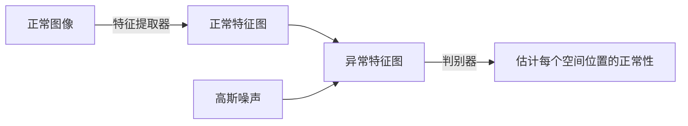

![[SimpleNet.pdf]]

## 摘要

我们提出了一种简单且适用的网络（称为SimpleNet），用于检测和定位异常。SimpleNet由四个组件组成：
- （1）一个预训练的特征提取器，生成局部特征，
- （2）一个浅层特征适配器，将局部特征转移到目标域，
- （3）一个简单的异常特征生成器，通过向正常特征添加高斯噪声来**伪造异常特征**，以及
- （4）一个二值化的异常鉴别器，区分异常特征和正常特征。

在推理过程中，异常特征生成器将被丢弃。我们的方法基于三个直觉。首先，将预训练特征转换为目标导向特征有助于避免领域偏差。其次，在特征空间生成合成异常更有效，因为缺陷在图像空间可能没有太多共性。第三，一个简单的鉴别器更加高效和实用。尽管简单，SimpleNet在定量和定性上都优于先前的方法。在MVTec AD基准测试中，SimpleNet实现了99.6%的异常检测AUROC，与次优模型相比，错误率降低了55.5%。此外，SimpleNet比现有方法更快，在3080ti GPU上的帧率高达77 FPS。此外，SimpleNet在单类新颖性检测任务的性能上显示出显著改进。代码：[https://github.com/DonaldRR/SimpleNet。](https://github.com/DonaldRR/SimpleNet%E3%80%82)

## 引言

图像异常检测和定位任务旨在识别异常图像并定位异常子区域。对感兴趣的各种异常进行检测的技术在工业检验中具有广泛的应用[3, 6]。在工业场景中，异常检测和定位尤其困难，因为异常样本稀缺，异常可能从细微的变化（如细小划痕）到大型结构缺陷（如缺失零件）各种各样。MVTec AD基准测试[3]中的一些示例以及我们提出的方法的结果如图1所示。这种情况限制了监督方法的应用。目前的方法以无监督方式解决这个问题，在训练过程中仅使用正常样本。基于重建的方法[10, 21, 31]、基于合成的方法[17, 30]和基于嵌入的方法[6, 22, 24]是解决这个问题的三个主要趋势。
- **基于重建的方法**（如[21,31]）假设只使用正常数据训练的深度网络无法准确重建异常区域。像素级重建误差被视为异常定位的异常分数。然而，这种假设并不总是成立，有时网络可以"泛化"得很好，以至于它也能很好地重建异常输入，导致误检[10, 19]。
- 基于合成的方法[17, 30]通过**在无异常图像上生成合成异常**来估计正常和异常之间的决策边界。然而，合成的图像不够真实。来自合成数据的特征可能偏离正常特征，使用这样的负样本进行训练可能导致正常特征空间边界松散，意味着模糊的缺陷可能被包含在分布特征空间中。
- 最近，基于嵌入的方法[6, 7, 22, 24]实现了最先进的性能。这些方法使用ImageNet预训练的卷积神经网络（CNN）提取广义的正常特征。然后，采用统计算法（如多元高斯分布[6]、正规流[24]和记忆库[22]）来嵌入正常特征分布。通过将输入特征与学习的分布或记忆的特征进行比较，检测异常。然而，工业图像通常具有与ImageNet不同的分布。直接使用这些有偏的特征可能会导致匹配问题。此外，统计算法总是受到高计算复杂性或高内存消耗的困扰。

【提出本文方法】为了减轻上述问题，我们提出了一种新颖的异常检测和定位网络，称为 SimpleNet。**SimpleNet 利用了基于合成和基于嵌入的方式**，并进行了几项改进。
- 首先，我们建议使用特征适配器产生目标导向特征，而不是直接使用预训练特征，从而减少域偏差。
- 其次，我们建议**在特征空间中向正常特征添加噪声来生成异常特征，而不是直接在图像上合成异常**。我们认为，通过适当校准噪声的尺度，可以获得一个紧密边界的正常特征空间。
- 第三，我们通过训练一个简单的鉴别器简化了异常检测过程，这比前述基于嵌入的方法采用的复杂统计算法要更具计算效率。

具体地，SimpleNet利用预训练的主干网络进行正常特征提取，然后使用特征适配器将特征转移到目标域。然后，异常特征通过将高斯噪声添加到适应的正常特征中简单生成。由几层MLP组成的简单鉴别器在这些特征上进行训练以区分异常。SimpleNet易于训练和应用，性能和推理速度突出。

【性能】基于广泛使用的WideResnet50主干，提出的SimpleNet在MVTec AD上实现了99.6%的AUROC，同时以77 fps运行，超过了先前发布的最佳异常检测方法，无论是在准确性还是效率上，见图2。我们进一步将SimpleNet引入到单类新颖性检测任务中，以展示其通用性。这些优势使SimpleNet弥合了学术研究和工业应用之间的差距。代码将公开提供。

## 方法

### 3.4. Discriminator

鉴别器 Dψ 作为一个正常性评分器，直接估计每个位置 $(h, w)$ 处的正常性。由于负样本与正常特征 {qi | xi ∈ Xtrain} 一起生成，它们在训练期间都被馈送给鉴别器。鉴别器期望对正常特征输出正值，对异常特征输出负值。我们简单地使用一个2层多层感知器（MLP）结构，正如常见的分类器所做的，将正常性估计为 Dψ(qh,w) ∈ R。

## 实验

### 评估指标

图像级别的异常检测性能通过标准的接收者操作特征曲线下面积来衡量，我们将其表示为**I-AUROC**，使用生成的异常检测分数SAD（方程11）。对于异常定位，使用异常图SAL（方程10）进行**像素级AUROC**（表示为**P-AUROC**）的评估。根据之前的工作[6, 22]，我们在MVTec AD上计算了类别平均AUROC以及检测和定位的整体平均AUROC。比较基线包括AE-SSIM [3]，RIAD [31]，DRÆM [30]，CutPaste [17]，CS-Flow [24]，PaDiM [6]，RevDist [7] 和PatchCore [22]。

### Anomaly detection on MVTec AD

在MVTec AD上的异常检测结果如表1所示。**图像级别的异常分数**由异常图的最大分数给出，如方程11所示。SimpleNet在15个类别中有9个类别的得分最高。对于纹理和物体，SimpleNet分别达到了99.8%和99.5%的I-AUROC的新SOTA。SimpleNet实现了显著更高的平均图像异常检测性能，即**99.6%的I-AUROC分数**。请注意，从PatchCore [22]（相同的WideResnet50主干下的次优竞争者）的0.9%错误减少到SimpleNet的0.4%意味着错误减少了55.5%。在工业检验环境中，这是一个相关且显著的降低。

### Anomaly localization on MVTec AD

异常定位性能通过像素级AUROC进行衡量，我们将其标记为**P-AUROC**。与最先进方法的比较结果如表1所示。SimpleNet在MVTec AD上实现了最佳的异常检测性能，**像素级AUROC达到了98.1%**，同时在物体类别上达到了新的98.4%的P-AUROC的SOTA。SimpleNet在15个类别中有4个类别的得分最高。我们在图8中展示了异常定位的代表性样本。![[异常检测/Untitled Diagram.svg]]