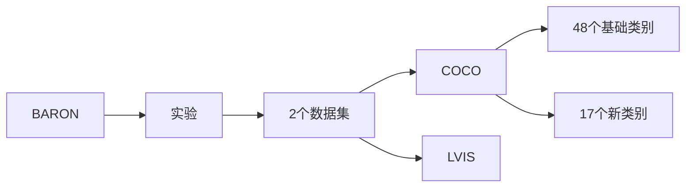

## 实验

【数据集】我们在两个流行的目标检测数据集上评估我们的方法，即COCO [33] 和LVIS [17]。对于COCO数据集，我们按照OV-RCNN [56] 的方法将对象类别分为48个基础类别和17个新类别。对于LVIS数据集，我们按照ViLD [16] 的方法将337个罕见类别分为新类别，将其余的常见和频繁类别分为基础类别。简便起见，我们将基于COCO和LVIS的开放词汇基准称为OV-COCO和OV-LVIS。

【评估指标】我们评估基础类别和新类别的检测性能以确保完整性。对于OV-COCO，我们按照OV-RCNN [56] 的方法在IoU阈值为0.5时报告盒子AP，标记为AP50。对于OV-LVIS，我们报告在IoU从0.5到0.95范围内平均的掩码和盒子AP，标记为mAP。新类别的AP50（APnovel50）和罕见类别的mAP（APr）是评估OV-COCO和OV-LVIS上开放词汇检测性能的主要指标。

实现细节。我们基于Faster R-CNN [44] 和ResNet50-FPN [31] 构建BARON。为了与现有方法进行公平比较，我们使用由SOCO [51] 预训练的骨干网络权重，并使用同步批量归一化（SyncBN） [39]，遵循DetPro [11] 的方法。我们选择2× 训练计划（180,000次迭代）进行COCO和LVIS [6,52] 上的主要实验。对于预训练的VLM，我们选择基于ViT-B/32 [10] 的CLIP [40] 模型。对于基于标题监督的适应，我们基于具有ResNet50-C4骨干网络的Faster R-CNN，并采用1× 训练计划。对于类别名称的提示，我们默认使用ViLD [16] 中的手工提示进行所有实验。仅在与DetPro [11] 进行比较时使用学习的提示。