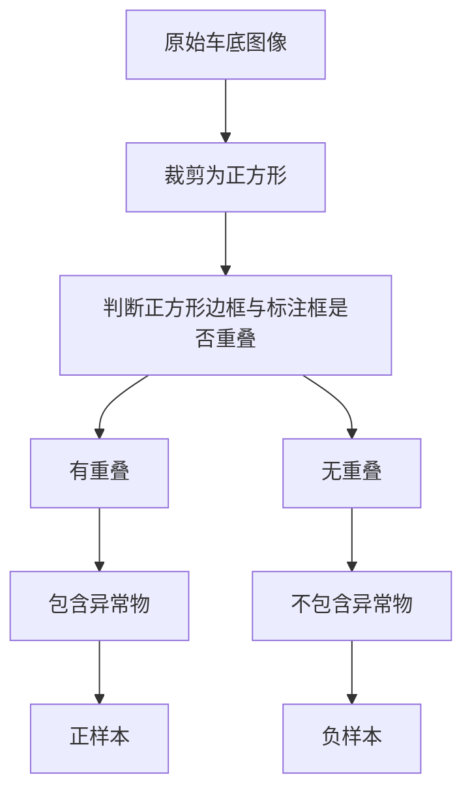
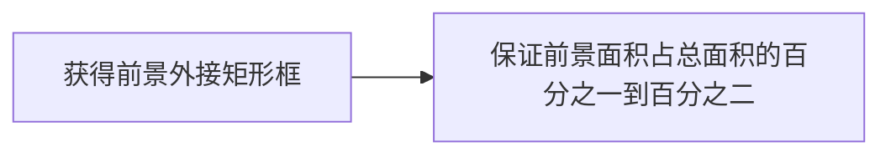
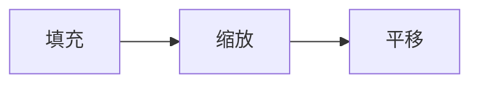
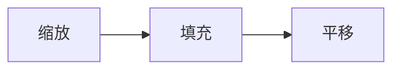

## 摘要

$\textit{任务重要性--传统车底检查算法缺点--引出基于计算机视觉的车底爆炸物检测--异常检测的不适用--提出本报告内容}$

车底爆炸物检测对于维护公共安全和重大活动安保至关重要。传统的车底检查方法存在人工成本高、效率低、易受人为因素影响等弊端。近年来，随着人工智能技术的快速发展，基于计算机视觉的车底爆炸物检测方法展现出显示出巨大的潜力。车底爆炸物检测可以建模为异常检测问题。然而，现有异常检测数据集集中于工业数据和医学数据，缺乏车底异常检测数据。此外，现有视觉异常检测算法在车底爆炸物检测中的应用效果尚未得到充分验证。上述两个原因导致现有的异常检测方法尚未在车底异常检测领域得到广泛应用。在本报告中，针对车底爆炸物检测任务，我们收集了一批车底图像，并评估了当前主流异常检测方法在车底异常检测数据集中的性能。 此外，本报告针对车底异常检测数据集的特点，提出了一种新的异常检测算法，在车底异常检测数据集中取得了最优性能。

## 1. 引言

### 1.1 研究背景

近年来，随着国际恐怖主义活动日益猖獗，车底爆炸事件频发，严重威胁着人民生命财产安全。传统的车底检查方法主要依靠人工检查，存在人工成本高、效率低、易受人为因素影响等弊端。

随着计算机视觉技术的快速发展，基于异常检测的车底爆炸物检测方法逐渐成为研究热点。异常检测是一种模式识别技术，旨在识别与正常模式明显不同的数据样本。在车底爆炸物检测中，异常检测可以用于识别车底的可疑物体，例如炸弹、炸药等。

### 1.2 研究意义

车底爆炸物检测对于维护公共安全和重大活动安保具有重要意义。基于异常检测的车底爆炸物检测方法具有以下优势：

- 自动化程度高：可以减少人工成本，提高检测效率。
- 客观性强：不受人为因素影响，检测结果更加可靠。
- 普适性强：可以应用于各种场景，例如停车场、边检站、大型活动现场等。

## 2. 相关工作

### 2.1 异常检测算法（DDAD）

#### 基于表示的方法

过去一直使用自监督学习来学习图像特征，通常通过解决辅助任务来实现。在异常检测中，已经证明高质量的特征有助于异常样本的检测。 DN2 已成功采用简单的 ResNet（在 Imagenet 上进行预训练）来提取信息特征。最近的方法，例如 SPADE 使用标称提取特征的内存库，PaDiM使用局部约束的特征包，PatchCore 使用内存库和邻域感知的补丁级特征，CFLOW 和 FastFlow 使用归一化流，US 和 RD4AD 使用知识蒸馏方法 进行异常检测。所有这些都依赖于预训练的特征提取器，而不适应当前问题的领域。当预训练的特征提取器无法提供信息丰富的特征时，这些模型可能会失败。
#### 基于重建的方法 

异常检测的初始框架是基于以下基本概念开发的：在标称样本上训练的生成模型能够学会准确地重建标称数据，同时无法重建异常。异常数据通常显着偏离学习模式，导致推理时异常重建效果不佳。早期的工作应用变分自动编码器（VAE）来检测皮肤病图像中的异常。然而，重建是模糊的，并且异常现象没有被充分消除。此后提出了各种技术，如使用基于结构相似性（SSIM）的感知损失来改进学习，或部署一个生成模型作为新颖性检测器，端到端连接到第二个网络，增强内部样本和扭曲的异常值。，或使用对抗性自动编码器来有效计算由内点分布生成的样本的可能性。然而，这些方法只能进行一类分类，不能定位异常。 

Ganomaly 使用条件 GAN，优于之前最先进的模型。还用工作使用有区别的端到端可训练表面异常范例来检测和定位异常。这些模型依赖于合成异常进行训练。最近，去噪扩散模型在图像和音频生成中越来越受欢迎。在医学领域，去噪扩散模型已被用于检测脑肿瘤。 AnoDDPM 表明，这些模型在医学领域的异常检测方面优于 GAN。 

## 3. 数据集收集

为了进行车底爆炸物检测实验，我们精心构建了一个包含正常车底图像和异常车底图像的数据集。该数据集涵盖了多种场景和条件，能够有效反映车底爆炸物检测的实际应用场景。

### 3.1 现有数据源

| 路径                                     | 数量   | 质量        |
| -------------------------------------- | ---- | --------- |
| 192.168.110.61/DATA/车底检测/成雅检查站/成雅检查站   | 3918 | 极差，不可用    |
| 192.168.110.61/DATA/车底检测/田房检查站         | 6032 | 极差，不可用    |
| 192.168.110.61/DATA/车底检测/田房检查站2        | 6401 | 极差，不可用    |
| 192.168.110.61/DATA/车底检测/玉堂沟检查站/玉堂沟检查站 | 1920 | 极差，不可用    |
| 192.168.110.61/DATA/车底检测/车底图像/小        | 7741 | 极差，不可用    |
| 192.168.110.61/DATA/车底检测/车底判图/正样本      | 784  | 好，有标注的异常物 |
| 192.168.110.61/DATA/车底检测/车底判图/负样本      | 3445 | 尚可        |

### 3.2 数据集构建

在构建数据集时，考虑如下因素：
- 车底图像与常见图像的长宽比存在显著差异。常见图像长宽比约为 3:2，而车底图像长宽比约为 5:2。
	- 小米 SU7：4997mm × 1963mm
	- 帕萨特：4948mm × 1836mm
- 多数神经网络，如 CLIP，接收的输入图像长宽比为 1:1。
- 车底图像训练集与测试集分布应尽可能一致。
- 可疑物尺寸相比于整个车底图像而言较小。
	- 若将整个车底图片作为网络输入，难以识别小目标。

基于以上因素，采取将整个车底图像裁剪成若干正方形块的方式，送入网络中。为保证训练集/测试集分布一致，数据源采用 `/192.168.110.61/DATA/车底检测/车底判图/正样本` 中的 1568 幅图像。


实现上述逻辑的代码位于 `/192.168.88.223/home/zhbli/projects/undercar/generate_dataset/`

构建后的数据集位于：`/192.168.88.223/home/zhbli/data_61/datasets/undercar/v1`，其中 normal 类 584 幅图像，anomaly 类 1975 幅图像。

接下来，按照 [YOLOv8](https://docs.ultralytics.com/datasets/classify/#dataset-structure-for-yolo-classification-tasks)的要求划分训练集和测试集：
```
`/192.168.88.223/home/zhbli/data_61/datasets/undercar/v2/
	train/
		anomaly/
			*.jpg 400幅
		normal/
			*.jpg 400幅
	test/
		anomaly/
			*.jpg 100幅
		normal/
			*.jpg 100幅
```
#### 3.2.1 将图像裁剪成若干正方形，边长为原图像短边长，保证不遗漏原图像中的区域

```python
from PIL import Image

def crop_image_into_squares(image_path, output_dir):
  """
  将图像裁剪成若干正方形，边长为原图像短边长，保证不遗漏原图像中的区域。

  Args:
    image_path: 图像文件的路径。
    output_dir: 输出目录的路径。
  """
  img = Image.open(image_path)
  width, height = img.size
  square_size = min(width, height)

  # 计算需要裁剪的正方形数量
  num_squares_x = (width + square_size - 1) // square_size
  num_squares_y = (height + square_size - 1) // square_size

  # 裁剪并保存每个正方形
  for y in range(num_squares_y):
    for x in range(num_squares_x):
      left = x * square_size
      top = y * square_size
      right = min(left + square_size, width)
      bottom = min(top + square_size, height)
      cropped_img = img.crop((left, top, right, bottom))
      output_path = os.path.join(output_dir, f"square_{y}_{x}.jpg")
      cropped_img.save(output_path)

# 示例用法
image_path = "path/to/your/image.jpg"
output_dir = "path/to/output/directory"
crop_image_into_squares(image_path, output_dir)
```

#### 3.2.2 判断两个边框是否重叠

```python
def is_overlapping(box1, box2):
  """
  判断两个边框是否重叠。

  Args:
    box1: 第一个边框，表示为 (x1, y1, x2, y2)，其中 (x1, y1) 是左上角坐标，(x2, y2) 是右下角坐标。
    box2: 第二个边框，表示方式与 box1 相同。

  Returns:
    如果两个边框重叠，则返回 True，否则返回 False。
  """
  # 检查 x 轴方向上的重叠
  if box1[0] > box2[2] or box2[0] > box1[2]:
    return False

  # 检查 y 轴方向上的重叠
  if box1[1] > box2[3] or box2[1] > box1[3]:
    return False

  # 如果 x 轴和 y 轴方向都重叠，则两个边框重叠
  return True

# 示例用法
box1 = (10, 10, 50, 50)
box2 = (30, 30, 70, 70)
overlap = is_overlapping(box1, box2)
print(overlap)  # 输出: True
```
### 本数据集与现有异常检测数据集的不同

现有异常检测数据集中，每个类别仅有数百张图像。而本数据集中，正常车底图像高达数万张。

**数据集概览**

- 数据集名称：车底爆炸物检测数据集（Vehicle Underbelly Anomaly Detection Dataset，VUAD）
- 数据量：包含[图片数量]张车底图像，其中正常图像[正常图像数量]张，异常图像[异常图像数量]张
- 图像格式：[图片格式]
- 图像分辨率：[分辨率]
- 数据划分：训练集、验证集和测试集按照[比例]的比例划分

**数据来源**

- 公开数据集：[数据集名称]等
- 自采集数据：我们使用专业相机在不同场景和条件下采集了车底图像，包括停车场、边检站、大型活动现场等。

**数据标注**

- 正常图像：由人工标注为“正常”
- 异常图像：由人工标注为“异常”，并标注出可疑物体的类别和位置

**数据特点**

- **多样性**：数据集包含了不同类型车辆、不同场景和不同光照条件下的车底图像，能够有效反映车底爆炸物检测的实际应用场景。
- **挑战性**：部分异常图像中的可疑物体体积较小，且光照条件复杂，对算法的鲁棒性提出了挑战。

**数据应用**

该数据集可用于训练和评估车底爆炸物检测算法。我们已经使用该数据集评估了多种主流异常检测方法，并取得了良好的结果。

**数据获取**

由于数据集包含敏感信息，暂不开放下载。如需使用该数据集，请与作者联系。

### 3.1.1 正常图像

正常图像包含空车底、停放的车辆等。这些图像可以用来训练算法识别正常车底的模式。

- **类型**：空车底、停放的轿车、停放的卡车、停放的摩托车等
- **场景**：停车场、边检站、大型活动现场等
- **光照条件**：晴天、阴天、夜晚等

### 3.1.2 异常图像

异常图像包含放置了炸弹、炸药等可疑物体的车底。这些图像可以用来训练算法识别异常车底的模式。

- **可疑物体类型**：炸弹、炸药、枪支、毒品等
- **可疑物体位置**：车轮附近、车底中央、排气管附近等
- **场景**：停车场、边检站、大型活动现场等
- **光照条件**：晴天、阴天、夜晚等

## 3.1.3 数据标注

为了确保数据集的准确性和可靠性，我们采用了严格的数据标注流程。

- **标注人员**：由经验丰富的专业人员进行标注
- **标注工具**：使用专业的图像标注工具进行标注
- **标注质量控制**：对标注结果进行严格的质量控制，确保标注的准确性和一致性

### 3.1.4 数据应用

该数据集可用于训练和评估车底爆炸物检测算法。我们已经使用该数据集评估了多种主流异常检测方法，并取得了良好的结果。

- **算法训练**：可以使用该数据集训练各种异常检测算法，例如基于统计的方法、基于距离的方法、基于密度的的方法等。
- **算法评估**：可以使用该数据集评估异常检测算法的性能，例如准确率、召回率和F1值等。

我们相信，该数据集将为车底爆炸物检测领域的后续研究提供 valuable 的资源。

## 4. 现有异常检测算法在车底异常检测数据集上的性能

### 4.1 Oracle Analysis

为了验证性能上限，我们执行 oracle analysis。

## 5. 本文提出的异常检测算法

本文通过合成异常图像进行二分类。

将前景目标缩放至合适尺寸：


合成图像的背景图像为正常图像，即：`/192.168.88.223/home/zhbli/data_61/datasets/undercar/v2/train/normal/`。其中有 400 张图像，200张做合成异常图像，200张做正常图像。
而测试集保持不变。


上述方式中，如目标很小，则缩放系数很大，会放大后目标超出画面。


上述方式克服了放大后目标超出画面的问题。但是可能缩放这一环节得到巨大的图像。解决方案是在选择polygon时就进行筛选得到合适尺寸，从而略过缩放环节。

## 5. 实验结果


| 数据集 | 训练集/异常 | 训练集/正常 | 测试集/异常 | 测试集/正常 | top1-acc | 漏报  | 误报  |
| --- | ------ | ------ | ------ | ------ | -------- | --- | --- |
| v2  | 400    | 400    | 100    | 100    | 0.96     | -   | -   |
| v3  | 200    | 200    | 100    | 100    | 0.83     | 10% | 34% |
