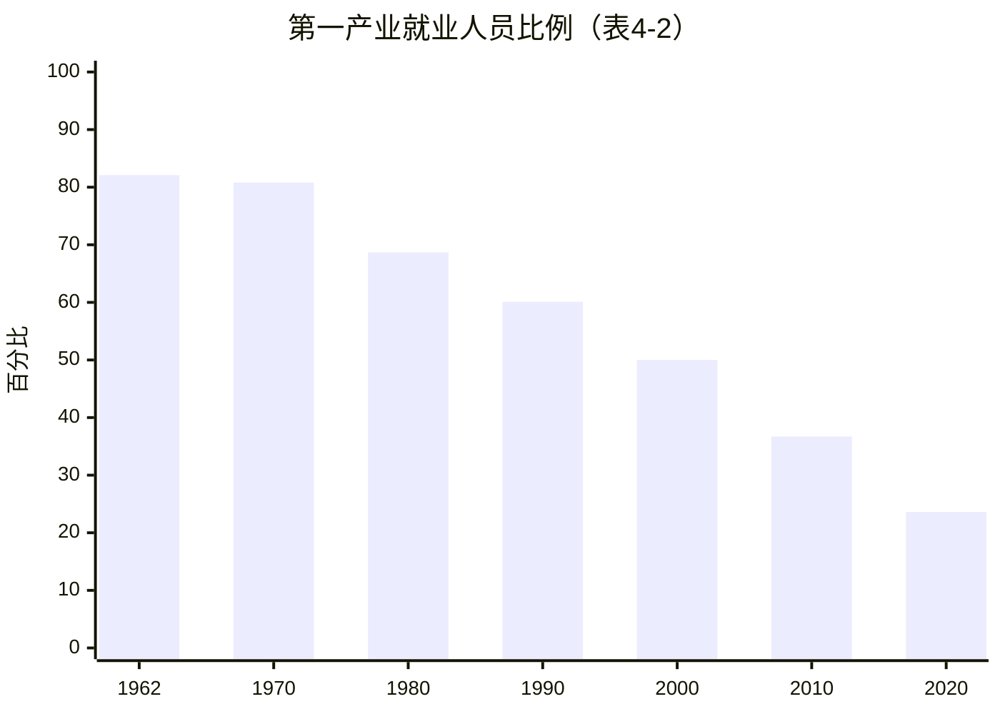
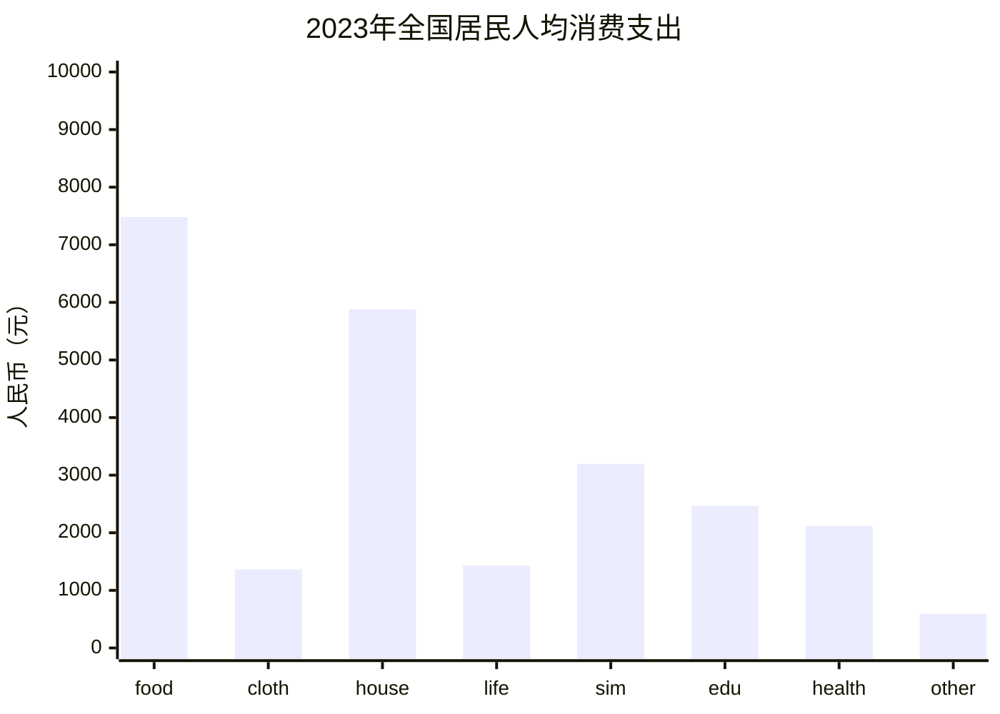
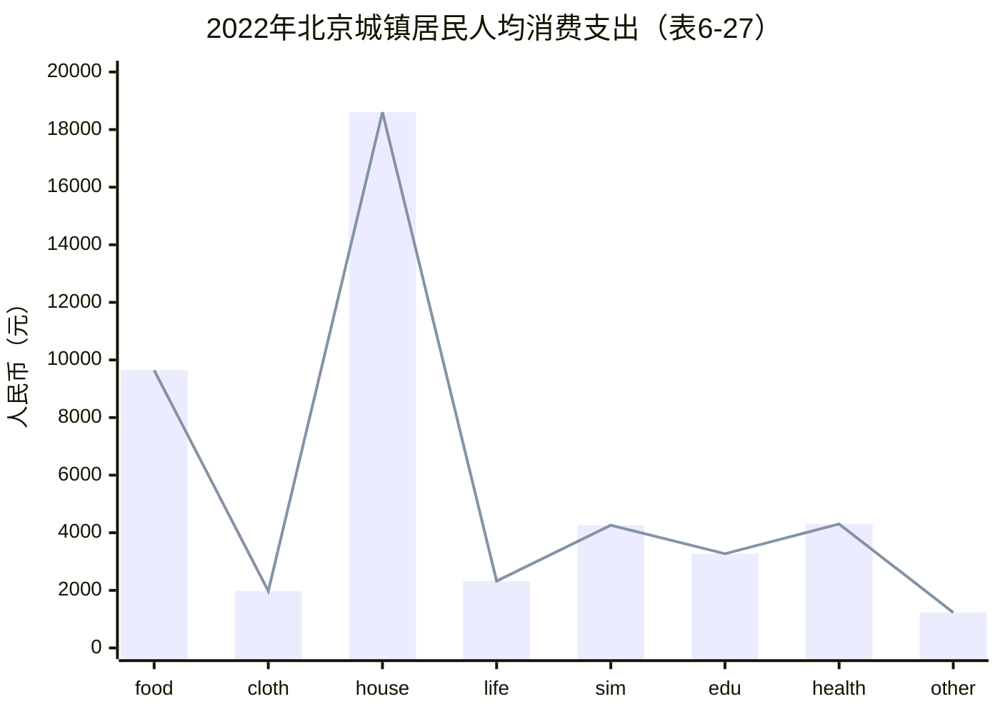
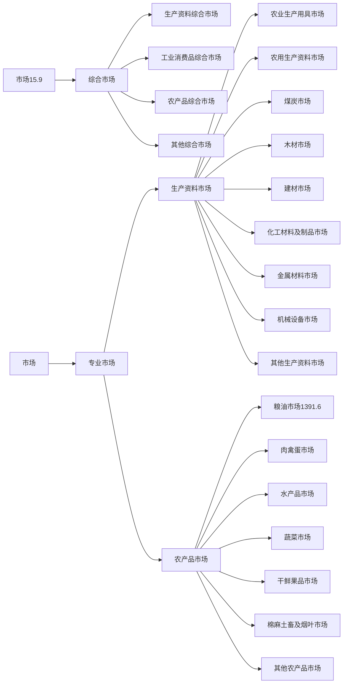

[- 一、综　合](https://www.stats.gov.cn/sj/ndsj/2023/html/ge01.jpg)

- [简要说明](https://www.stats.gov.cn/sj/ndsj/2023/html/sm01.htm)
- [1-1 全国行政区划(2022年底)](https://www.stats.gov.cn/sj/ndsj/2023/html/C01-01.jpg)
- [1-2 国民经济和社会发展总量与速度指标](https://www.stats.gov.cn/sj/ndsj/2023/html/C01-02.jpg)
- [1-3 国民经济和社会发展结构指标](https://www.stats.gov.cn/sj/ndsj/2023/html/C01-03.jpg)
- [1-4 国民经济和社会发展比例和效益指标](https://www.stats.gov.cn/sj/ndsj/2023/html/C01-04.jpg)
- [1-5 按主要行业分法人单位数](https://www.stats.gov.cn/sj/ndsj/2023/html/C01-05.jpg)
- [1-6 分地区按三次产业和机构类型分法人单位数(2022年)](https://www.stats.gov.cn/sj/ndsj/2023/html/C01-06.jpg)
- [1-7 按地区和控股情况分企业法人单位数(2022年)](https://www.stats.gov.cn/sj/ndsj/2023/html/C01-07.jpg)
- [1-8 按地区和登记注册类型分企业法人单位数(2022年)](https://www.stats.gov.cn/sj/ndsj/2023/html/C01-08.jpg)
- [主要统计指标解释](https://www.stats.gov.cn/sj/ndsj/2023/html/zb01.pdf)

[- 二、人　口](https://www.stats.gov.cn/sj/ndsj/2023/html/ge02.jpg)

- [简要说明](https://www.stats.gov.cn/sj/ndsj/2023/html/sm02.htm)
- [2-1 人口数及构成](https://www.stats.gov.cn/sj/ndsj/2023/html/C02-01.jpg)
- [2-2 人口出生率、死亡率和自然增长率](https://www.stats.gov.cn/sj/ndsj/2023/html/C02-02.jpg)
- [2-3 平均预期寿命](https://www.stats.gov.cn/sj/ndsj/2023/html/C02-03.jpg)
- [2-4 人口年龄结构和抚养比](https://www.stats.gov.cn/sj/ndsj/2023/html/C02-04.jpg)
- [2-5 分地区年末人口数](https://www.stats.gov.cn/sj/ndsj/2023/html/C02-05.jpg)
- [2-6 分地区年末城镇人口比重](https://www.stats.gov.cn/sj/ndsj/2023/html/C02-06.jpg)
- [2-7 分地区人口的城乡构成和出生率、死亡率、自然增长率(2022年)](https://www.stats.gov.cn/sj/ndsj/2023/html/C02-07.jpg)
- [2-8 按年龄和性别分人口数(2022年)](https://www.stats.gov.cn/sj/ndsj/2023/html/C02-08.jpg)
- [2-9 分地区户数、人口数、性别比和户规模(2022年)](https://www.stats.gov.cn/sj/ndsj/2023/html/C02-09.jpg)
- [2-10 分地区分性别、户口登记状况的人口(2022年)](https://www.stats.gov.cn/sj/ndsj/2023/html/C02-10.jpg)
- [2-11 分地区人口年龄构成和抚养比(2022年)](https://www.stats.gov.cn/sj/ndsj/2023/html/C02-11.jpg)
- [2-12 分地区按性别和婚姻状况分的人口(2022年)](https://www.stats.gov.cn/sj/ndsj/2023/html/C02-12.jpg)
- [2-13 分地区按性别、受教育程度分的6岁及以上人口(2022年)](https://www.stats.gov.cn/sj/ndsj/2023/html/C02-13.jpg)
- [2-14 分地区按性别分的15岁及以上文盲人口(2022年)](https://www.stats.gov.cn/sj/ndsj/2023/html/C02-14.jpg)
- [2-15 分地区按家庭户规模分的户数(2022年)](https://www.stats.gov.cn/sj/ndsj/2023/html/C02-15.jpg)
- [主要统计指标解释](https://www.stats.gov.cn/sj/ndsj/2023/html/zb02.pdf)

[- 三、国民经济核算](https://www.stats.gov.cn/sj/ndsj/2023/html/ge03.jpg)

- [简要说明](https://www.stats.gov.cn/sj/ndsj/2023/html/sm03.htm)
- [3-1 国内生产总值](https://www.stats.gov.cn/sj/ndsj/2023/html/C03-01.jpg)
- [3-2 国内生产总值构成](https://www.stats.gov.cn/sj/ndsj/2023/html/C03-02.jpg)
- [3-3 不变价国内生产总值](https://www.stats.gov.cn/sj/ndsj/2023/html/C03-03.jpg)
- [3-4 国内生产总值指数](https://www.stats.gov.cn/sj/ndsj/2023/html/C03-04.jpg)
- [3-5 国内生产总值指数](https://www.stats.gov.cn/sj/ndsj/2023/html/C03-05.jpg)
- [3-6 分行业增加值](https://www.stats.gov.cn/sj/ndsj/2023/html/C03-06.jpg)
- [3-7 三次产业和主要行业贡献率](https://www.stats.gov.cn/sj/ndsj/2023/html/C03-07.jpg)
- [3-8 三次产业和主要行业对国内生产总值增长的拉动](https://www.stats.gov.cn/sj/ndsj/2023/html/C03-08.jpg)
- [3-9 地区生产总值(2022年)](https://www.stats.gov.cn/sj/ndsj/2023/html/C03-09.jpg)
- [3-10 支出法国内生产总值](https://www.stats.gov.cn/sj/ndsj/2023/html/C03-10.jpg)
- [3-11 支出法国内生产总值及构成](https://www.stats.gov.cn/sj/ndsj/2023/html/C03-11.jpg)
- [3-12 实际最终消费及构成](https://www.stats.gov.cn/sj/ndsj/2023/html/C03-12.jpg)
- [3-13 居民消费水平](https://www.stats.gov.cn/sj/ndsj/2023/html/C03-13.jpg)
- [3-14 三大需求对国内生产总值增长的贡献率和拉动](https://www.stats.gov.cn/sj/ndsj/2023/html/C03-14.jpg)
- [3-15 资金流量表(非金融交易，2021年)](https://www.stats.gov.cn/sj/ndsj/2023/html/C03-15.jpg)
- [3-16 资金流量表(金融交易，2021年)](https://www.stats.gov.cn/sj/ndsj/2023/html/C03-16.jpg)
- [3-17 企业、广义政府与住户部门初次分配总收入及比重](https://www.stats.gov.cn/sj/ndsj/2023/html/C03-17.jpg)
- [3-18 企业、广义政府与住户部门可支配总收入及比重](https://www.stats.gov.cn/sj/ndsj/2023/html/C03-18.jpg)
- [3-19 企业、广义政府与住户部门调整后可支配总收入及比重](https://www.stats.gov.cn/sj/ndsj/2023/html/C03-19.jpg)
- [3-20 国际收支平衡表(2022年)](https://www.stats.gov.cn/sj/ndsj/2023/html/C03-20.jpg)
- [3-21 2020年投入产出基本流量表(中间使用部分)](https://www.stats.gov.cn/sj/ndsj/2023/html/C03-21.jpg)
- [3-22 2020年投入产出基本流量表(最终使用部分)](https://www.stats.gov.cn/sj/ndsj/2023/html/C03-22.jpg)
- [3-23 2020年非竞争型投入产出表(17×17产品部门)](https://www.stats.gov.cn/sj/ndsj/2023/html/C03-23.jpg)
- [主要统计指标解释](https://www.stats.gov.cn/sj/ndsj/2023/html/zb03.pdf)

[- 四、就业和工资](https://www.stats.gov.cn/sj/ndsj/2023/html/ge04.jpg)

- [简要说明](https://www.stats.gov.cn/sj/ndsj/2023/html/sm04.htm)
- [4-1 就业基本情况](https://www.stats.gov.cn/sj/ndsj/2023/html/C04-01.jpg)
- [4-2 按三次产业分就业人员数(年底数)](https://www.stats.gov.cn/sj/ndsj/2023/html/C04-02.jpg)
- [4-3 分地区就业人员数(2022年底数)](https://www.stats.gov.cn/sj/ndsj/2023/html/C04-03.jpg)
- [4-4 按登记注册类型分城镇非私营单位就业人员数(年底数)](https://www.stats.gov.cn/sj/ndsj/2023/html/C04-04.jpg)
- [4-5 按登记注册类型和行业分城镇非私营单位就业人员数(2022年底数)](https://www.stats.gov.cn/sj/ndsj/2023/html/C04-05.jpg)
- [4-6 按行业分城镇非私营单位就业人员数(年底数)](https://www.stats.gov.cn/sj/ndsj/2023/html/C04-06.jpg)
- [4-7 城镇非私营单位就业人员工资总额和指数](https://www.stats.gov.cn/sj/ndsj/2023/html/C04-07.jpg)
- [4-8 按行业分城镇非私营单位就业人员工资总额](https://www.stats.gov.cn/sj/ndsj/2023/html/C04-08.jpg)
- [4-9 城镇非私营单位就业人员平均工资和指数](https://www.stats.gov.cn/sj/ndsj/2023/html/C04-09.jpg)
- [4-10 按登记注册分类型城镇非私营单位就业人员平均工资](https://www.stats.gov.cn/sj/ndsj/2023/html/C04-10.jpg)
- [4-11 按登记注册类型和行业分城镇非私营单位就业人员平均工资(2022年)](https://www.stats.gov.cn/sj/ndsj/2023/html/C04-11.jpg)
- [4-12 按行业分城镇非私营单位就业人员平均工资](https://www.stats.gov.cn/sj/ndsj/2023/html/C04-12.jpg)
- [4-13 按行业分城镇私营单位就业人员平均工资](https://www.stats.gov.cn/sj/ndsj/2023/html/C04-13.jpg)
- [4-14 分地区城镇登记失业人员及失业率](https://www.stats.gov.cn/sj/ndsj/2023/html/C04-14.jpg)
- [主要统计指标解释](https://www.stats.gov.cn/sj/ndsj/2023/html/zb04.pdf)

[- 五、价　格](https://www.stats.gov.cn/sj/ndsj/2023/html/ge05.jpg)

- [简要说明](https://www.stats.gov.cn/sj/ndsj/2023/html/sm05.htm)
- [5-1 各种价格指数](https://www.stats.gov.cn/sj/ndsj/2023/html/C05-01.jpg)
- [5-2 各种价格定基指数](https://www.stats.gov.cn/sj/ndsj/2023/html/C05-02.jpg)
- [5-3 居民消费价格分类指数(2022年)](https://www.stats.gov.cn/sj/ndsj/2023/html/C05-03.jpg)
- [5-4 商品零售价格分类指数(2022年)](https://www.stats.gov.cn/sj/ndsj/2023/html/C05-04.jpg)
- [5-5 居民消费价格指数和商品零售价格指数](https://www.stats.gov.cn/sj/ndsj/2023/html/C05-05.jpg)
- [5-6 分地区居民消费价格分类指数(2022年)](https://www.stats.gov.cn/sj/ndsj/2023/html/C05-06.jpg)
- [5-7 分地区商品零售价格分类指数(2022年)](https://www.stats.gov.cn/sj/ndsj/2023/html/C05-07.jpg)
- [5-8 农产品生产者价格指数](https://www.stats.gov.cn/sj/ndsj/2023/html/C05-08.jpg)
- [5-9 分地区农产品生产者价格指数](https://www.stats.gov.cn/sj/ndsj/2023/html/C05-09.jpg)
- [5-10 按工业行业分工业生产者出厂价格指数](https://www.stats.gov.cn/sj/ndsj/2023/html/C05-10.jpg)
- [5-11 分地区工业生产者出厂价格指数](https://www.stats.gov.cn/sj/ndsj/2023/html/C05-11.jpg)
- [5-12 工业生产者出厂价格分类指数](https://www.stats.gov.cn/sj/ndsj/2023/html/C05-12.jpg)
- [5-13 工业生产者购进价格指数](https://www.stats.gov.cn/sj/ndsj/2023/html/C05-13.jpg)
- [5-14 进出口商品价格指数](https://www.stats.gov.cn/sj/ndsj/2023/html/C05-14.jpg)
- [5-15 分行业进出口商品价格指数](https://www.stats.gov.cn/sj/ndsj/2023/html/C05-15.jpg)
- [主要统计指标解释](https://www.stats.gov.cn/sj/ndsj/2023/html/zb05.pdf)

[- 六、人民生活](https://www.stats.gov.cn/sj/ndsj/2023/html/ge06.jpg)

- [简要说明](https://www.stats.gov.cn/sj/ndsj/2023/html/sm06.htm)
- [6-1 全国居民人均收支情况](https://www.stats.gov.cn/sj/ndsj/2023/html/C06-01.jpg)
- [6-2 全国居民按收入五等份分组的人均可支配收入](https://www.stats.gov.cn/sj/ndsj/2023/html/C06-02.jpg)
- [6-3 全国居民按东、中、西部及东北地区分组的人均可支配收入](https://www.stats.gov.cn/sj/ndsj/2023/html/C06-03.jpg)
- [6-4 全国居民人均主要食品消费量](https://www.stats.gov.cn/sj/ndsj/2023/html/C06-04.jpg)
- [6-5 全国居民平均每百户年末主要耐用消费品拥有量](https://www.stats.gov.cn/sj/ndsj/2023/html/C06-05.jpg)
- [6-6 城镇居民人均收支情况](https://www.stats.gov.cn/sj/ndsj/2023/html/C06-06.jpg)
- [6-7 城镇居民按收入五等份分组的人均可支配收入](https://www.stats.gov.cn/sj/ndsj/2023/html/C06-07.jpg)
- [6-8 城镇居民按东、中、西部及东北地区分组的人均可支配收入](https://www.stats.gov.cn/sj/ndsj/2023/html/C06-08.jpg)
- [6-9 城镇居民人均主要食品消费量](https://www.stats.gov.cn/sj/ndsj/2023/html/C06-09.jpg)
- [6-10 城镇居民平均每百户年末主要耐用消费品拥有量](https://www.stats.gov.cn/sj/ndsj/2023/html/C06-10.jpg)
- [6-11 农村居民人均收支情况](https://www.stats.gov.cn/sj/ndsj/2023/html/C06-11.jpg)
- [6-12 农村居民按收入五等份分组的人均可支配收入](https://www.stats.gov.cn/sj/ndsj/2023/html/C06-12.jpg)
- [6-13 农村居民按东、中、西部及东北地区分组的人均可支配收入](https://www.stats.gov.cn/sj/ndsj/2023/html/C06-13.jpg)
- [6-14 农村居民人均主要食品消费量](https://www.stats.gov.cn/sj/ndsj/2023/html/C06-14.jpg)
- [6-15 农村居民平均每百户年末主要耐用消费品拥有量](https://www.stats.gov.cn/sj/ndsj/2023/html/C06-15.jpg)
- [6-16 居民人均可支配收入和指数](https://www.stats.gov.cn/sj/ndsj/2023/html/C06-16.jpg)
- [6-17 居民人均消费支出和指数](https://www.stats.gov.cn/sj/ndsj/2023/html/C06-17.jpg)
- [6-18 分地区居民人均可支配收入](https://www.stats.gov.cn/sj/ndsj/2023/html/C06-18.jpg)
- [6-19 分地区居民人均可支配收入来源(2022年)](https://www.stats.gov.cn/sj/ndsj/2023/html/C06-19.jpg)
- [6-20 分地区居民人均消费支出](https://www.stats.gov.cn/sj/ndsj/2023/html/C06-20.jpg)
- [6-21 分地区居民人均消费支出构成(2022年)](https://www.stats.gov.cn/sj/ndsj/2023/html/C06-21.jpg)
- [6-22 分地区居民家庭人均主要食品消费量(2022年)](https://www.stats.gov.cn/sj/ndsj/2023/html/C06-22.jpg)
- [6-23 分地区居民平均每百户年末主要耐用消费品拥有量(2022年)](https://www.stats.gov.cn/sj/ndsj/2023/html/C06-23.jpg)
- [6-24 分地区城镇居民人均可支配收入](https://www.stats.gov.cn/sj/ndsj/2023/html/C06-24.jpg)
- [6-25 分地区城镇居民人均可支配收入来源(2022年)](https://www.stats.gov.cn/sj/ndsj/2023/html/C06-25.jpg)
- [6-26 分地区城镇居民人均消费支出](https://www.stats.gov.cn/sj/ndsj/2023/html/C06-26.jpg)
- [6-27 分地区城镇居民人均消费支出构成(2022年)](https://www.stats.gov.cn/sj/ndsj/2023/html/C06-27.jpg)
- [6-28 分地区城镇居民家庭人均主要食品消费量(2022年)](https://www.stats.gov.cn/sj/ndsj/2023/html/C06-28.jpg)
- [6-29 分地区城镇居民平均每百户年末主要耐用消费品拥有量(2022年)](https://www.stats.gov.cn/sj/ndsj/2023/html/C06-29.jpg)
- [6-30 分地区农村居民人均可支配收入](https://www.stats.gov.cn/sj/ndsj/2023/html/C06-30.jpg)
- [6-31 分地区农村居民人均可支配收入来源(2022年)](https://www.stats.gov.cn/sj/ndsj/2023/html/C06-31.jpg)
- [6-32 分地区农村居民人均消费支出](https://www.stats.gov.cn/sj/ndsj/2023/html/C06-32.jpg)
- [6-33 分地区农村居民人均消费支出构成(2022年)](https://www.stats.gov.cn/sj/ndsj/2023/html/C06-33.jpg)
- [6-34 分地区农村居民家庭人均主要食品消费量(2022年)](https://www.stats.gov.cn/sj/ndsj/2023/html/C06-34.jpg)
- [6-35 分地区农村居民平均每百户年末主要耐用消费品拥有量(2022年)](https://www.stats.gov.cn/sj/ndsj/2023/html/C06-35.jpg)
- [6-36 中西部22省(区、市)脱贫县农村居民人均可支配收入](https://www.stats.gov.cn/sj/ndsj/2023/html/C06-36.jpg)
- [主要统计指标解释](https://www.stats.gov.cn/sj/ndsj/2023/html/zb06.pdf)

[- 七、财　政](https://www.stats.gov.cn/sj/ndsj/2023/html/ge07.jpg)

- [简要说明](https://www.stats.gov.cn/sj/ndsj/2023/html/sm07.htm)
- [7-1 一般公共预算收支总额及增长速度](https://www.stats.gov.cn/sj/ndsj/2023/html/C07-01.jpg)
- [7-2 中央和地方一般公共预算主要收入项目(2022年)](https://www.stats.gov.cn/sj/ndsj/2023/html/C07-02.jpg)
- [7-3 中央和地方一般公共预算主要支出项目(2022年)](https://www.stats.gov.cn/sj/ndsj/2023/html/C07-03.jpg)
- [7-4 各项税收](https://www.stats.gov.cn/sj/ndsj/2023/html/C07-04.jpg)
- [7-5 分地区一般公共预算收入(2022年)](https://www.stats.gov.cn/sj/ndsj/2023/html/C07-05.jpg)
- [7-6 分地区一般公共预算支出(2022年)](https://www.stats.gov.cn/sj/ndsj/2023/html/C07-06.jpg)
- [7-7 中央财政债务余额情况](https://www.stats.gov.cn/sj/ndsj/2023/html/C07-07.jpg)
- [7-8 按部门划分的外债总额头寸](https://www.stats.gov.cn/sj/ndsj/2023/html/C07-08.jpg)
- [7-9 外债风险指标](https://www.stats.gov.cn/sj/ndsj/2023/html/C07-09.jpg)
- [7-10 全国政府性基金收入决算表(2022年)](https://www.stats.gov.cn/sj/ndsj/2023/html/C07-10.jpg)
- [7-11 全国政府性基金支出决算表(2022年)](https://www.stats.gov.cn/sj/ndsj/2023/html/C07-11.jpg)
- [7-12 全国国有资本经营收入决算表(2022年)](https://www.stats.gov.cn/sj/ndsj/2023/html/C07-12.jpg)
- [7-13 全国国有资本经营支出决算表(2022年)](https://www.stats.gov.cn/sj/ndsj/2023/html/C07-13.jpg)
- [主要统计指标解释](https://www.stats.gov.cn/sj/ndsj/2023/html/zb07.pdf)

[- 八、资源和环境](https://www.stats.gov.cn/sj/ndsj/2023/html/ge08.jpg)

- [简要说明](https://www.stats.gov.cn/sj/ndsj/2023/html/sm08.htm)
- [8-1 土地状况(2022年)](https://www.stats.gov.cn/sj/ndsj/2023/html/C08-01.jpg)
- [8-2 主要河流基本情况](https://www.stats.gov.cn/sj/ndsj/2023/html/C08-02.jpg)
- [8-3 河流流域面积](https://www.stats.gov.cn/sj/ndsj/2023/html/C08-03.jpg)
- [8-4 主要矿产储量(年底数)](https://www.stats.gov.cn/sj/ndsj/2023/html/C08-04.jpg)
- [8-5 主要城市平均气温(2022年)](https://www.stats.gov.cn/sj/ndsj/2023/html/C08-05.jpg)
- [8-6 主要城市平均相对湿度(2022年)](https://www.stats.gov.cn/sj/ndsj/2023/html/C08-06.jpg)
- [8-7 主要城市降水量(2022年)](https://www.stats.gov.cn/sj/ndsj/2023/html/C08-07.jpg)
- [8-8 主要城市日照时数(2022年)](https://www.stats.gov.cn/sj/ndsj/2023/html/C08-08.jpg)
- [8-9 水资源情况](https://www.stats.gov.cn/sj/ndsj/2023/html/C08-09.jpg)
- [8-10 供水用水情况](https://www.stats.gov.cn/sj/ndsj/2023/html/C08-10.jpg)
- [8-11 分地区废水中主要污染物排放情况(2022年)](https://www.stats.gov.cn/sj/ndsj/2023/html/C08-11.jpg)
- [8-12 主要城市废水中主要污染物排放情况(2022年)](https://www.stats.gov.cn/sj/ndsj/2023/html/C08-12.jpg)
- [8-13 分地区废气中主要污染物排放情况(2022年)](https://www.stats.gov.cn/sj/ndsj/2023/html/C08-13.jpg)
- [8-14 主要城市废气中主要污染物排放情况(2022年)](https://www.stats.gov.cn/sj/ndsj/2023/html/C08-14.jpg)
- [8-15 分地区固体废物处理利用情况(2022年)](https://www.stats.gov.cn/sj/ndsj/2023/html/C08-15.jpg)
- [8-16 主要城市固体废物处理利用情况(2022年)](https://www.stats.gov.cn/sj/ndsj/2023/html/C08-16.jpg)
- [8-17 主要城市空气质量情况(2022年)](https://www.stats.gov.cn/sj/ndsj/2023/html/C08-17.jpg)
- [8-18 分地区城市生活垃圾清运和处理情况(2022年)](https://www.stats.gov.cn/sj/ndsj/2023/html/C08-18.jpg)
- [8-19 主要城市噪声监测情况(2022年)](https://www.stats.gov.cn/sj/ndsj/2023/html/C08-19.jpg)
- [8-20 分地区耕地面积](https://www.stats.gov.cn/sj/ndsj/2023/html/C08-20.jpg)
- [8-21 分地区土地利用情况(2022年)](https://www.stats.gov.cn/sj/ndsj/2023/html/C08-21.jpg)
- [8-22 分地区森林资源情况](https://www.stats.gov.cn/sj/ndsj/2023/html/C08-22.jpg)
- [8-23 造林面积](https://www.stats.gov.cn/sj/ndsj/2023/html/C08-23.jpg)
- [8-24 分地区草原建设利用情况(2022年)](https://www.stats.gov.cn/sj/ndsj/2023/html/C08-24.jpg)
- [8-25 分地区自然保护基本情况(2021年)](https://www.stats.gov.cn/sj/ndsj/2023/html/C08-25.jpg)
- [8-26 分地区自然灾害损失情况(2022年)](https://www.stats.gov.cn/sj/ndsj/2023/html/C08-26.jpg)
- [8-27 地质灾害及防治情况](https://www.stats.gov.cn/sj/ndsj/2023/html/C08-27.jpg)
- [8-28 森林火灾情况(2022年)](https://www.stats.gov.cn/sj/ndsj/2023/html/C08-28.jpg)
- [8-29 林业有害生物防治情况](https://www.stats.gov.cn/sj/ndsj/2023/html/C08-29.jpg)
- [8-30 突发环境事件情况(2022年)](https://www.stats.gov.cn/sj/ndsj/2023/html/C08-30.jpg)
- [8-31 地震灾害情况](https://www.stats.gov.cn/sj/ndsj/2023/html/C08-31.jpg)
- [8-32 主要海洋灾害情况(2022年)](https://www.stats.gov.cn/sj/ndsj/2023/html/C08-32.jpg)
- [8-33 管辖海域未达到第一类海水水质标准的海域面积(2022年)](https://www.stats.gov.cn/sj/ndsj/2023/html/C08-33.jpg)
- [8-34 城镇环境基础设施建设投资情况(2022年)](https://www.stats.gov.cn/sj/ndsj/2023/html/C08-34.jpg)
- [8-35 林业草原投资完成情况(2022年)](https://www.stats.gov.cn/sj/ndsj/2023/html/C08-35.jpg)
- [8-36 工业污染治理投资完成情况](https://www.stats.gov.cn/sj/ndsj/2023/html/C08-36.jpg)
- [主要统计指标解释](https://www.stats.gov.cn/sj/ndsj/2023/html/zb08.pdf)

[- 九、能　源](https://www.stats.gov.cn/sj/ndsj/2023/html/ge09.jpg)

- [简要说明](https://www.stats.gov.cn/sj/ndsj/2023/html/sm09.htm)
- [9-1 一次能源生产总量及构成](https://www.stats.gov.cn/sj/ndsj/2023/html/C09-01.jpg)
- [9-2 能源消费总量及构成](https://www.stats.gov.cn/sj/ndsj/2023/html/C09-02.jpg)
- [9-3 综合能源平衡表](https://www.stats.gov.cn/sj/ndsj/2023/html/C09-03.jpg)
- [9-4 石油平衡表](https://www.stats.gov.cn/sj/ndsj/2023/html/C09-04.jpg)
- [9-5 煤炭平衡表](https://www.stats.gov.cn/sj/ndsj/2023/html/C09-05.jpg)
- [9-6 电力平衡表](https://www.stats.gov.cn/sj/ndsj/2023/html/C09-06.jpg)
- [9-7 能源生产弹性系数](https://www.stats.gov.cn/sj/ndsj/2023/html/C09-07.jpg)
- [9-8 能源消费弹性系数](https://www.stats.gov.cn/sj/ndsj/2023/html/C09-08.jpg)
- [9-9 按行业分能源消费量(2021年)](https://www.stats.gov.cn/sj/ndsj/2023/html/C09-09.jpg)
- [9-10 能源加工转换效率](https://www.stats.gov.cn/sj/ndsj/2023/html/C09-10.jpg)
- [9-11 平均每天能源消费量](https://www.stats.gov.cn/sj/ndsj/2023/html/C09-11.jpg)
- [9-12 居民生活能源消费量](https://www.stats.gov.cn/sj/ndsj/2023/html/C09-12.jpg)
- [9-13 人均生活能源消费量](https://www.stats.gov.cn/sj/ndsj/2023/html/C09-13.jpg)
- [9-14 分地区用电量](https://www.stats.gov.cn/sj/ndsj/2023/html/C09-14.jpg)
- [9-15 发电装机容量](https://www.stats.gov.cn/sj/ndsj/2023/html/C09-15.jpg)
- [9-16 万元国内生产总值能源消费量](https://www.stats.gov.cn/sj/ndsj/2023/html/C09-16.jpg)
- [主要统计指标解释](https://www.stats.gov.cn/sj/ndsj/2023/html/zb09.pdf)

[- 十、固定资产投资](https://www.stats.gov.cn/sj/ndsj/2023/html/ge10.jpg)

- [简要说明](https://www.stats.gov.cn/sj/ndsj/2023/html/sm10.htm)
- [10-1 全社会固定资产投资](https://www.stats.gov.cn/sj/ndsj/2023/html/C10-01.jpg)
- [10-2 全社会固定资产投资实际到位资金比上年增长情况](https://www.stats.gov.cn/sj/ndsj/2023/html/C10-02.jpg)
- [10-3 民间固定资产投资](https://www.stats.gov.cn/sj/ndsj/2023/html/C10-03.jpg)
- [10-4 三次产业固定资产投资](https://www.stats.gov.cn/sj/ndsj/2023/html/C10-04.jpg)
- [10-5 分地区按领域分固定资产投资比上年增长情况(2022年)](https://www.stats.gov.cn/sj/ndsj/2023/html/C10-05.jpg)
- [10-6 分地区实际到位资金比上年增长情况(2022年)](https://www.stats.gov.cn/sj/ndsj/2023/html/C10-06.jpg)
- [10-7 分地区按构成分固定资产投资比上年增长情况(2022年)](https://www.stats.gov.cn/sj/ndsj/2023/html/C10-07.jpg)
- [10-8 分地区按建设性质分固定资产投资比上年增长情况(2022年)](https://www.stats.gov.cn/sj/ndsj/2023/html/C10-08.jpg)
- [10-9 分地区按隶属关系分固定资产投资比上年增长情况(2022年)](https://www.stats.gov.cn/sj/ndsj/2023/html/C10-09.jpg)
- [10-10 分地区按登记注册类型分固定资产投资比上年增长情况(2022年)](https://www.stats.gov.cn/sj/ndsj/2023/html/C10-10.jpg)
- [10-11 分地区按控股情况分固定资产投资比上年增长情况(2022年)](https://www.stats.gov.cn/sj/ndsj/2023/html/C10-11.jpg)
- [10-12 各行业按构成分固定资产投资比上年增长情况(2022年)](https://www.stats.gov.cn/sj/ndsj/2023/html/C10-12.jpg)
- [10-13 各行业按建设性质分固定资产投资比上年增长情况(2022年)](https://www.stats.gov.cn/sj/ndsj/2023/html/C10-13.jpg)
- [10-14 各行业按隶属关系分固定资产投资比上年增长情况(2022年)](https://www.stats.gov.cn/sj/ndsj/2023/html/C10-14.jpg)
- [10-15 各行业按登记注册类型分固定资产投资比上年增长情况(2022年)](https://www.stats.gov.cn/sj/ndsj/2023/html/C10-15.jpg)
- [10-16 各行业按控股情况分固定资产投资比上年增长情况(2022年)](https://www.stats.gov.cn/sj/ndsj/2023/html/C10-16.jpg)
- [10-17 各行业实际到位资金比上年增长情况(2022年)](https://www.stats.gov.cn/sj/ndsj/2023/html/C10-17.jpg)
- [10-18 分地区各行业固定资产投资比上年增长情况(2022年)](https://www.stats.gov.cn/sj/ndsj/2023/html/C10-18.jpg)
- [10-19 农村农户固定资产投资比上年增长情况(2022年)](https://www.stats.gov.cn/sj/ndsj/2023/html/C10-19.jpg)
- [主要统计指标解释](https://www.stats.gov.cn/sj/ndsj/2023/html/zb10.pdf)

[- 十一、对外经济贸易](https://www.stats.gov.cn/sj/ndsj/2023/html/ge11.jpg)

- [简要说明](https://www.stats.gov.cn/sj/ndsj/2023/html/sm11.htm)
- [11-1 对外经济贸易基本情况](https://www.stats.gov.cn/sj/ndsj/2023/html/C11-01.jpg)
- [11-2 货物进出口总额](https://www.stats.gov.cn/sj/ndsj/2023/html/C11-02.jpg)
- [11-3 按国际贸易标准分类分进出口商品金额(2022年)](https://www.stats.gov.cn/sj/ndsj/2023/html/C11-03.jpg)
- [11-4 按商品类章分进出口商品金额(2022年)](https://www.stats.gov.cn/sj/ndsj/2023/html/C11-04.jpg)
- [11-5 我国同各国(地区)海关货物进出口总额(2022年)](https://www.stats.gov.cn/sj/ndsj/2023/html/C11-05.jpg)
- [11-6 出口主要货物数量和金额(2022年)](https://www.stats.gov.cn/sj/ndsj/2023/html/C11-06.jpg)
- [11-7 进口主要货物数量和金额(2022年)](https://www.stats.gov.cn/sj/ndsj/2023/html/C11-07.jpg)
- [11-8 分地区货物进出口总额(2022年)](https://www.stats.gov.cn/sj/ndsj/2023/html/C11-08.jpg)
- [11-9 分地区货物进出口总额(2022年)](https://www.stats.gov.cn/sj/ndsj/2023/html/C11-09.jpg)
- [11-10 分地区外商投资企业货物进出口总额(2022年)](https://www.stats.gov.cn/sj/ndsj/2023/html/C11-10.jpg)
- [11-11 服务进出口总额](https://www.stats.gov.cn/sj/ndsj/2023/html/C11-11.jpg)
- [11-12 服务进出口分类金额(2022年)](https://www.stats.gov.cn/sj/ndsj/2023/html/C11-12.jpg)
- [11-13 外商直接投资情况](https://www.stats.gov.cn/sj/ndsj/2023/html/C11-13.jpg)
- [11-14 按国别(地区)分外商直接投资额](https://www.stats.gov.cn/sj/ndsj/2023/html/C11-14.jpg)
- [11-15 按行业分外商直接投资(2022年)](https://www.stats.gov.cn/sj/ndsj/2023/html/C11-15.jpg)
- [11-16 按行业分外商投资企业年底注册登记情况(2022年)](https://www.stats.gov.cn/sj/ndsj/2023/html/C11-16.jpg)
- [11-17 分地区外商投资企业年底注册登记情况](https://www.stats.gov.cn/sj/ndsj/2023/html/C11-17.jpg)
- [11-18 对外直接投资](https://www.stats.gov.cn/sj/ndsj/2023/html/C11-18.jpg)
- [11-19 按主要国别(地区)分对外直接投资](https://www.stats.gov.cn/sj/ndsj/2023/html/C11-19.jpg)
- [11-20 按行业分对外直接投资](https://www.stats.gov.cn/sj/ndsj/2023/html/C11-20.jpg)
- [11-21 对外经济合作](https://www.stats.gov.cn/sj/ndsj/2023/html/C11-21.jpg)
- [11-22 按国别(地区)分对外经济合作(2022年)](https://www.stats.gov.cn/sj/ndsj/2023/html/C11-22.jpg)
- [主要统计指标解释](https://www.stats.gov.cn/sj/ndsj/2023/html/zb11.pdf)

[- 十二、农　业](https://www.stats.gov.cn/sj/ndsj/2023/html/ge12.jpg)

- [简要说明](https://www.stats.gov.cn/sj/ndsj/2023/html/sm12.htm)
- [12-1 农业生产条件与农作物播种面积](https://www.stats.gov.cn/sj/ndsj/2023/html/C12-01.jpg)
- [12-2 主要农牧渔业生产情况](https://www.stats.gov.cn/sj/ndsj/2023/html/C12-02.jpg)
- [12-3 农、林、牧、渔业总产值及指数](https://www.stats.gov.cn/sj/ndsj/2023/html/C12-03.jpg)
- [12-4 主要农业机械拥有量(年底数)](https://www.stats.gov.cn/sj/ndsj/2023/html/C12-04.jpg)
- [12-5 耕地灌溉面积和农用化肥施用量](https://www.stats.gov.cn/sj/ndsj/2023/html/C12-05.jpg)
- [12-6 灌溉、水库和除涝治水情况](https://www.stats.gov.cn/sj/ndsj/2023/html/C12-06.jpg)
- [12-7 分地区水利设施和除涝面积(2022年)](https://www.stats.gov.cn/sj/ndsj/2023/html/C12-07.jpg)
- [12-8 农作物播种面积](https://www.stats.gov.cn/sj/ndsj/2023/html/C12-08.jpg)
- [12-9 主要农作物种植结构](https://www.stats.gov.cn/sj/ndsj/2023/html/C12-09.jpg)
- [12-10 主要农产品产量](https://www.stats.gov.cn/sj/ndsj/2023/html/C12-10.jpg)
- [12-11 主要农产品单位面积产量](https://www.stats.gov.cn/sj/ndsj/2023/html/C12-11.jpg)
- [12-12 主要林产品产量](https://www.stats.gov.cn/sj/ndsj/2023/html/C12-12.jpg)
- [12-13 牲畜饲养情况](https://www.stats.gov.cn/sj/ndsj/2023/html/C12-13.jpg)
- [12-14 畜产品产量](https://www.stats.gov.cn/sj/ndsj/2023/html/C12-14.jpg)
- [12-15 水产品产量](https://www.stats.gov.cn/sj/ndsj/2023/html/C12-15.jpg)
- [12-16 人均主要农产品产量](https://www.stats.gov.cn/sj/ndsj/2023/html/C12-16.jpg)
- [12-17 国有农场基本情况](https://www.stats.gov.cn/sj/ndsj/2023/html/C12-17.jpg)
- [主要统计指标解释](https://www.stats.gov.cn/sj/ndsj/2023/html/zb12.pdf)

[- 十三、工　业](https://www.stats.gov.cn/sj/ndsj/2023/html/ge13.jpg)

- [简要说明](https://www.stats.gov.cn/sj/ndsj/2023/html/sm13.htm)
- [13-1 规模以上工业企业主要指标(2022年)](https://www.stats.gov.cn/sj/ndsj/2023/html/C13-01.jpg)
- [13-2 按行业分规模以上工业企业主要指标(2022年)](https://www.stats.gov.cn/sj/ndsj/2023/html/C13-02.jpg)
- [13-3 规模以上工业企业主要指标](https://www.stats.gov.cn/sj/ndsj/2023/html/C13-03.jpg)
- [13-4 按行业分国有控股工业企业主要指标(2022年)](https://www.stats.gov.cn/sj/ndsj/2023/html/C13-04.jpg)
- [13-5 国有控股工业企业主要指标](https://www.stats.gov.cn/sj/ndsj/2023/html/C13-05.jpg)
- [13-6 按行业分私营工业企业主要指标(2022年)](https://www.stats.gov.cn/sj/ndsj/2023/html/C13-06.jpg)
- [13-7 私营工业企业主要指标](https://www.stats.gov.cn/sj/ndsj/2023/html/C13-07.jpg)
- [13-8 按行业分外商投资和港澳台商投资工业企业主要指标(2022年)](https://www.stats.gov.cn/sj/ndsj/2023/html/C13-08.jpg)
- [13-9 外商投资和港澳台商投资工业企业主要指标](https://www.stats.gov.cn/sj/ndsj/2023/html/C13-09.jpg)
- [13-10 按行业分大中型工业企业主要指标(2022年)](https://www.stats.gov.cn/sj/ndsj/2023/html/C13-10.jpg)
- [13-11 大中型工业企业主要指标](https://www.stats.gov.cn/sj/ndsj/2023/html/C13-11.jpg)
- [13-12 工业产品产量](https://www.stats.gov.cn/sj/ndsj/2023/html/C13-12.jpg)
- [13-13 分地区工业产品产量](https://www.stats.gov.cn/sj/ndsj/2023/html/C13-13.jpg)
- [13-14 人均主要工业产品产量](https://www.stats.gov.cn/sj/ndsj/2023/html/C13-14.jpg)
- [13-15 全国规模以上工业主要产品生产能力](https://www.stats.gov.cn/sj/ndsj/2023/html/C13-15.jpg)
- [主要统计指标解释](https://www.stats.gov.cn/sj/ndsj/2023/html/zb13.pdf)

[- 十四、建筑业](https://www.stats.gov.cn/sj/ndsj/2023/html/ge14.jpg)

- [简要说明](https://www.stats.gov.cn/sj/ndsj/2023/html/sm14.htm)
- [14-1 建筑业企业概况](https://www.stats.gov.cn/sj/ndsj/2023/html/C14-01.jpg)
- [14-2 按登记注册类型分建筑业企业主要经济指标(2022年)](https://www.stats.gov.cn/sj/ndsj/2023/html/C14-02.jpg)
- [14-3 分地区建筑业劳动生产率(2022年)](https://www.stats.gov.cn/sj/ndsj/2023/html/C14-03.jpg)
- [14-4 分地区按登记注册类型分建筑业企业单位数(2022年)](https://www.stats.gov.cn/sj/ndsj/2023/html/C14-04.jpg)
- [14-5 分地区按登记注册类型分建筑业企业从业人员(2022年)](https://www.stats.gov.cn/sj/ndsj/2023/html/C14-05.jpg)
- [14-6 建筑业企业技术装备情况](https://www.stats.gov.cn/sj/ndsj/2023/html/C14-06.jpg)
- [14-7 分地区建筑业总产值(2022年)](https://www.stats.gov.cn/sj/ndsj/2023/html/C14-07.jpg)
- [14-8 分地区按登记注册类型分建筑业总产值(2022年)](https://www.stats.gov.cn/sj/ndsj/2023/html/C14-08.jpg)
- [14-9 分地区按行业分建筑业总产值(2022年)](https://www.stats.gov.cn/sj/ndsj/2023/html/C14-09.jpg)
- [14-10 分地区建筑业企业签订合同和承包工程完成情况(2022年)](https://www.stats.gov.cn/sj/ndsj/2023/html/C14-10.jpg)
- [14-11 分地区按登记注册类型分建筑业企业实收资本(2022年)](https://www.stats.gov.cn/sj/ndsj/2023/html/C14-11.jpg)
- [14-12 分地区建筑业企业资产(2022年)](https://www.stats.gov.cn/sj/ndsj/2023/html/C14-12.jpg)
- [14-13 分地区建筑业企业负债及所有者权益(2022年)](https://www.stats.gov.cn/sj/ndsj/2023/html/C14-13.jpg)
- [14-14 分地区按登记注册类型分建筑业企业资产(2022年)](https://www.stats.gov.cn/sj/ndsj/2023/html/C14-14.jpg)
- [14-15 分地区按登记注册类型分建筑业企业负债(2022年)](https://www.stats.gov.cn/sj/ndsj/2023/html/C14-15.jpg)
- [14-16 分地区按登记注册类型分建筑业企业所有者权益(2022年)](https://www.stats.gov.cn/sj/ndsj/2023/html/C14-16.jpg)
- [14-17 分地区建筑业企业营业收入(2022年)](https://www.stats.gov.cn/sj/ndsj/2023/html/C14-17.jpg)
- [14-18 分地区按登记注册类型分建筑业企业营业收入(2022年)](https://www.stats.gov.cn/sj/ndsj/2023/html/C14-18.jpg)
- [14-19 分地区建筑业企业利税总额(2022年)](https://www.stats.gov.cn/sj/ndsj/2023/html/C14-19.jpg)
- [14-20 分地区按登记注册类型分建筑业企业税金总额(2022年)](https://www.stats.gov.cn/sj/ndsj/2023/html/C14-20.jpg)
- [14-21 分地区按登记注册类型分建筑业企业利润总额(2022年)](https://www.stats.gov.cn/sj/ndsj/2023/html/C14-21.jpg)
- [14-22 分地区按登记注册类型分建筑业企业主营业务利润(2022年)](https://www.stats.gov.cn/sj/ndsj/2023/html/C14-22.jpg)
- [14-23 建筑业企业房屋建筑面积](https://www.stats.gov.cn/sj/ndsj/2023/html/C14-23.jpg)
- [14-24 勘察设计单位基本情况(2022年)](https://www.stats.gov.cn/sj/ndsj/2023/html/C14-24.jpg)
- [14-25 建设工程监理企业基本情况(2022年)](https://www.stats.gov.cn/sj/ndsj/2023/html/C14-25.jpg)
- [主要统计指标解释](https://www.stats.gov.cn/sj/ndsj/2023/html/zb14.pdf)

[- 十五、批发和零售业](https://www.stats.gov.cn/sj/ndsj/2023/html/ge15.jpg)

- [简要说明](https://www.stats.gov.cn/sj/ndsj/2023/html/sm15.htm)
- [15-1 限额以上批发和零售业企业主要指标](https://www.stats.gov.cn/sj/ndsj/2023/html/C15-01.jpg)
- [15-2 按登记注册类型和行业分限额以上批发业企业主要指标(2022年)](https://www.stats.gov.cn/sj/ndsj/2023/html/C15-02.jpg)
- [15-3 分地区限额以上批发业企业主要指标(2022年)](https://www.stats.gov.cn/sj/ndsj/2023/html/C15-03.jpg)
- [15-4 按登记注册类型和行业分限额以上零售业企业主要指标(2022年)](https://www.stats.gov.cn/sj/ndsj/2023/html/C15-04.jpg)
- [15-5 分地区限额以上零售业企业主要指标(2022年)](https://www.stats.gov.cn/sj/ndsj/2023/html/C15-05.jpg)
- [15-6 按登记注册类型分连锁零售企业基本情况(2022年)](https://www.stats.gov.cn/sj/ndsj/2023/html/C15-06.jpg)
- [15-7 按行业和业态分连锁零售企业基本情况(2022年)](https://www.stats.gov.cn/sj/ndsj/2023/html/C15-07.jpg)
- [15-8 分地区连锁零售企业基本情况](https://www.stats.gov.cn/sj/ndsj/2023/html/C15-08.jpg)
- [15-9 亿元以上商品交易市场基本情况(2022年)](https://www.stats.gov.cn/sj/ndsj/2023/html/C15-09.jpg)
- [15-10 亿元以上商品交易市场摊位分类情况(2022年)](https://www.stats.gov.cn/sj/ndsj/2023/html/C15-10.jpg)
- [15-11 分地区亿元以上商品交易市场基本情况](https://www.stats.gov.cn/sj/ndsj/2023/html/C15-11.jpg)
- [15-12 社会消费品零售总额](https://www.stats.gov.cn/sj/ndsj/2023/html/C15-12.jpg)
- [15-13 分地区网上零售额(2022年)](https://www.stats.gov.cn/sj/ndsj/2023/html/C15-13.jpg)
- [15-14 乘用车销售情况](https://www.stats.gov.cn/sj/ndsj/2023/html/C15-14.jpg)
- [15-15 二手乘用车销售情况](https://www.stats.gov.cn/sj/ndsj/2023/html/C15-15.jpg)
- [主要统计指标解释](https://www.stats.gov.cn/sj/ndsj/2023/html/zb15.pdf)

[- 十六、运输、邮电和软件业](https://www.stats.gov.cn/sj/ndsj/2023/html/ge16.jpg)

- [简要说明](https://www.stats.gov.cn/sj/ndsj/2023/html/sm16.htm)
- [16-1 分地区交通运输、仓储和邮政业就业人员数(2022年底)](https://www.stats.gov.cn/sj/ndsj/2023/html/C16-01.jpg)
- [16-2 交通运输业基本情况](https://www.stats.gov.cn/sj/ndsj/2023/html/C16-02.jpg)
- [16-3 运输线路长度](https://www.stats.gov.cn/sj/ndsj/2023/html/C16-03.jpg)
- [16-4 分地区运输线路长度(2022年底)](https://www.stats.gov.cn/sj/ndsj/2023/html/C16-04.jpg)
- [16-5 运输线路质量](https://www.stats.gov.cn/sj/ndsj/2023/html/C16-05.jpg)
- [16-6 客运量](https://www.stats.gov.cn/sj/ndsj/2023/html/C16-06.jpg)
- [16-7 旅客周转量](https://www.stats.gov.cn/sj/ndsj/2023/html/C16-07.jpg)
- [16-8 货运量](https://www.stats.gov.cn/sj/ndsj/2023/html/C16-08.jpg)
- [16-9 货物周转量](https://www.stats.gov.cn/sj/ndsj/2023/html/C16-09.jpg)
- [16-10 旅客运输平均运距](https://www.stats.gov.cn/sj/ndsj/2023/html/C16-10.jpg)
- [16-11 货物运输平均运距](https://www.stats.gov.cn/sj/ndsj/2023/html/C16-11.jpg)
- [16-12 分地区客运量(2022年)](https://www.stats.gov.cn/sj/ndsj/2023/html/C16-12.jpg)
- [16-13 分地区旅客周转量(2022年)](https://www.stats.gov.cn/sj/ndsj/2023/html/C16-13.jpg)
- [16-14 分地区货运量(2022年)](https://www.stats.gov.cn/sj/ndsj/2023/html/C16-14.jpg)
- [16-15 分地区货物周转量(2022年)](https://www.stats.gov.cn/sj/ndsj/2023/html/C16-15.jpg)
- [16-16 按货类分全国铁路货物运输量](https://www.stats.gov.cn/sj/ndsj/2023/html/C16-16.jpg)
- [16-17 国家铁路地区间货物交流(2022年)](https://www.stats.gov.cn/sj/ndsj/2023/html/C16-17.jpg)
- [16-18 全国铁路运输设备基本情况](https://www.stats.gov.cn/sj/ndsj/2023/html/C16-18.jpg)
- [16-19 高速铁路基本情况](https://www.stats.gov.cn/sj/ndsj/2023/html/C16-19.jpg)
- [16-20 民用汽车拥有量](https://www.stats.gov.cn/sj/ndsj/2023/html/C16-20.jpg)
- [16-21 私人汽车拥有量](https://www.stats.gov.cn/sj/ndsj/2023/html/C16-21.jpg)
- [16-22 新注册民用汽车数量](https://www.stats.gov.cn/sj/ndsj/2023/html/C16-22.jpg)
- [16-23 公路营运汽车拥有量](https://www.stats.gov.cn/sj/ndsj/2023/html/C16-23.jpg)
- [16-24 民用运输船舶拥有量](https://www.stats.gov.cn/sj/ndsj/2023/html/C16-24.jpg)
- [16-25 全国沿海和内河港口分货类吞吐量(2022年)](https://www.stats.gov.cn/sj/ndsj/2023/html/C16-25.jpg)
- [16-26 沿海港口货物吞吐量](https://www.stats.gov.cn/sj/ndsj/2023/html/C16-26.jpg)
- [16-27 沿海港口码头泊位数(2022年底)](https://www.stats.gov.cn/sj/ndsj/2023/html/C16-27.jpg)
- [16-28 内河港口码头泊位数(2022年底)](https://www.stats.gov.cn/sj/ndsj/2023/html/C16-28.jpg)
- [16-29 民用航空航线及飞机架数](https://www.stats.gov.cn/sj/ndsj/2023/html/C16-29.jpg)
- [16-30 民用航空运输量及通用航空飞行时间](https://www.stats.gov.cn/sj/ndsj/2023/html/C16-30.jpg)
- [16-31 邮电业务基本情况](https://www.stats.gov.cn/sj/ndsj/2023/html/C16-31.jpg)
- [16-32 邮政和电信业务量](https://www.stats.gov.cn/sj/ndsj/2023/html/C16-32.jpg)
- [16-33 邮政业网点及邮递线路(年底数)](https://www.stats.gov.cn/sj/ndsj/2023/html/C16-33.jpg)
- [16-34 电信主要通信能力(年底数)](https://www.stats.gov.cn/sj/ndsj/2023/html/C16-34.jpg)
- [16-35 电信通信服务水平(年底数)](https://www.stats.gov.cn/sj/ndsj/2023/html/C16-35.jpg)
- [16-36 邮政通信服务水平(年底数)](https://www.stats.gov.cn/sj/ndsj/2023/html/C16-36.jpg)
- [16-37 互联网主要指标发展情况(年底数)](https://www.stats.gov.cn/sj/ndsj/2023/html/C16-37.jpg)
- [16-38 软件和信息技术服务业主要经济指标](https://www.stats.gov.cn/sj/ndsj/2023/html/C16-38.jpg)
- [16-39 按行业分企业信息化及电子商务情况(2022年)](https://www.stats.gov.cn/sj/ndsj/2023/html/C16-39.jpg)
- [16-40 分地区企业信息化及电子商务情况(2022年)](https://www.stats.gov.cn/sj/ndsj/2023/html/C16-40.jpg)
- [主要统计指标解释](https://www.stats.gov.cn/sj/ndsj/2023/html/zb16.pdf)

[- 十七、住宿、餐饮业和旅游](https://www.stats.gov.cn/sj/ndsj/2023/html/ge17.jpg)

- [简要说明](https://www.stats.gov.cn/sj/ndsj/2023/html/sm17.htm)
- [17-1 限额以上住宿和餐饮业企业主要指标](https://www.stats.gov.cn/sj/ndsj/2023/html/C17-01.jpg)
- [17-2 按登记注册类型和行业分限额以上住宿业企业主要指标(2022年)](https://www.stats.gov.cn/sj/ndsj/2023/html/C17-02.jpg)
- [17-3 分地区限额以上住宿业企业主要指标(2022年)](https://www.stats.gov.cn/sj/ndsj/2023/html/C17-03.jpg)
- [17-4 按登记注册类型和行业分限额以上餐饮业企业主要指标(2022年)](https://www.stats.gov.cn/sj/ndsj/2023/html/C17-04.jpg)
- [17-5 分地区限额以上餐饮业企业主要指标(2022年)](https://www.stats.gov.cn/sj/ndsj/2023/html/C17-05.jpg)
- [17-6 按登记注册类型分连锁餐饮企业基本情况(2022年)](https://www.stats.gov.cn/sj/ndsj/2023/html/C17-06.jpg)
- [17-7 按行业分连锁餐饮企业基本情况(2022年)](https://www.stats.gov.cn/sj/ndsj/2023/html/C17-07.jpg)
- [17-8 分地区连锁餐饮企业基本情况](https://www.stats.gov.cn/sj/ndsj/2023/html/C17-08.jpg)
- [17-9 旅游发展情况](https://www.stats.gov.cn/sj/ndsj/2023/html/C17-09.jpg)
- [17-10 国内旅游情况](https://www.stats.gov.cn/sj/ndsj/2023/html/C17-10.jpg)
- [17-11 国际旅游收入及构成](https://www.stats.gov.cn/sj/ndsj/2023/html/C17-11.jpg)
- [17-12 入境外国游客分组构成](https://www.stats.gov.cn/sj/ndsj/2023/html/C17-12.jpg)
- [17-13 分地区国际旅游收入](https://www.stats.gov.cn/sj/ndsj/2023/html/C17-13.jpg)
- [17-14 分地区接待入境过夜游客](https://www.stats.gov.cn/sj/ndsj/2023/html/C17-14.jpg)
- [主要统计指标解释](https://www.stats.gov.cn/sj/ndsj/2023/html/zb17.pdf)

[- 十八、金融业](https://www.stats.gov.cn/sj/ndsj/2023/html/ge18.jpg)

- [简要说明](https://www.stats.gov.cn/sj/ndsj/2023/html/sm18.htm)
- [18-1 货币供应量(年底余额)](https://www.stats.gov.cn/sj/ndsj/2023/html/C18-01.jpg)
- [18-2 货币供应量同比增长率](https://www.stats.gov.cn/sj/ndsj/2023/html/C18-02.jpg)
- [18-3 社会融资规模增量及构成](https://www.stats.gov.cn/sj/ndsj/2023/html/C18-03.jpg)
- [18-4 社会融资规模存量及增长率](https://www.stats.gov.cn/sj/ndsj/2023/html/C18-04.jpg)
- [18-5 金融机构人民币存款基准利率](https://www.stats.gov.cn/sj/ndsj/2023/html/C18-05.jpg)
- [18-6 金融机构人民币贷款基准利率](https://www.stats.gov.cn/sj/ndsj/2023/html/C18-06.jpg)
- [18-7 贷款市场报价利率(LPR)](https://www.stats.gov.cn/sj/ndsj/2023/html/C18-07.jpg)
- [18-8 黄金和外汇储备](https://www.stats.gov.cn/sj/ndsj/2023/html/C18-08.jpg)
- [18-9 人民币汇率(年平均价)](https://www.stats.gov.cn/sj/ndsj/2023/html/C18-09.jpg)
- [18-10 货币当局资产负债表(年底余额)](https://www.stats.gov.cn/sj/ndsj/2023/html/C18-10.jpg)
- [18-11 其他存款性公司资产负债表(年底余额)](https://www.stats.gov.cn/sj/ndsj/2023/html/C18-11.jpg)
- [18-12 外资银行资产负债表(年底余额)](https://www.stats.gov.cn/sj/ndsj/2023/html/C18-12.jpg)
- [18-13 金融机构人民币信贷收支表(年底余额)(资金来源)](https://www.stats.gov.cn/sj/ndsj/2023/html/C18-13.jpg)
- [18-14 金融机构人民币信贷收支表(年底余额)(资金运用)](https://www.stats.gov.cn/sj/ndsj/2023/html/C18-14.jpg)
- [18-15 证券市场基本情况](https://www.stats.gov.cn/sj/ndsj/2023/html/C18-15.jpg)
- [18-16 上市公司数量](https://www.stats.gov.cn/sj/ndsj/2023/html/C18-16.jpg)
- [18-17 证券市场发行情况](https://www.stats.gov.cn/sj/ndsj/2023/html/C18-17.jpg)
- [18-18 股票交易情况](https://www.stats.gov.cn/sj/ndsj/2023/html/C18-18.jpg)
- [18-19 保险公司业务经济技术指标](https://www.stats.gov.cn/sj/ndsj/2023/html/C18-19.jpg)
- [18-20 保险公司资产情况](https://www.stats.gov.cn/sj/ndsj/2023/html/C18-20.jpg)
- [18-21 保险公司资金运用情况](https://www.stats.gov.cn/sj/ndsj/2023/html/C18-21.jpg)
- [18-22 分地区原保险保费收入和赔付支出情况(2022年)](https://www.stats.gov.cn/sj/ndsj/2023/html/C18-22.jpg)
- [主要统计指标解释](https://www.stats.gov.cn/sj/ndsj/2023/html/zb18.pdf)

[- 十九、房地产](https://www.stats.gov.cn/sj/ndsj/2023/html/ge19.jpg)

- [简要说明](https://www.stats.gov.cn/sj/ndsj/2023/html/sm19.htm)
- [19-1 房地产开发企业主要指标](https://www.stats.gov.cn/sj/ndsj/2023/html/C19-01.jpg)
- [19-2 房地产开发企业个数](https://www.stats.gov.cn/sj/ndsj/2023/html/C19-02.jpg)
- [19-3 房地产开发企业从业人员数](https://www.stats.gov.cn/sj/ndsj/2023/html/C19-03.jpg)
- [19-4 房地产开发企业土地开发及购置](https://www.stats.gov.cn/sj/ndsj/2023/html/C19-04.jpg)
- [19-5 房地产开发企业投资总规模及完成情况(2022年)](https://www.stats.gov.cn/sj/ndsj/2023/html/C19-05.jpg)
- [19-6 按用途分房地产开发企业完成投资](https://www.stats.gov.cn/sj/ndsj/2023/html/C19-06.jpg)
- [19-7 房地产开发企业实际到位资金](https://www.stats.gov.cn/sj/ndsj/2023/html/C19-07.jpg)
- [19-8 房地产开发企业房屋建筑面积和造价](https://www.stats.gov.cn/sj/ndsj/2023/html/C19-08.jpg)
- [19-9 按用途分房地产开发企业房屋新开工面积](https://www.stats.gov.cn/sj/ndsj/2023/html/C19-09.jpg)
- [19-10 按用途分商品房销售面积](https://www.stats.gov.cn/sj/ndsj/2023/html/C19-10.jpg)
- [19-11 按用途分商品房销售额](https://www.stats.gov.cn/sj/ndsj/2023/html/C19-11.jpg)
- [19-12 按用途分商品房平均销售价格](https://www.stats.gov.cn/sj/ndsj/2023/html/C19-12.jpg)
- [19-13 房地产开发企业资产负债](https://www.stats.gov.cn/sj/ndsj/2023/html/C19-13.jpg)
- [19-14 房地产开发企业经营情况](https://www.stats.gov.cn/sj/ndsj/2023/html/C19-14.jpg)
- [19-15 分地区按项目规模分房地产开发完成投资(2022年)](https://www.stats.gov.cn/sj/ndsj/2023/html/C19-15.jpg)
- [19-16 房地产开发企业成套住宅竣工与销售情况](https://www.stats.gov.cn/sj/ndsj/2023/html/C19-16.jpg)
- [19-17 35个大中城市主要指标完成情况(2022年)](https://www.stats.gov.cn/sj/ndsj/2023/html/C19-17.jpg)
- [主要统计指标解释](https://www.stats.gov.cn/sj/ndsj/2023/html/zb19.pdf)

[- 二十、科学技术](https://www.stats.gov.cn/sj/ndsj/2023/html/ge20.jpg)

- [简要说明](https://www.stats.gov.cn/sj/ndsj/2023/html/sm20.htm)
- [20-1 科技活动基本情况](https://www.stats.gov.cn/sj/ndsj/2023/html/C20-01.jpg)
- [20-2 科学研究与开发机构基本情况](https://www.stats.gov.cn/sj/ndsj/2023/html/C20-02.jpg)
- [20-3 高等学校科技活动情况](https://www.stats.gov.cn/sj/ndsj/2023/html/C20-03.jpg)
- [20-4 规模以上工业企业的科技活动基本情况](https://www.stats.gov.cn/sj/ndsj/2023/html/C20-04.jpg)
- [20-5 按登记注册类型分规模以上工业企业研究与试验发展(R&D)活动及专利情况(2022年)](https://www.stats.gov.cn/sj/ndsj/2023/html/C20-05.jpg)
- [20-6 按行业分规模以上工业企业研究与试验发展(R&D)活动及专利情况(2022年)](https://www.stats.gov.cn/sj/ndsj/2023/html/C20-06.jpg)
- [20-7 分地区规模以上工业企业研究与试验发展(R&D)活动及专利情况(2022年)](https://www.stats.gov.cn/sj/ndsj/2023/html/C20-07.jpg)
- [20-8 按登记注册类型分规模以上工业企业新产品开发及生产情况(2022年)](https://www.stats.gov.cn/sj/ndsj/2023/html/C20-08.jpg)
- [20-9 按行业分规模以上工业企业新产品开发及生产情况(2022年)](https://www.stats.gov.cn/sj/ndsj/2023/html/C20-09.jpg)
- [20-10 分地区规模以上工业企业新产品开发及生产情况(2022年)](https://www.stats.gov.cn/sj/ndsj/2023/html/C20-10.jpg)
- [20-11 按行业分规模以上工业企业产品和工艺创新情况(2022年)](https://www.stats.gov.cn/sj/ndsj/2023/html/C20-11.jpg)
- [20-12 按登记注册类型分规模以上工业企业产品和工艺创新情况(2022年)](https://www.stats.gov.cn/sj/ndsj/2023/html/C20-12.jpg)
- [20-13 按行业分规模以上工业企业组织(管理)和营销创新情况(2022年)](https://www.stats.gov.cn/sj/ndsj/2023/html/C20-13.jpg)
- [20-14 按登记注册类型分规模以上工业企业组织(管理)和营销创新情况(2022年)](https://www.stats.gov.cn/sj/ndsj/2023/html/C20-14.jpg)
- [20-15 按行业分规模以上工业企业创新费用支出情况(2022年)](https://www.stats.gov.cn/sj/ndsj/2023/html/C20-15.jpg)
- [20-16 按登记注册类型分规模以上工业企业创新费用支出情况(2022年)](https://www.stats.gov.cn/sj/ndsj/2023/html/C20-16.jpg)
- [20-17 高技术产业(制造业)企业R&D及相关活动情况](https://www.stats.gov.cn/sj/ndsj/2023/html/C20-17.jpg)
- [20-18 高技术产业(制造业)相关情况(2022年)](https://www.stats.gov.cn/sj/ndsj/2023/html/C20-18.jpg)
- [20-19 国内外三种专利申请数和授权数](https://www.stats.gov.cn/sj/ndsj/2023/html/C20-19.jpg)
- [20-20 分地区国内三种专利申请数和授权数(2022年)](https://www.stats.gov.cn/sj/ndsj/2023/html/C20-20.jpg)
- [20-21 按国别(地区)分国外专利申请数及授权数(2022年)](https://www.stats.gov.cn/sj/ndsj/2023/html/C20-21.jpg)
- [20-22 按国际标准分类的发明和实用新型专利申请数与授权数](https://www.stats.gov.cn/sj/ndsj/2023/html/C20-22.jpg)
- [20-23 国外主要检索工具收录我国科技论文按学科分布(2021年)](https://www.stats.gov.cn/sj/ndsj/2023/html/C20-23.jpg)
- [20-24 高新技术产品、工业制品和初级产品的进出口贸易额](https://www.stats.gov.cn/sj/ndsj/2023/html/C20-24.jpg)
- [20-25 国家级高新区企业主要经济指标(2022年)](https://www.stats.gov.cn/sj/ndsj/2023/html/C20-25.jpg)
- [20-26 分地区技术市场成交额](https://www.stats.gov.cn/sj/ndsj/2023/html/C20-26.jpg)
- [20-27 按技术合同构成分全国技术市场成交合同金额](https://www.stats.gov.cn/sj/ndsj/2023/html/C20-27.jpg)
- [20-28 分地区测绘资料提供情况(2022年)](https://www.stats.gov.cn/sj/ndsj/2023/html/C20-28.jpg)
- [20-29 分地区地震监测情况(2022年)](https://www.stats.gov.cn/sj/ndsj/2023/html/C20-29.jpg)
- [20-30 中国科协系统科技活动情况(2021年)](https://www.stats.gov.cn/sj/ndsj/2023/html/C20-30.jpg)
- [20-31 分地区气象业务站点及观测项目情况(2022年)](https://www.stats.gov.cn/sj/ndsj/2023/html/C20-31.jpg)
- [20-32 产品质量监督抽查情况(2022年)](https://www.stats.gov.cn/sj/ndsj/2023/html/C20-32.jpg)
- [20-33 分地区产品质量情况](https://www.stats.gov.cn/sj/ndsj/2023/html/C20-33.jpg)
- [主要统计指标解释](https://www.stats.gov.cn/sj/ndsj/2023/html/zb20.pdf)

[- 二十一、教　育](https://www.stats.gov.cn/sj/ndsj/2023/html/ge21.jpg)

- [简要说明](https://www.stats.gov.cn/sj/ndsj/2023/html/sm21.htm)
- [21-1 各级各类学校和教职工情况(2022年)](https://www.stats.gov.cn/sj/ndsj/2023/html/C21-01.jpg)
- [21-2 各级各类学历教育学生情况(2022年)](https://www.stats.gov.cn/sj/ndsj/2023/html/C21-02.jpg)
- [21-3 各级各类民办学校和教职工情况(2022年)](https://www.stats.gov.cn/sj/ndsj/2023/html/C21-03.jpg)
- [21-4 各级各类民办教育学生情况(2022年)](https://www.stats.gov.cn/sj/ndsj/2023/html/C21-04.jpg)
- [21-5 各级各类教育专任教师情况(2022年)](https://www.stats.gov.cn/sj/ndsj/2023/html/C21-05.jpg)
- [21-6 各级各类学校校数情况](https://www.stats.gov.cn/sj/ndsj/2023/html/C21-06.jpg)
- [21-7 各级各类教育专任教师情况](https://www.stats.gov.cn/sj/ndsj/2023/html/C21-07.jpg)
- [21-8 各级各类教育毕业生情况](https://www.stats.gov.cn/sj/ndsj/2023/html/C21-08.jpg)
- [21-9 各级各类教育招生情况](https://www.stats.gov.cn/sj/ndsj/2023/html/C21-09.jpg)
- [21-10 各级各类教育在校生情况](https://www.stats.gov.cn/sj/ndsj/2023/html/C21-10.jpg)
- [21-11 技工学校情况](https://www.stats.gov.cn/sj/ndsj/2023/html/C21-11.jpg)
- [21-12 进城务工人员子女和农村留守儿童在校情况(2022年)](https://www.stats.gov.cn/sj/ndsj/2023/html/C21-12.jpg)
- [21-13 义务教育巩固率、高中阶段和高等教育毛入学率](https://www.stats.gov.cn/sj/ndsj/2023/html/C21-13.jpg)
- [21-14 分地区普通、职业本专科学生情况(2022年)](https://www.stats.gov.cn/sj/ndsj/2023/html/C21-14.jpg)
- [21-15 分地区普通、职业高等学校情况(2022年)](https://www.stats.gov.cn/sj/ndsj/2023/html/C21-15.jpg)
- [21-16 分地区普通高中情况(2022年)](https://www.stats.gov.cn/sj/ndsj/2023/html/C21-16.jpg)
- [21-17 分地区中等职业教育情况(2022年)](https://www.stats.gov.cn/sj/ndsj/2023/html/C21-17.jpg)
- [21-18 分地区初中情况(2022年)](https://www.stats.gov.cn/sj/ndsj/2023/html/C21-18.jpg)
- [21-19 分地区小学情况(2022年)](https://www.stats.gov.cn/sj/ndsj/2023/html/C21-19.jpg)
- [21-20 分地区特殊教育情况(2022年)](https://www.stats.gov.cn/sj/ndsj/2023/html/C21-20.jpg)
- [21-21 各级教育生师比](https://www.stats.gov.cn/sj/ndsj/2023/html/C21-21.jpg)
- [21-22 每十万人口各级教育平均在校生数](https://www.stats.gov.cn/sj/ndsj/2023/html/C21-22.jpg)
- [21-23 教育经费情况](https://www.stats.gov.cn/sj/ndsj/2023/html/C21-23.jpg)
- [主要统计指标解释](https://www.stats.gov.cn/sj/ndsj/2023/html/zb21.pdf)

[- 二十二、卫生和社会服务](https://www.stats.gov.cn/sj/ndsj/2023/html/ge22.jpg)

- [简要说明](https://www.stats.gov.cn/sj/ndsj/2023/html/sm22.htm)
- [22-1 医疗卫生机构](https://www.stats.gov.cn/sj/ndsj/2023/html/C22-01.jpg)
- [22-2 卫生人员](https://www.stats.gov.cn/sj/ndsj/2023/html/C22-02.jpg)
- [22-3 每千人口卫生技术人员](https://www.stats.gov.cn/sj/ndsj/2023/html/C22-03.jpg)
- [22-4 村卫生室情况](https://www.stats.gov.cn/sj/ndsj/2023/html/C22-04.jpg)
- [22-5 各类医疗卫生机构医疗服务及床位利用情况(2022年)](https://www.stats.gov.cn/sj/ndsj/2023/html/C22-05.jpg)
- [22-6 医疗卫生机构床位](https://www.stats.gov.cn/sj/ndsj/2023/html/C22-06.jpg)
- [22-7 分城乡医疗卫生机构床位数](https://www.stats.gov.cn/sj/ndsj/2023/html/C22-07.jpg)
- [22-8 分地区医院床位利用情况(2022年)](https://www.stats.gov.cn/sj/ndsj/2023/html/C22-08.jpg)
- [22-9 分地区医疗卫生机构门诊服务情况(2022年)](https://www.stats.gov.cn/sj/ndsj/2023/html/C22-09.jpg)
- [22-10 分地区医疗卫生机构住院服务情况(2022年)](https://www.stats.gov.cn/sj/ndsj/2023/html/C22-10.jpg)
- [22-11 社区卫生服务中心(站)医疗服务情况](https://www.stats.gov.cn/sj/ndsj/2023/html/C22-11.jpg)
- [22-12 乡镇卫生院医疗服务情况](https://www.stats.gov.cn/sj/ndsj/2023/html/C22-12.jpg)
- [22-13 甲乙类法定报告传染病发病及死亡人数(2022年)](https://www.stats.gov.cn/sj/ndsj/2023/html/C22-13.jpg)
- [22-14 甲乙类法定报告传染病发病率及死亡率(2022年)](https://www.stats.gov.cn/sj/ndsj/2023/html/C22-14.jpg)
- [22-15 部分地区城市居民主要疾病死亡率及死因构成(2021年)](https://www.stats.gov.cn/sj/ndsj/2023/html/C22-15.jpg)
- [22-16 部分地区农村居民主要疾病死亡率及死因构成(2021年)](https://www.stats.gov.cn/sj/ndsj/2023/html/C22-16.jpg)
- [22-17 监测地区儿童和孕产妇死亡率](https://www.stats.gov.cn/sj/ndsj/2023/html/C22-17.jpg)
- [22-18 卫生总费用](https://www.stats.gov.cn/sj/ndsj/2023/html/C22-18.jpg)
- [22-19 分地区民政机构床位数(2022年)](https://www.stats.gov.cn/sj/ndsj/2023/html/C22-19.jpg)
- [22-20 分地区孤儿和收养登记情况(2022年)](https://www.stats.gov.cn/sj/ndsj/2023/html/C22-20.jpg)
- [22-21 社会救助情况](https://www.stats.gov.cn/sj/ndsj/2023/html/C22-21.jpg)
- [22-22 分地区医疗救助情况(2022年)](https://www.stats.gov.cn/sj/ndsj/2023/html/C22-22.jpg)
- [22-23 社会组织、自治组织单位数](https://www.stats.gov.cn/sj/ndsj/2023/html/C22-23.jpg)
- [22-24 婚姻登记情况](https://www.stats.gov.cn/sj/ndsj/2023/html/C22-24.jpg)
- [22-25 福利彩票销售情况](https://www.stats.gov.cn/sj/ndsj/2023/html/C22-25.jpg)
- [22-26 残疾人事业基本情况](https://www.stats.gov.cn/sj/ndsj/2023/html/C22-26.jpg)
- [主要统计指标解释](https://www.stats.gov.cn/sj/ndsj/2023/html/zb22.pdf)

[- 二十三、文化和体育](https://www.stats.gov.cn/sj/ndsj/2023/html/ge23.jpg)

- [简要说明](https://www.stats.gov.cn/sj/ndsj/2023/html/sm23.htm)
- [23-1 图书、期刊和报纸出版情况](https://www.stats.gov.cn/sj/ndsj/2023/html/C23-01.jpg)
- [23-2 图书出版情况(2022年)](https://www.stats.gov.cn/sj/ndsj/2023/html/C23-02.jpg)
- [23-3 分地区少年儿童读物和课本出版情况(2022年)](https://www.stats.gov.cn/sj/ndsj/2023/html/C23-03.jpg)
- [23-4 课本出版情况(2022年)](https://www.stats.gov.cn/sj/ndsj/2023/html/C23-04.jpg)
- [23-5 分地区音像制品及电子出版物情况(2022年)](https://www.stats.gov.cn/sj/ndsj/2023/html/C23-05.jpg)
- [23-6 图书、期刊、报纸进出口情况(2022年)](https://www.stats.gov.cn/sj/ndsj/2023/html/C23-06.jpg)
- [23-7 全国音像、电子出版物进出口情况(2022年)](https://www.stats.gov.cn/sj/ndsj/2023/html/C23-07.jpg)
- [23-8 版权引进和输出情况(2022年)](https://www.stats.gov.cn/sj/ndsj/2023/html/C23-08.jpg)
- [23-9 分地区出版印刷生产情况(2022年)](https://www.stats.gov.cn/sj/ndsj/2023/html/C23-09.jpg)
- [23-10 国家综合档案馆基本情况](https://www.stats.gov.cn/sj/ndsj/2023/html/C23-10.jpg)
- [23-11 档案馆机构和人员情况](https://www.stats.gov.cn/sj/ndsj/2023/html/C23-11.jpg)
- [23-12 广播电视电影事业发展情况](https://www.stats.gov.cn/sj/ndsj/2023/html/C23-12.jpg)
- [23-13 广播电视节目制作时间](https://www.stats.gov.cn/sj/ndsj/2023/html/C23-13.jpg)
- [23-14 公共广播电视节目播出时间(2022年)](https://www.stats.gov.cn/sj/ndsj/2023/html/C23-14.jpg)
- [23-15 分地区广播电视节目综合人口覆盖及播出情况(2022年)](https://www.stats.gov.cn/sj/ndsj/2023/html/C23-15.jpg)
- [23-16 分地区有线广播电视传输干线网络及实际用户情况(2022年)](https://www.stats.gov.cn/sj/ndsj/2023/html/C23-16.jpg)
- [23-17 电视节目进口情况(2022年)](https://www.stats.gov.cn/sj/ndsj/2023/html/C23-17.jpg)
- [23-18 电影综合情况](https://www.stats.gov.cn/sj/ndsj/2023/html/C23-18.jpg)
- [23-19 主要文化机构情况](https://www.stats.gov.cn/sj/ndsj/2023/html/C23-19.jpg)
- [23-20 文化文物机构人员情况(2022年)](https://www.stats.gov.cn/sj/ndsj/2023/html/C23-20.jpg)
- [23-21 艺术表演团体基本情况(2022年)](https://www.stats.gov.cn/sj/ndsj/2023/html/C23-21.jpg)
- [23-22 全国艺术表演场馆基本情况(2022年)](https://www.stats.gov.cn/sj/ndsj/2023/html/C23-22.jpg)
- [23-23 分地区艺术表演团体、艺术表演场馆演出情况(2022年)](https://www.stats.gov.cn/sj/ndsj/2023/html/C23-23.jpg)
- [23-24 公共图书馆基本情况(2022年)](https://www.stats.gov.cn/sj/ndsj/2023/html/C23-24.jpg)
- [23-25 分地区公共图书馆基本情况(2022年)](https://www.stats.gov.cn/sj/ndsj/2023/html/C23-25.jpg)
- [23-26 群众文化机构基本情况(2022年)](https://www.stats.gov.cn/sj/ndsj/2023/html/C23-26.jpg)
- [23-27 文物业基本情况(2022年)](https://www.stats.gov.cn/sj/ndsj/2023/html/C23-27.jpg)
- [23-28 分地区博物馆基本情况(2022年)](https://www.stats.gov.cn/sj/ndsj/2023/html/C23-28.jpg)
- [23-29 分地区规模以上文化及相关产业法人单位数(2022年)](https://www.stats.gov.cn/sj/ndsj/2023/html/C23-29.jpg)
- [23-30 分地区规模以上文化制造业企业基本情况(2022年)](https://www.stats.gov.cn/sj/ndsj/2023/html/C23-30.jpg)
- [23-31 分地区限额以上文化批发和零售业企业基本情况(2022年)](https://www.stats.gov.cn/sj/ndsj/2023/html/C23-31.jpg)
- [23-32 分地区规模以上文化服务业企业基本情况(2022年)](https://www.stats.gov.cn/sj/ndsj/2023/html/C23-32.jpg)
- [23-33 体育系统机构人员情况(2022年)](https://www.stats.gov.cn/sj/ndsj/2023/html/C23-33.jpg)
- [23-34 运动员获世界冠军情况](https://www.stats.gov.cn/sj/ndsj/2023/html/C23-34.jpg)
- [23-35 运动员分项创世界纪录情况(2022年)](https://www.stats.gov.cn/sj/ndsj/2023/html/C23-35.jpg)
- [主要统计指标解释](https://www.stats.gov.cn/sj/ndsj/2023/html/zb23.pdf)

[- 二十四、公共管理、社会保障和社会组织](https://www.stats.gov.cn/sj/ndsj/2023/html/ge24.jpg)

- [简要说明](https://www.stats.gov.cn/sj/ndsj/2023/html/sm24.htm)
- [24-1 历届全国人民代表大会代表人数](https://www.stats.gov.cn/sj/ndsj/2023/html/C24-01.jpg)
- [24-2 历届全国政治协商会议委员人数](https://www.stats.gov.cn/sj/ndsj/2023/html/C24-02.jpg)
- [24-3 公安机关立案的刑事案件及构成](https://www.stats.gov.cn/sj/ndsj/2023/html/C24-03.jpg)
- [24-4 公安机关受理和查处治安案件数(2022年)](https://www.stats.gov.cn/sj/ndsj/2023/html/C24-04.jpg)
- [24-5 道路交通事故情况(2022年)](https://www.stats.gov.cn/sj/ndsj/2023/html/C24-05.jpg)
- [24-6 各地区交通事故情况(2022年)](https://www.stats.gov.cn/sj/ndsj/2023/html/C24-06.jpg)
- [24-7 人民检察院审查逮捕、审查起诉情况(2022年)](https://www.stats.gov.cn/sj/ndsj/2023/html/C24-07.jpg)
- [24-8 人民检察院办理刑事申诉案件情况(2022年)](https://www.stats.gov.cn/sj/ndsj/2023/html/C24-08.jpg)
- [24-9 人民检察院办理刑事抗诉案件情况(2022年)](https://www.stats.gov.cn/sj/ndsj/2023/html/C24-09.jpg)
- [24-10 人民检察院办理民事、行政判决裁定调解书监督情况(2022年)](https://www.stats.gov.cn/sj/ndsj/2023/html/C24-10.jpg)
- [24-11 人民检察院刑事诉讼监督和刑事执行检察情况](https://www.stats.gov.cn/sj/ndsj/2023/html/C24-11.jpg)
- [24-12 人民检察院办理民事、行政公益诉讼案件情况(2022年)](https://www.stats.gov.cn/sj/ndsj/2023/html/C24-12.jpg)
- [24-13 人民法院审理一审案件情况](https://www.stats.gov.cn/sj/ndsj/2023/html/C24-13.jpg)
- [24-14 人民法院审理刑事一审案件收结案情况(2022年)](https://www.stats.gov.cn/sj/ndsj/2023/html/C24-14.jpg)
- [24-15 人民法院审理刑事案件罪犯情况](https://www.stats.gov.cn/sj/ndsj/2023/html/C24-15.jpg)
- [24-16 人民法院审理民事一审案件情况(2022年)](https://www.stats.gov.cn/sj/ndsj/2023/html/C24-16.jpg)
- [24-17 人民法院审理婚姻家庭、继承一审案件收结案情况(2022年)](https://www.stats.gov.cn/sj/ndsj/2023/html/C24-17.jpg)
- [24-18 人民法院审理行政一审案件收结案情况(2022年)](https://www.stats.gov.cn/sj/ndsj/2023/html/C24-18.jpg)
- [24-19 律师、公证和调解工作基本情况](https://www.stats.gov.cn/sj/ndsj/2023/html/C24-19.jpg)
- [24-20 公证业务分类(2022年)](https://www.stats.gov.cn/sj/ndsj/2023/html/C24-20.jpg)
- [24-21 调解民间纠纷分类情况](https://www.stats.gov.cn/sj/ndsj/2023/html/C24-21.jpg)
- [24-22 劳动人事争议仲裁情况](https://www.stats.gov.cn/sj/ndsj/2023/html/C24-22.jpg)
- [24-23 分地区工会组织情况(2022年)](https://www.stats.gov.cn/sj/ndsj/2023/html/C24-23.jpg)
- [24-24 社会保险基金收支及累计结余](https://www.stats.gov.cn/sj/ndsj/2023/html/C24-24.jpg)
- [24-25 社会保险基本情况](https://www.stats.gov.cn/sj/ndsj/2023/html/C24-25-0.jpg)
- [24-25 续表](https://www.stats.gov.cn/sj/ndsj/2023/html/C24-25-1.jpg)
- [24-26 分地区城镇职工基本养老保险情况(2022年)](https://www.stats.gov.cn/sj/ndsj/2023/html/C24-26.jpg)
- [24-27 分地区城乡居民基本养老保险情况(2022年)](https://www.stats.gov.cn/sj/ndsj/2023/html/C24-27.jpg)
- [24-28 分地区失业保险情况(2022年)](https://www.stats.gov.cn/sj/ndsj/2023/html/C24-28.jpg)
- [24-29 分地区基本医疗保险参保人数(2022年)](https://www.stats.gov.cn/sj/ndsj/2023/html/C24-29.jpg)
- [24-30 分地区基本医疗保险基金收支情况(2022年)](https://www.stats.gov.cn/sj/ndsj/2023/html/C24-30.jpg)
- [24-31 分地区工伤保险情况(2022年)](https://www.stats.gov.cn/sj/ndsj/2023/html/C24-31.jpg)
- [24-32 分地区生育保险情况(2022年)](https://www.stats.gov.cn/sj/ndsj/2023/html/C24-32.jpg)
- [主要统计指标解释](https://www.stats.gov.cn/sj/ndsj/2023/html/zb24.pdf)

[- 二十五、城市、农村和区域发展](https://www.stats.gov.cn/sj/ndsj/2023/html/ge25.jpg)

- [简要说明](https://www.stats.gov.cn/sj/ndsj/2023/html/sm25.htm)
- [25-1 全部地级及以上城市数(2022年)](https://www.stats.gov.cn/sj/ndsj/2023/html/C25-01.jpg)
- [25-2 省会城市和计划单列市主要指标(2022年)](https://www.stats.gov.cn/sj/ndsj/2023/html/C25-02.jpg)
- [25-3 城市公用事业基本情况](https://www.stats.gov.cn/sj/ndsj/2023/html/C25-03.jpg)
- [25-4 分地区城市建设情况(2022年)](https://www.stats.gov.cn/sj/ndsj/2023/html/C25-04.jpg)
- [25-5 分地区城市供水情况(2022年)](https://www.stats.gov.cn/sj/ndsj/2023/html/C25-05.jpg)
- [25-6 分地区城市燃气情况(2022年)](https://www.stats.gov.cn/sj/ndsj/2023/html/C25-06.jpg)
- [25-7 分地区城市集中供热情况(2022年)](https://www.stats.gov.cn/sj/ndsj/2023/html/C25-07.jpg)
- [25-8 分地区城市市政设施(2022年)](https://www.stats.gov.cn/sj/ndsj/2023/html/C25-08.jpg)
- [25-9 分地区城市公共交通情况(2022年)](https://www.stats.gov.cn/sj/ndsj/2023/html/C25-09.jpg)
- [25-10 分地区城市绿地和园林(2022年)](https://www.stats.gov.cn/sj/ndsj/2023/html/C25-10.jpg)
- [25-11 分地区城市市容环境卫生情况(2022年)](https://www.stats.gov.cn/sj/ndsj/2023/html/C25-11.jpg)
- [25-12 分地区城市设施水平(2022年)](https://www.stats.gov.cn/sj/ndsj/2023/html/C25-12.jpg)
- [25-13 分地区县城市政公用设施水平(2022年)](https://www.stats.gov.cn/sj/ndsj/2023/html/C25-13.jpg)
- [25-14 农村水电建设和农村用电量](https://www.stats.gov.cn/sj/ndsj/2023/html/C25-14.jpg)
- [25-15 东、中、西部及东北地区国民经济和社会发展主要指标(2022年)](https://www.stats.gov.cn/sj/ndsj/2023/html/C25-15.jpg)
- [25-16 京津冀、长江经济带、长江三角洲国民经济和社会发展主要指标(2022年)](https://www.stats.gov.cn/sj/ndsj/2023/html/C25-16.jpg)
- [25-17 民族自治地方行政区划(2022年)](https://www.stats.gov.cn/sj/ndsj/2023/html/C25-17.jpg)
- [25-18 少数民族分布的主要地区及人口](https://www.stats.gov.cn/sj/ndsj/2023/html/C25-18.jpg)
- [25-19 民族自治地方国民经济与社会发展主要指标](https://www.stats.gov.cn/sj/ndsj/2023/html/C25-19.jpg)
- [主要统计指标解释](https://www.stats.gov.cn/sj/ndsj/2023/html/zb25.pdf)

[- 二十六、香港特别行政区主要社会经济指标](https://www.stats.gov.cn/sj/ndsj/2023/html/ge26.jpg)

- [简要说明](https://www.stats.gov.cn/sj/ndsj/2023/html/sm26.htm)
- [26-1 主要统计指标概况](https://www.stats.gov.cn/sj/ndsj/2023/html/C26-01.jpg)
- [26-2 土地用途分布情况](https://www.stats.gov.cn/sj/ndsj/2023/html/C26-02.jpg)
- [26-3 按地区类别及路边情况划分的空气质量(2022年)](https://www.stats.gov.cn/sj/ndsj/2023/html/C26-03.jpg)
- [26-4 按种类划分的平均固体废物量](https://www.stats.gov.cn/sj/ndsj/2023/html/C26-04.jpg)
- [26-5 人口主要指标](https://www.stats.gov.cn/sj/ndsj/2023/html/C26-05.jpg)
- [26-6 劳动人口及失业状况](https://www.stats.gov.cn/sj/ndsj/2023/html/C26-06.jpg)
- [26-7 按行业划分的就业人数](https://www.stats.gov.cn/sj/ndsj/2023/html/C26-07.jpg)
- [26-8 按每月就业收入划分的就业人数](https://www.stats.gov.cn/sj/ndsj/2023/html/C26-08.jpg)
- [26-9 按行业划分督导级(不包括经理级与专业雇员)及以下雇员的工资指数](https://www.stats.gov.cn/sj/ndsj/2023/html/C26-09.jpg)
- [26-10 本地生产总值](https://www.stats.gov.cn/sj/ndsj/2023/html/C26-10.jpg)
- [26-11 按当时价格计算的生产法本地生产总值](https://www.stats.gov.cn/sj/ndsj/2023/html/C26-11.jpg)
- [26-12 按2021年环比物量计算的生产法本地生产总值](https://www.stats.gov.cn/sj/ndsj/2023/html/C26-12.jpg)
- [26-13 支出法本地生产总值](https://www.stats.gov.cn/sj/ndsj/2023/html/C26-13.jpg)
- [26-14 本地居民总收入](https://www.stats.gov.cn/sj/ndsj/2023/html/C26-14.jpg)
- [26-15 香港国际收支平衡](https://www.stats.gov.cn/sj/ndsj/2023/html/C26-15.jpg)
- [26-16 香港国际投资头寸(期末头寸)](https://www.stats.gov.cn/sj/ndsj/2023/html/C26-16.jpg)
- [26-17 电力、煤气、水消费量](https://www.stats.gov.cn/sj/ndsj/2023/html/C26-17.jpg)
- [26-18 工业生产指数](https://www.stats.gov.cn/sj/ndsj/2023/html/C26-18.jpg)
- [26-19 按楼宇种类划分的新落成私人楼宇](https://www.stats.gov.cn/sj/ndsj/2023/html/C26-19.jpg)
- [26-20 按楼宇种类划分的获批准可动工兴建私人楼宇](https://www.stats.gov.cn/sj/ndsj/2023/html/C26-20.jpg)
- [26-21 按类型划分的永久性居住屋宇单位数量(3月底的数字)](https://www.stats.gov.cn/sj/ndsj/2023/html/C26-21.jpg)
- [26-22 按住房租住权划分的家庭住户数目](https://www.stats.gov.cn/sj/ndsj/2023/html/C26-22.jpg)
- [26-23 进出香港货物](https://www.stats.gov.cn/sj/ndsj/2023/html/C26-23.jpg)
- [26-24 按主要货物装卸地点划分的集装箱吞吐量](https://www.stats.gov.cn/sj/ndsj/2023/html/C26-24.jpg)
- [26-25 通讯及互联网服务](https://www.stats.gov.cn/sj/ndsj/2023/html/C26-25.jpg)
- [26-26 商品进出口贸易总额](https://www.stats.gov.cn/sj/ndsj/2023/html/C26-26.jpg)
- [26-27 商品进口的主要供应地](https://www.stats.gov.cn/sj/ndsj/2023/html/C26-27.jpg)
- [26-28 商品整体出口的主要目的地](https://www.stats.gov.cn/sj/ndsj/2023/html/C26-28.jpg)
- [26-29 涉及外发中国内地加工的贸易](https://www.stats.gov.cn/sj/ndsj/2023/html/C26-29.jpg)
- [26-30 按服务组成部分划分的服务出口及进口](https://www.stats.gov.cn/sj/ndsj/2023/html/C26-30.jpg)
- [26-31 按主要目的地和来源地划分的服务出口及进口](https://www.stats.gov.cn/sj/ndsj/2023/html/C26-31.jpg)
- [26-32 按选定主要投资者国家／地区划分的外商直接投资头寸及流动](https://www.stats.gov.cn/sj/ndsj/2023/html/C26-32.jpg)
- [26-33 按选定主要接受投资国家／地区划分的对外直接投资头寸及流动](https://www.stats.gov.cn/sj/ndsj/2023/html/C26-33.jpg)
- [26-34 按母公司所在的国家／地区划分的驻港地区总部数目](https://www.stats.gov.cn/sj/ndsj/2023/html/C26-34.jpg)
- [26-35 按母公司所在的国家／地区划分的驻港地区办事处数目](https://www.stats.gov.cn/sj/ndsj/2023/html/C26-35.jpg)
- [26-36 按居住国家／地区划分的访港旅客人数](https://www.stats.gov.cn/sj/ndsj/2023/html/C26-36.jpg)
- [26-37 政府储备结余](https://www.stats.gov.cn/sj/ndsj/2023/html/C26-37.jpg)
- [26-38 政府收入(一般收入帐目及各基金)](https://www.stats.gov.cn/sj/ndsj/2023/html/C26-38.jpg)
- [26-39 政府支出(一般收入帐目及各基金)](https://www.stats.gov.cn/sj/ndsj/2023/html/C26-39.jpg)
- [26-40 按政策组别划分的公共开支](https://www.stats.gov.cn/sj/ndsj/2023/html/C26-40.jpg)
- [26-41 外币兑换率及港汇指数](https://www.stats.gov.cn/sj/ndsj/2023/html/C26-41.jpg)
- [26-42 货币供应量](https://www.stats.gov.cn/sj/ndsj/2023/html/C26-42.jpg)
- [26-43 股票价格指数、证券交易成交额及市场总值](https://www.stats.gov.cn/sj/ndsj/2023/html/C26-43.jpg)
- [26-44 消费物价指数(2019年10月-2020年9月=100)](https://www.stats.gov.cn/sj/ndsj/2023/html/C26-44.jpg)
- [26-45 按四分位开支组别及商品或服务类别划分的住户每月平均开支](https://www.stats.gov.cn/sj/ndsj/2023/html/C26-45.jpg)
- [26-46 15岁及以上人口受教育程度](https://www.stats.gov.cn/sj/ndsj/2023/html/C26-46.jpg)
- [26-47 按教育及培训机构类别划分的学生人数](https://www.stats.gov.cn/sj/ndsj/2023/html/C26-47.jpg)
- [26-48 医疗卫生条件](https://www.stats.gov.cn/sj/ndsj/2023/html/C26-48.jpg)
- [26-49 社会保障](https://www.stats.gov.cn/sj/ndsj/2023/html/C26-49.jpg)
- [主要统计指标解释](https://www.stats.gov.cn/sj/ndsj/2023/html/zb26.pdf)

[- 二十七、澳门特别行政区主要社会经济指标](https://www.stats.gov.cn/sj/ndsj/2023/html/ge27.jpg)

- [简要说明](https://www.stats.gov.cn/sj/ndsj/2023/html/sm27.htm)
- [27-1 主要统计指标概况](https://www.stats.gov.cn/sj/ndsj/2023/html/C27-01.jpg)
- [27-2 按堂区划分的陆地面积](https://www.stats.gov.cn/sj/ndsj/2023/html/C27-02.jpg)
- [27-3 人口主要指标](https://www.stats.gov.cn/sj/ndsj/2023/html/C27-03.jpg)
- [27-4 经济活动人口及失业状况](https://www.stats.gov.cn/sj/ndsj/2023/html/C27-04.jpg)
- [27-5 按行业划分的就业人口](https://www.stats.gov.cn/sj/ndsj/2023/html/C27-05.jpg)
- [27-6 按行业划分的月工作收入中位数](https://www.stats.gov.cn/sj/ndsj/2023/html/C27-06.jpg)
- [27-7 本地生产总值(当年价格)](https://www.stats.gov.cn/sj/ndsj/2023/html/C27-07.jpg)
- [27-8 支出法本地生产总值](https://www.stats.gov.cn/sj/ndsj/2023/html/C27-08.jpg)
- [27-9 生产法本地生产总值](https://www.stats.gov.cn/sj/ndsj/2023/html/C27-09.jpg)
- [27-10 生产法本地生产总值结构](https://www.stats.gov.cn/sj/ndsj/2023/html/C27-10.jpg)
- [27-11 电力、燃料及水消耗量](https://www.stats.gov.cn/sj/ndsj/2023/html/C27-11.jpg)
- [27-12 按用途划分的获发使用准照私人楼宇](https://www.stats.gov.cn/sj/ndsj/2023/html/C27-12.jpg)
- [27-13 按用途划分的获发动工批示私人楼宇](https://www.stats.gov.cn/sj/ndsj/2023/html/C27-13.jpg)
- [27-14 零售业销售额](https://www.stats.gov.cn/sj/ndsj/2023/html/C27-14.jpg)
- [27-15 按出入境方式统计的对外商品贸易](https://www.stats.gov.cn/sj/ndsj/2023/html/C27-15.jpg)
- [27-16 集装箱流量](https://www.stats.gov.cn/sj/ndsj/2023/html/C27-16.jpg)
- [27-17 港口集装箱总吞吐量](https://www.stats.gov.cn/sj/ndsj/2023/html/C27-17.jpg)
- [27-18 通信服务](https://www.stats.gov.cn/sj/ndsj/2023/html/C27-18.jpg)
- [27-19 对外商品贸易主要指标](https://www.stats.gov.cn/sj/ndsj/2023/html/C27-19.jpg)
- [27-20 按主要原产地和目的地划分的商品进出口](https://www.stats.gov.cn/sj/ndsj/2023/html/C27-20.jpg)
- [27-21 财政收入](https://www.stats.gov.cn/sj/ndsj/2023/html/C27-21.jpg)
- [27-22 财政支出](https://www.stats.gov.cn/sj/ndsj/2023/html/C27-22-0.jpg)
- [27-22 续表](https://www.stats.gov.cn/sj/ndsj/2023/html/C27-22-1.jpg)
- [27-23 货币供应](https://www.stats.gov.cn/sj/ndsj/2023/html/C27-23.jpg)
- [27-24 外币兑换率](https://www.stats.gov.cn/sj/ndsj/2023/html/C27-24.jpg)
- [27-25 消费物价指数](https://www.stats.gov.cn/sj/ndsj/2023/html/C27-25.jpg)
- [27-26 按收入五等分位及商品与服务分类统计的每户双周平均消费开支(2017年10月至2018年9月)](https://www.stats.gov.cn/sj/ndsj/2023/html/C27-26.jpg)
- [27-27 按受教育程度统计14岁及以上人口](https://www.stats.gov.cn/sj/ndsj/2023/html/C27-27.jpg)
- [27-28 按教育机构类别统计的注册学生人数](https://www.stats.gov.cn/sj/ndsj/2023/html/C27-28.jpg)
- [27-29 医疗卫生条件](https://www.stats.gov.cn/sj/ndsj/2023/html/C27-29.jpg)
- [27-30 社会保障基金发放资料](https://www.stats.gov.cn/sj/ndsj/2023/html/C27-30.jpg)
- [主要统计指标解释](https://www.stats.gov.cn/sj/ndsj/2023/html/zb27.pdf)

[- 二十八、台湾省主要社会经济指标](https://www.stats.gov.cn/sj/ndsj/2023/html/ge28.jpg)

- [简要说明](https://www.stats.gov.cn/sj/ndsj/2023/html/sm28.htm)
- [28-1 主要统计指标概况](https://www.stats.gov.cn/sj/ndsj/2023/html/C28-01.jpg)
- [28-2 面积和人口主要指标](https://www.stats.gov.cn/sj/ndsj/2023/html/C28-02.jpg)
- [28-3 劳动力和就业状况](https://www.stats.gov.cn/sj/ndsj/2023/html/C28-03.jpg)
- [28-4 本地居民总收入](https://www.stats.gov.cn/sj/ndsj/2023/html/C28-04.jpg)
- [28-5 本地生产总值支出构成](https://www.stats.gov.cn/sj/ndsj/2023/html/C28-05.jpg)
- [28-6 本地生产总值产业构成](https://www.stats.gov.cn/sj/ndsj/2023/html/C28-06.jpg)
- [28-7 农业生产指数](https://www.stats.gov.cn/sj/ndsj/2023/html/C28-07.jpg)
- [28-8 主要农产品产量](https://www.stats.gov.cn/sj/ndsj/2023/html/C28-08.jpg)
- [28-9 工业生产指数](https://www.stats.gov.cn/sj/ndsj/2023/html/C28-09.jpg)
- [28-10 主要工业产品产量](https://www.stats.gov.cn/sj/ndsj/2023/html/C28-10.jpg)
- [28-11 能源平衡表](https://www.stats.gov.cn/sj/ndsj/2023/html/C28-11.jpg)
- [28-12 按用途分批准动工的建筑物面积](https://www.stats.gov.cn/sj/ndsj/2023/html/C28-12.jpg)
- [28-13 铁路和公路客货运量](https://www.stats.gov.cn/sj/ndsj/2023/html/C28-13.jpg)
- [28-14 邮政及电信营运量](https://www.stats.gov.cn/sj/ndsj/2023/html/C28-14.jpg)
- [28-15 货物进出口额](https://www.stats.gov.cn/sj/ndsj/2023/html/C28-15.jpg)
- [28-16 货物出口去向和进口来源](https://www.stats.gov.cn/sj/ndsj/2023/html/C28-16.jpg)
- [28-17 出口与进口货物分类](https://www.stats.gov.cn/sj/ndsj/2023/html/C28-17.jpg)
- [28-18 来台旅游人数](https://www.stats.gov.cn/sj/ndsj/2023/html/C28-18.jpg)
- [28-19 居民消费价格分类指数](https://www.stats.gov.cn/sj/ndsj/2023/html/C28-19.jpg)
- [28-20 各级政府财政收入净额](https://www.stats.gov.cn/sj/ndsj/2023/html/C28-20.jpg)
- [28-21 各级政府财政支出净额](https://www.stats.gov.cn/sj/ndsj/2023/html/C28-21.jpg)
- [28-22 政府公债](https://www.stats.gov.cn/sj/ndsj/2023/html/C28-22.jpg)
- [28-23 金融概况](https://www.stats.gov.cn/sj/ndsj/2023/html/C28-23.jpg)
- [28-24 股票交易](https://www.stats.gov.cn/sj/ndsj/2023/html/C28-24.jpg)
- [28-25 入学率和教育经费](https://www.stats.gov.cn/sj/ndsj/2023/html/C28-25.jpg)
- [28-26 科技人员数和科研开发经费](https://www.stats.gov.cn/sj/ndsj/2023/html/C28-26.jpg)
- [28-27 医院、病床和医务人员情况](https://www.stats.gov.cn/sj/ndsj/2023/html/C28-27.jpg)
- [28-28 家庭主要设备普及率](https://www.stats.gov.cn/sj/ndsj/2023/html/C28-28.jpg)

[- 附录、国际主要社会经济指标](https://www.stats.gov.cn/sj/ndsj/2023/html/ge29.jpg)

- [简要说明](https://www.stats.gov.cn/sj/ndsj/2023/html/sm29.htm)
- [附录1-1 国土面积和人口(2022年)](https://www.stats.gov.cn/sj/ndsj/2023/html/CFu1-01.jpg)
- [附录1-2 按三次产业分就业人员构成](https://www.stats.gov.cn/sj/ndsj/2023/html/CFu1-02.jpg)
- [附录1-3 失业率](https://www.stats.gov.cn/sj/ndsj/2023/html/CFu1-03.jpg)
- [附录1-4 国内生产总值及其增长率](https://www.stats.gov.cn/sj/ndsj/2023/html/CFu1-04.jpg)
- [附录1-5 人均国内生产总值](https://www.stats.gov.cn/sj/ndsj/2023/html/CFu1-05.jpg)
- [附录1-6 国内生产总值产业构成](https://www.stats.gov.cn/sj/ndsj/2023/html/CFu1-06.jpg)
- [附录1-7 居民最终消费率](https://www.stats.gov.cn/sj/ndsj/2023/html/CFu1-07.jpg)
- [附录1-8 农业生产指数](https://www.stats.gov.cn/sj/ndsj/2023/html/CFu1-08.jpg)
- [附录1-9 制造业生产指数](https://www.stats.gov.cn/sj/ndsj/2023/html/CFu1-09.jpg)
- [附录1-10 消费价格指数](https://www.stats.gov.cn/sj/ndsj/2023/html/CFu1-10.jpg)
- [附录1-11 货物进出口额](https://www.stats.gov.cn/sj/ndsj/2023/html/CFu1-11.jpg)
- [附录1-12 外商直接投资](https://www.stats.gov.cn/sj/ndsj/2023/html/CFu1-12.jpg)
- [附录1-13 外汇储备](https://www.stats.gov.cn/sj/ndsj/2023/html/CFu1-13.jpg)
- [附录1-14 国际旅游收支](https://www.stats.gov.cn/sj/ndsj/2023/html/CFu1-14.jpg)
- [附录1-15 货币汇率(年平均价)](https://www.stats.gov.cn/sj/ndsj/2023/html/CFu1-15.jpg)

![[Pasted image 20240517135601.png]]

![[Pasted image 20240517092804.png]]
![[Pasted image 20240517093125.png]]

