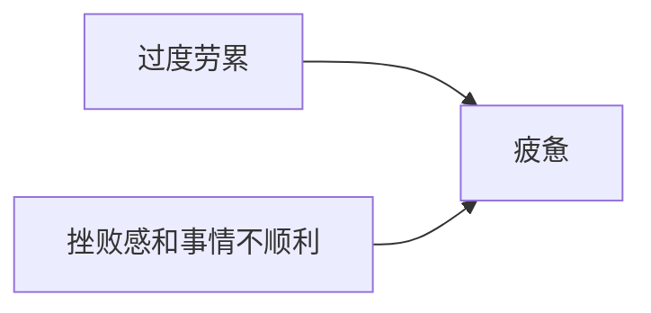

【山姆·奥特曼】动力确实会让人精神百倍，缺乏动力会让人疲惫不堪。很长一段时间我以为疲惫来源于过度劳累。至少从我自己的经验来看，我发现疲惫不堪实际上来自于挫败感和事情不顺利。所以我认为很多创业者创业但失败了，人们通常认为他们只是不够努力，没有足够的精力或激情之类的，但事实并非如此，只是那件事不顺利，你应该做的是关闭那家公司，去度假，再试一次。然后很多人发现，实际上当我在做喜欢的事情并且顺利进展时，我有大量的精力，我可以完成很多事情，所以当你看到真正成功的人，好奇他们是如何完成那么多事情时，得益于他们有动力。

