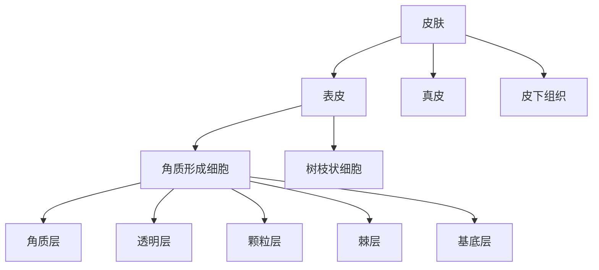
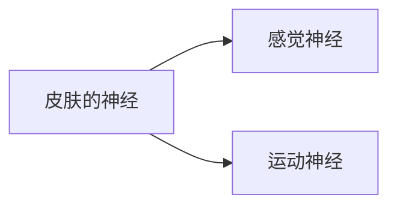

![[Pasted image 20240510143458.png]]
- 绪论
	- 皮肤性病学（dermatovenereology）是研究皮肤、皮肤粘膜（口腔和生殖器）及皮肤附属器的医学学科。
## 第二章 正常皮肤的结构和功能

- 皮肤由 3 部分组成：
	- 表皮
	- 真皮
	- 皮下组织
- 表皮与真皮之间由基底膜带连接。皮肤还有毛发、皮脂腺、汗腺和甲等附属器和丰富的血管、淋巴管、神经与肌肉组织。
- 表皮结构及功能
	- 表皮(epidermis)在组织学上属于复层鳞状上皮，主要由 2 部分组成构成：
		- 角质形成细胞（分为 5 层）
			- 基底层
			- 棘层
			- 颗粒层
			- 透明层
			- 角质层
		- 树枝状细胞
			包括黑素细胞、朗格汉斯细胞和梅克尔细胞。

### 第五节 皮肤的神经、脉管和肌肉

#### 神经

- 感觉神经主要分布在表皮下和毛囊周围

#### 血管

- 皮肤血管分布于真皮和皮下组织内

## 真菌性皮肤病

- 真菌最基本结构为菌丝和孢子。
- 浅部真菌病
	- 由皮肤癣菌(dermatophyte)侵犯人和动物皮肤角质层、毛发或甲板引起的感染。统称为皮肤癣菌病(dermatophytosis),简称癣(tinea)。疾病命名方式有两种:
		- 根据感染部位:如头癣、体癣、股癣、足癣等
		- 根据皮损形态和致病菌:如花斑糠疹、马拉色菌毛囊炎等。
- 深部真菌病
	- 是指累及真皮、皮下组织、内脏、血液的真菌感染,临床上主要包括孢子丝菌病、着色芽生菌病、暗色丝孢霉病及足菌肿等。
- 系统性真菌病
	- 多由条件致病菌引起,主要见于长期使用广谱抗生素、糖皮质激素、免疫抑制剂的器官移植或自身免疫性疾病患者,以及艾滋病、先天或其他原因所致的免疫缺陷病患者。

### 皮肤癣菌病

皮肤癣菌病(dermatophytosis)是由寄生在人皮肤角质层的皮肤癣菌引起的以皮肤干燥、脱屑或浸渍为特点一类皮肤病。主要通过接触传染,如污染土壤、患畜等环境因素;可通过直接接触患者或间接接触污染的澡盆、浴巾、拖鞋等传播:也可自体传染,如由搔抓足癣诱发手癣。根据感染部位可分为头癣(tinea capitis)、体癣(tinea corporis)、股癬(tinea cruris)、手癬(tinea manum)和足癬(tineapedis)。热带、亚热带,以及长期使用免疫抑制剂或广谱抗菌药者感染率较高。

##### 手癣和足癣

常单侧发病,渐累及对侧,呈不对称性,伴程度不等的瘙痒。手癣表现为红斑,脱屑,皲裂等;足癣根据临床表现分为3种类型:
- 水疱型,足弓和足趾底部多见,边界相对清楚的鳞屑性红斑,其上可见针头大小浅表水疱(图 1-11-18A)。雨季加重,秋天缓解。
- 鳞屑角化型,足跟部多见角化过度,粗糙,皲裂(图 1-11-18B)。足癣常瘙痒剧烈。
- 浸渍糜烂型,最常见,趾缝尤其是第四趾缝浸渍、发白、糜烂伴有细碎鳞屑(图 1-11-18C)。继发细菌感染可致局部红、肿、热、痛。

外用药物治疗为主，以咪唑类和丙烯胺类常用，有复发可能。