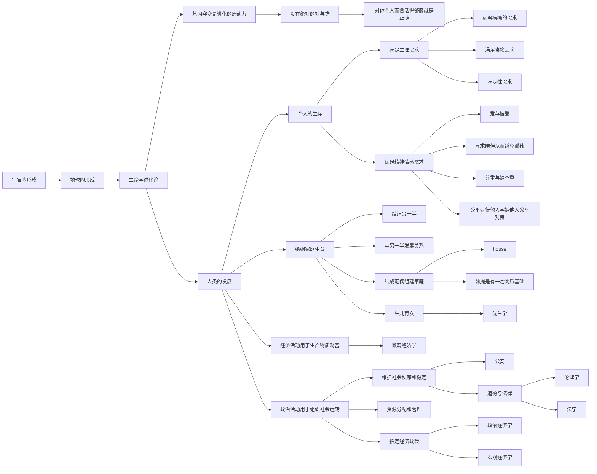

《人类简史》的作者尤瓦尔·赫拉利说:“如果你忘记了人类是动物，你就永远无法了解人性，你也无法理解历史”。

动物最重要的是生存和繁殖，延伸到人身上就是 #钱 (生存资源)和 #性 (繁殖机会)

钱和性具有稀缺性，婚姻、道德、政治、文化等等都属于相对表象的东西，而且就是为生存和繁衍服务的，即解决人类个体之间关于生存资源和性资源分配的矛盾。

```mermaid
graph LR;
宇宙的形成 --> 地球的形成;
地球的形成 --> 生命与进化论;
生命与进化论 --> 人类的发展;
生命与进化论 --> 基因突变是进化的原动力;
基因突变是进化的原动力 --> 没有绝对的对与错;
没有绝对的对与错 --> 对你个人而言活得舒服就是正确;
人类的发展 --> 个人的生存;
个人的生存 --> 满足生理需求;
满足生理需求 --> 远离病痛的需求;
满足生理需求 --> 满足食物需求;
满足生理需求 --> 满足性需求;
个人的生存 --> 满足精神情感需求;
满足精神情感需求 --> 爱与被爱;
满足精神情感需求 --> 寻求陪伴从而避免孤独;
满足精神情感需求 --> 尊重与被尊重;
满足精神情感需求 --> 公平对待他人与被他人公平对待;
人类的发展 --> 婚姻家庭生育;
婚姻家庭生育 --> 结识另一半;
婚姻家庭生育 --> 与另一半发展关系;
婚姻家庭生育 --> 结成配偶组建家庭;
结成配偶组建家庭 --> house;
结成配偶组建家庭 --> 前提是有一定物质基础;
婚姻家庭生育 --> 生儿育女;
生儿育女 --> 优生学;
人类的发展 --> 经济活动用于生产物质财富;
经济活动用于生产物质财富 --> 微观经济学;
人类的发展 --> 政治活动用于组织社会运转;
政治活动用于组织社会运转 --> 维护社会秩序和稳定;
维护社会秩序和稳定 --> 公安;
维护社会秩序和稳定 --> 道德与法律;
道德与法律 --> 伦理学;
道德与法律 --> 法学;
政治活动用于组织社会运转 --> 资源分配和管理;
政治活动用于组织社会运转 --> 指定经济政策;
指定经济政策 --> 政治经济学;
指定经济政策 --> 宏观经济学;
```