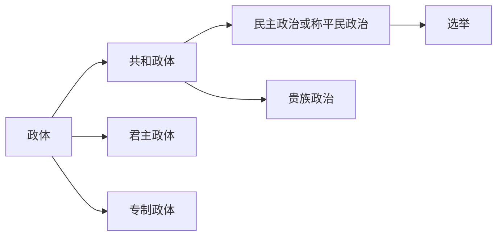

- 是亚里士多德以后第一本综合性的政治学著作

译本介绍

| 译者  | 出版社     | 译文对照                                                                                                                                                                                             |
| --- | ------- | ------------------------------------------------------------------------------------------------------------------------------------------------------------------------------------------------ |
| 夏玲  | 红旗出版社   | 别具一格的智能存在物受其原始性质的限制，免不了会犯下一定的【错误】，而且他们通常因为其原始性质而自以为是，因此他们既不遵守他们的初始规则，对他们自身制定的法则也无法持之以恒地遵守，尽管出于自己的原始性质，但智能世界也有其固定的法则。这一点，物理世界与之不同，它通常是始终如一地遵守其法则，所以说，与物理世界相比，智能世界的治理差远了。                          |
| 张雁深 | 云南人民出版社 | 但是这绝不是说，智能的世界和物理的世界是管理得一样好的。因为虽然智能的世界也有它的规律，这些规律在性质上也是不可变易的，但是智能的世界并不像物理的世界那样永恒不变地遵守自己的规律，这是因为个别的“智能的存在物”受到了本性的限制，因此就会犯【错误】；而且，从另一方面来说，独立行动就是他们的本性。所以他们并不永恒地遵守他们原始的规律；而且，就是他们自己制定的规律，他们应并不老是遵守的。 |
| 欧启明 | 译林出版社   |                                                                                                                                                                                                  |
## 第一章 普通法

### 第一节 法和其他事物的关系

别具一格的智能存在物受其原始性质的限制，免不了会犯下一定的错误，而且他们通常因为其原始性质而自以为是，因此他们既不遵守他们的初始规则，对他们自身制定的法则也无法持之以恒地遵守，尽管出于自己的原始性质，但智能世界也有其固定的法则。这一点，物理世界与之不同，它通常是始终如一地遵守其法则，所以说，与物理世界相比，智能世界的治理差远了。（自然物没有对好和坏的认识，所以自然物无论如何都没有好坏之分。而智能物有对好和坏的认识，所以智能物有正确和错误）

|     | 规律   | 遵守情况     |           | 行为         |
| --- | ---- | -------- | --------- | ---------- |
| 自然物 | 自然定律 | 必然遵守自然规律 | 有对好和坏的认识  | 被动行为：无动机驱动 |
| 智能物 | 法律   | 不一定遵守法律  | 没有对好和坏的认识 | 主动行为：由动机驱动 |
（智能物和自然物的区别：智能物由动机驱动，主动行动，必然遵守物理定理，不一定遵守人规定的法律。自然物不由动机驱动，被动行动，必然遵守物理定律。）（动机的本质：进化过程中的产生的能力）

由于欲求的引诱，兽类保存了它们个别的生命；而且，由于欲求的引诱，它们保存了自己的种类。（什么是幸福？你的基因里注定了娶妻生子会快乐。注定了疾病和灾祸会让你痛苦。对幸福的追求就是人类行为的 #动机 。多种动机产生矛盾就会让人痛苦。比如我有两条路可以选择，向左走可以获得10kg食物，但是有20%的可能失去孩子；向右走有0.5%的可能失去孩子，但只可以获得300g食物。然而有人无论怎么走都能获得100kg食物而不会失去孩子。我们要努力变成这种人）

### 第二节　自然法

和平应当是自然法的第一条。

自然法的另一条就是促使他去寻找食物。

相互之间经常存在着自然的爱慕，应当是自然法的第三条。

希望过社会生活，这就是自然法的第四条。

### 第三节　人为法

人类一有了社会，便立即失掉自身软弱的感觉；存在于他们之间的 #平等 消失了，于是 #战争 的状态开始。

#战争 状态使人与人之间的 #法律 建立了起来。（如果夫妻两个人老是争吵，说明这两人之前没有共同认可的法律）

## 第二章　由政体的性质直接引申出来的法律

### 第一节　三种政体的性质

政体有三种：共和政体、君主政体、专制政体。

共和政体是全体人民或仅仅一部分人民握有最高权力的政体；君主政体是由单独一个人执政，不过遵照固定的和确立了的法律；专制政体是既无法律又无规章，由单独一个人按照一己的意志与反复无常的性情领导一切。

### 第二节　共和政体和与民主政治有关的法律

共和国的全体人民握有最高权力时，就是民主政治。共和国的一部分人民握有最高权力时，就是贵族政治。

人民和君主们一样需要，或者比君主们更需要，由一个参政院或参议会来指导一切。但是为着可靠起见，它的成员应由人民选择。或者像雅典一样，由人民直接选择，或是像罗马曾几次实行过的一样，由人民指派官员去选择。（民主政治也是金字塔结构。关键的区别是金字塔尖的人是怎么来的）

## 第三章　三种政体的原则
（你有能力当你们县的人大代表吗？如果你在你们县里办成了数一数二的企业，那就可能有能力）

【大家都是平等的奴隶】专制国家的原则绝不是荣誉。在那里，人人都是平等的，没有人能够认为自己比别人优越；在那里，人人都是奴隶，已经没有谁可以和自己比较一下优越了。（ #平等 有时也不是好事，比如，平等的奴隶）

（为什么恶政能够延续？作为一个被压迫者，心想：我自己什么都改变不了，只能默默接受。每个被压迫者都这么想，导致恶政延续）在那里，人们不得把坏的遭遇归咎于命运之无常，也不得表示对将来厄运的畏惧。在那里，人的命运和牲畜一样，就是本能、服从与惩罚。

（本章完，20240429）