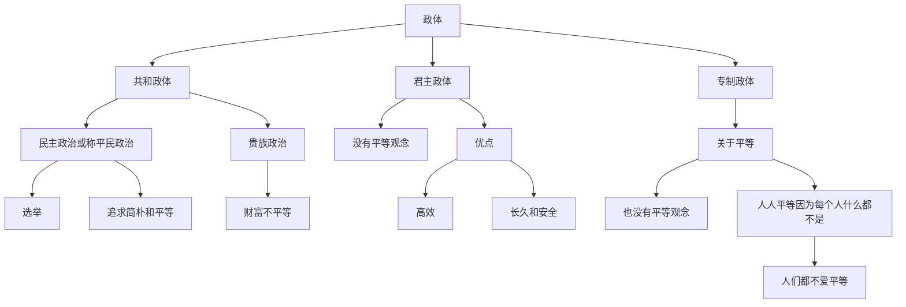

- 是亚里士多德以后第一本综合性的政治学著作

译本介绍

| 译者  | 出版社     | 译文对照                                                                                                                                                                                             |
| --- | ------- | ------------------------------------------------------------------------------------------------------------------------------------------------------------------------------------------------ |
| 夏玲  | 红旗出版社   | 别具一格的智能存在物受其原始性质的限制，免不了会犯下一定的【错误】，而且他们通常因为其原始性质而自以为是，因此他们既不遵守他们的初始规则，对他们自身制定的法则也无法持之以恒地遵守，尽管出于自己的原始性质，但智能世界也有其固定的法则。这一点，物理世界与之不同，它通常是始终如一地遵守其法则，所以说，与物理世界相比，智能世界的治理差远了。                          |
| 张雁深 | 云南人民出版社 | 但是这绝不是说，智能的世界和物理的世界是管理得一样好的。因为虽然智能的世界也有它的规律，这些规律在性质上也是不可变易的，但是智能的世界并不像物理的世界那样永恒不变地遵守自己的规律，这是因为个别的“智能的存在物”受到了本性的限制，因此就会犯【错误】；而且，从另一方面来说，独立行动就是他们的本性。所以他们并不永恒地遵守他们原始的规律；而且，就是他们自己制定的规律，他们应并不老是遵守的。 |
| 欧启明 | 译林出版社   |                                                                                                                                                                                                  |
## 第一章 普通法

### 第一节 法和其他事物的关系

别具一格的智能存在物受其原始性质的限制，免不了会犯下一定的错误，而且他们通常因为其原始性质而自以为是，因此他们既不遵守他们的初始规则，对他们自身制定的法则也无法持之以恒地遵守，尽管出于自己的原始性质，但智能世界也有其固定的法则。这一点，物理世界与之不同，它通常是始终如一地遵守其法则，所以说，与物理世界相比，智能世界的治理差远了。（自然物没有对好和坏的认识，所以自然物无论如何都没有好坏之分。而智能物有对好和坏的认识，所以智能物有正确和错误）

|     | 规律   | 遵守情况     |           | 行为         |
| --- | ---- | -------- | --------- | ---------- |
| 自然物 | 自然定律 | 必然遵守自然规律 | 有对好和坏的认识  | 被动行为：无动机驱动 |
| 智能物 | 法律   | 不一定遵守法律  | 没有对好和坏的认识 | 主动行为：由动机驱动 |
（智能物和自然物的区别：智能物由动机驱动，主动行动，必然遵守物理定理，不一定遵守人规定的法律。自然物不由动机驱动，被动行动，必然遵守物理定律。）（动机的本质：进化过程中的产生的能力）

由于欲求的引诱，兽类保存了它们个别的生命；而且，由于欲求的引诱，它们保存了自己的种类。（什么是幸福？你的基因里注定了娶妻生子会快乐。注定了疾病和灾祸会让你痛苦。对幸福的追求就是人类行为的 #动机 。多种动机产生矛盾就会让人痛苦。比如我有两条路可以选择，向左走可以获得10kg食物，但是有20%的可能失去孩子；向右走有0.5%的可能失去孩子，但只可以获得300g食物。然而有人无论怎么走都能获得100kg食物而不会失去孩子。我们要努力变成这种人）

### 第二节　自然法

和平应当是自然法的第一条。

自然法的另一条就是促使他去寻找食物。

相互之间经常存在着自然的爱慕，应当是自然法的第三条。

希望过社会生活，这就是自然法的第四条。

### 第三节　人为法

人类一有了社会，便立即失掉自身软弱的感觉；存在于他们之间的 #平等 消失了，于是 #战争 的状态开始。

#战争 状态使人与人之间的 #法律 建立了起来。（如果夫妻两个人老是争吵，说明这两人之前没有共同认可的法律）

## 第二章　由政体的性质直接引申出来的法律

### 第一节　三种政体的性质

政体有三种：共和政体、君主政体、专制政体。

共和政体是全体人民或仅仅一部分人民握有最高权力的政体；君主政体是由单独一个人执政，不过遵照固定的和确立了的法律；专制政体是既无法律又无规章，由单独一个人按照一己的意志与反复无常的性情领导一切。

### 第二节　共和政体和与民主政治有关的法律

共和国的全体人民握有最高权力时，就是民主政治。共和国的一部分人民握有最高权力时，就是贵族政治。

人民和君主们一样需要，或者比君主们更需要，由一个参政院或参议会来指导一切。但是为着可靠起见，它的成员应由人民选择。或者像雅典一样，由人民直接选择，或是像罗马曾几次实行过的一样，由人民指派官员去选择。（民主政治也是金字塔结构。关键的区别是金字塔尖的人是怎么来的）

## 第三章　三种政体的原则

（你有能力当你们县的人大代表吗？如果你在你们县里办成了数一数二的企业，那就可能有能力）

【大家都是平等的奴隶】专制国家的原则绝不是荣誉。在那里，人人都是平等的，没有人能够认为自己比别人优越；在那里，人人都是奴隶，已经没有谁可以和自己比较一下优越了。（ #平等 有时也不是好事，比如，平等的奴隶）

（为什么恶政能够延续？作为一个被压迫者，心想：我自己什么都改变不了，只能默默接受。每个被压迫者都这么想，导致恶政延续）在那里，人们不得把坏的遭遇归咎于命运之无常，也不得表示对将来厄运的畏惧。在那里，人的命运和牲畜一样，就是本能、服从与惩罚。

（本章完，20240429）

## 第四章　教育的法律应该和政体的原则相适应

【人为什么讲礼貌】礼仪的来源通常不是很单纯的。它是来自想出人头地的欲望。我们有礼貌是因为自尊。我们用一些仪表来证明我们不是卑贱，来证明我们从未同各世代所不齿的人们生活在一起过，这就使我们自己感到得意。

【对逸乐的烦腻】在朝廷里，各种东西的风味都很讲究。这是由于长期习惯于从巨富而来的浮华；由于逸乐的多样性，尤其是由于对逸乐的烦腻；又由于幻想、嗜癖的纷繁，甚至混乱。一切幻想、嗜癖，只要合意，便老是被欢迎的。（单纯追求逸乐的确很容易令人烦腻）

【愚民政策】君主国家的教育所努力的是提高人们的心志，而专制国家的教育所寻求的是降低人们的心志。

【要保存它，就要爱它】这种爱是民主国家所特有的。只有民主国家，政府才由每个公民负责。政府和世界的万物一样：要保存它，就要 #爱 它。

【国王与暴君】从来没听说过国王不爱君主政体，也没听说过暴君憎恨专制政体。

【农业自古就由奴隶从事】农业在当时还是一种奴隶性的职业，通常是由某些被征服的人民去从事操作的，例如拉栖代孟人使用伊洛底人，克里特人使用珀里埃人，帖撒利亚人使用珀内斯特人，其他共和国使用其他奴隶。（想要控制这些奴隶老老实实做事，真得花不少功夫呀）

【技术让人孤僻】身体的锻炼使人冷酷；推理的科学使人孤僻。音乐是二者的折中。

（本章完，20240430）

## 第五章　立法应与政体的原则相适应

在民主政治之下，爱共和国就是爱民主政治；爱民主政治就是爱平等。爱民主政体也就是爱俭朴。

【专制国家的百姓不爱平等】在君主和专制的国家里，没有人渴慕平等。平等的观念根本就不进入人们的头脑里去。大家都希望出类拔萃。就是出身最卑微的人们也希望脱离他原来的境地，而成为别人的主人。（百姓不爱 #平等 ，不是百姓的错，而是xx的错。）

在贵族政治之下，人们的财富是很不平等的。

【疲倦产生怠惰】征税繁重首先使人民愈益劳苦；劳苦产生疲倦；疲倦产生怠惰的心情。

【君主政体效率高】君主政体比共和政体有一个显著的优点。事务由单独一个人指挥，执行起来，较为迅速。（这说明了科层制存在的意义）

【君主国更长久和安全】君主政体比专制政体有一个很大的优点。依照君主政体的性质，在君主之下，有许多阶层，这些阶层是和政制分不开的，所以国家比较长久，政制比较巩固，进行统治的人们，比较安全。

【专制主义是竭泽而渔】路易斯安纳的野蛮人要果子的时候，便把树从根柢砍倒，采摘果实 。这就是专制政体。

【不制定规则就产生混乱和纷争】按照俄罗斯的宪法 ，沙皇可以从皇室或是皇室之外，选择他所中意的继承者。这样的一种继承制度产生了千百次的革命，并使得帝位颠簸不定，这种帝位的不定性可以和该国传位的武断性相比拟。王位继承的顺序是人民应该知道的最重要的事情之一，所以最好要用最显著的事实为依据，例如依据出生和出生先后的一定顺序。这种办法可以杜绝阴谋，压制野心。一个软弱的君主，将不必再为继承问题而焦虑。

【专制国家的商人并不像想象中那样光鲜亮丽】在专制国家里，商人不能经营大规模的贸易，他的收入仅仅足以糊口。如果他购进大批货物的话，则购货资金利息上的损失将要多于从货物所可赚得的钱。因此，这种国家是几乎没有贸易法律的。

【赏赐不是好事】最坏的罗马皇帝就是那些赏赐最多的皇帝，例如：卡里古拉、格老狄乌斯、尼禄、奥托、维蒂利乌斯、康莫都斯、海里欧伽巴露斯和卡拉卡拉。最好的皇帝，像奥古斯都、维司巴西安、安托尼努斯·比乌斯、马尔库斯·奥列利乌斯和佩尔提纳克司等，都是节俭的人。当好皇帝在位的时候，国家的原则又有了地位，荣誉的财宝代替了其他的财宝。

## 第六章　各政体原则的结果和民、刑法的繁简、判决的形式、处刑等的关系

（ #哲学 是做什么， #技术 是怎么做。显然技术处于更不重要的地位）

【悲惨的平等】在共和国政体之下，人人都是 #平等 的。在专制政体之下，人人也都是平等的。在共和国，人人平等是因为每一个人“什么都是”；在专制国家，人人平等是因为每一个人“什么都不是”。

【刑罚多的坏处】中国的著述家们老是说，在他们的帝国里，刑罚越增加，他们就越临近革命 。这是因为风俗越浇薄，刑罚便越增多的缘故。（公司管理者也要注意这一点）

【刑罚与自由的关系】在所有或几乎所有的欧洲的国家里，刑罚的增减和人民距离 #自由 的远近成正比例，这是不难证明的一件事。

（坏的单位里的预算是拍脑袋算的，好的公司的预算是一分钱一分钱抠出来的）

【酷刑失效】有的国家时常发生拦路抢劫，为着消除这种祸害，它们便发明了车轮轧杀刑；这个刑罚的恐怖，使抢劫暂时停止。但是不久以后，在大路上拦路抢劫又和从前一样了。

【不应用酷刑】治理人类不要用极端的方法；我们对于自然所给予我们领导人类的手段，应该谨慎地使用。如果我们研究人类所以腐败的一切原因的话，我们便会看到，这是因为对犯罪不加处罚，而不是因为刑罚的宽和。

【日本刑罚严苛】在日本，差不多所有的犯罪都处死刑。在那里，甚至不像是犯罪的事情也受到严厉的刑罚；例如赌钱的人处死刑。但是日本人本来就轻视死亡，并且往往因为最最微不足道的一种幻想就剖腹自杀；不断地让他们看到刑罚就能够改正或阻止住他们么？他们不会司空见惯，不以为意么？（日本人动不动就切腹自尽，是因为刑罚严苛）

【酷刑的恶性循环】人们的心灵，处处都受到震惊，并变得更残暴了；只有用更严厉的残暴才能驾驭它们。