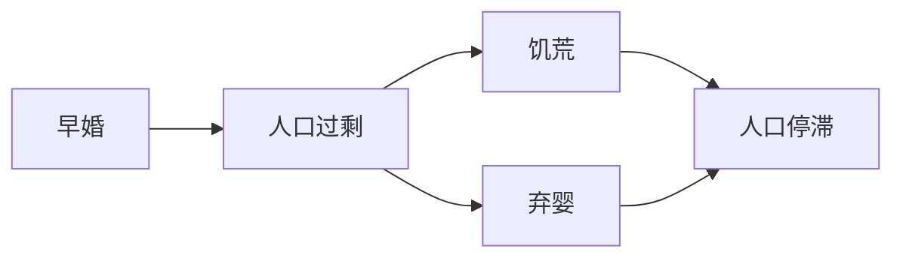
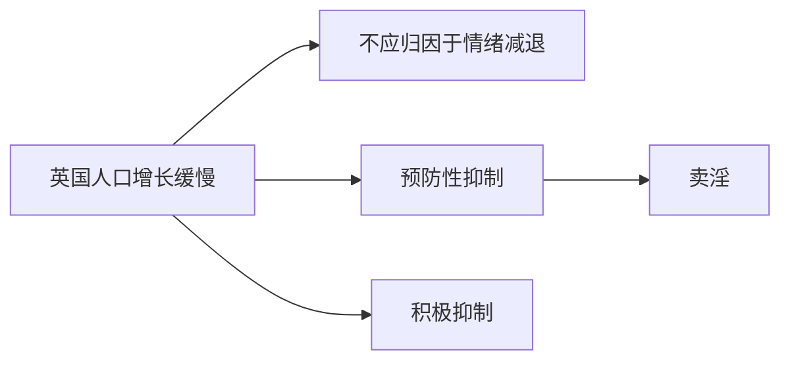
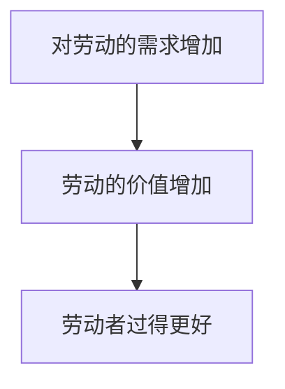

[[人口原理 (（英）马尔萨斯著) (Z-Library).pdf]]
## 第一章

我认为，我可以正当地提出两条公理。第一，食物为人类生存所必需。第二，两性间的情欲是必然的，且几乎会保持现状。

【情欲强烈是人的天性】据我所知，还没有哪个著述家设想过在这个地球上人类最终将能够不依靠食物而生存。但葛德文先生却推测说，两性间的情欲总有一天会被消除。不过，既然他声明，他著作的这一部分进入了推测的境地，所以我在这里对此不想多加评论，而只想说，支持人类可完善性的最好论据，是人类已摆脱了野蛮状态而取得了长足进步，且很难说这种进步会止于何处。但在消除两性间的情欲方面，迄今却尚未取得任何进展，**两性间的情欲今天仍同两千年或四千年前一样强烈**。

一旦接受了上述两项公理，我便可以说，人口的增殖力无限大于土地为人类生产生活资料的能力。

我们这个地球上的生命种子，若得到充足的食物和空间，经过几千年的繁殖，会挤满几百万个地球。但贫困这一专横而无处不在的**自然法则**却可以把它们限制在规定的范围内。

在人类当中，**自然法则**表现为苦难与罪恶。苦难是贫困的绝对必然的结果。罪恶也是贫困很可能会带来的后果，因而我们看到到处都有罪恶。

**人口增殖力和土地生产力天然地不相等**，而伟大的自然法则却必须不断使它们的作用保持相等，我认为，这便是阻碍社会自我完善的不可克服的巨大困难。与此相比，**所有其他困难都是次要的**，微不足道的。这一法则**制约着整个生物界**，我看不出人类如何能逃避这一法则的重压。任何空想出来的平等，任何大规模的土地调整；都**不会消除这一法则的压力**。

## 第二章

无论有没有婚姻法，在天性与道德的驱使下，男人似乎总是倾向于及早爱上一个女子。

如果在一个国家里，人人享有平等权利，道德风气良好，风俗淳朴，生活资料非常充足，无人为家人的生活担忧，人口增殖力可以不受抑制地发挥作用，那么，该国人口的增长速度就会大大超过迄今已知的人口增长速度。

人受强大的本能驱使而繁衍自己的种族，但理性却出面加以干预，向他提出这样的问题，即若无力供养子女，是否可以不生育？若生育孩子，生活地位是否会降低？生活是否会遇到比现在更多的困难？是否要更卖力地干活？若家庭人口很多，尽最大努力能否养活他们？是否会**眼看着子女受冻挨饿而自己又无能为力**？是否会陷于不能自食其力的贫困境地而不得不依靠他人施舍过活？

据认为，在所有文明国家，正是这些考虑会阻止而且也确实**阻止了许许多多人遵从及早爱上一个女子的自然命令**。

人口没有生活资料便无法增加这一命题是极其明了的，无需再加以任何说明。

【一国人口增加说明人民生活开心】只要有生活资料，人口便会增加，所有民族的历史已充分证明了这一点。（一个家庭超出承受能力盲目增加人口是不好的）

## 第三章

尚待研究的是，能否在不产生罪恶或贫困的条件下，抑制人口增殖力，使人口与生活资料保持平衡。

某一时期的绝对人口相对于领土面积而言，绝不会很大，因为总有某些被占领的地区是不毛之地；但人口的代谢却似乎极为迅速，**一些人被战争或饥谨所消灭，更多的人会立即填补其位置**。

我认为必须承认，发动战争是一种罪恶，是贫困造成的结果，而且谁也不会怀疑，这种贫困是由食物匮乏造成的。

## 第四章

接下来人类进入了畜牧和耕种混合的状态，现今大多数文明国家仍处于这一状态，虽然两者相互混合的比例各国有所不同。

如果我们发现该时期养家糊口很困难，因而很少有人早婚，很多男女独身，则可以十分有把握地推论说，当时人口处于停滞状态，也许**实际人口**相对于土地肥力来说已很**庞大**，几乎没有多余的地盘和食物来供养更多的人口。

大多数有关**中国**的书籍所记载的一件事情，却似乎很难与上述推理协调一致。据说，中国各个阶层的人都普遍盛行**早婚**。可是，亚当·斯密博士却认为**中国的人口处于停滞状态**。这**两件事情**似乎是**不可调和**的。中国的人口确实不可能在迅速增加。中国的每亩土地都已被耕种了很长很长时间，很难想象土地的平均产量每年还能有很大增长。盛行早婚的事也许并不那么确切。如果早婚确实很盛行，则就我们现在对这一问题的了解而言，似乎只能这样来**解释上述矛盾**，即：盛行早婚必然造成的人口过剩，肯定受到了不时发生的**饥荒**和**弃婴**习惯的抑制，弃婴现象在荒年也许是很普遍的，是欧洲人所无法想象的。

预防性抑制在某种程度上似乎影响着英国的所有社会阶层。甚至一些社会地位很高的人，想到成家后须节俭度日，须放弃自己喜爱的快乐生活，也会因此而不娶妻。当然，在上层阶级中，这种考虑是微不足道的，但我们所考察的社会阶层愈低下，这种对未来生活的忧虑也就愈大。

看一下现代欧洲各主要国家的情况，就会发现，虽然这些国家自成为畜牧国家以来人口已有很大增长，但当前人口的增长却较为缓慢。

人口增长缓慢的原因，**不能归结为两性间情欲的衰退**。我们有充足理由认为，这种自然倾向同以前一样强烈。那么它为什么没有使人口迅速增加呢？仔细看一下欧洲任何一个国家的社会状况（随便哪一国都可以代表所有国家），就可以回答这一问题了。答案是，**预防性的抑制**和**积极的抑制**，阻止了人口的自然增长。所谓预防性的抑制，是指人们对养家糊口的忧虑，所谓积极的抑制，是指一些下层阶级实际所处的困难境地，使他们不能给予子女以应有的食物和照料。

英国是欧洲最繁荣兴旺的国家之一，可以拿它作为例子。

预防性抑制在某种程度上似乎影响着英国的所有社会阶层。甚至一些社会地位很高的人，想到**成家后须节俭度日**，须**放弃自己喜爱的快乐生活**，也会因此而**不娶妻**。当然，在上层阶级中，这种考虑是微不足道的，但我们所考察的社会阶层愈低下，这种对未来生活的忧虑也就愈大。

毫无疑问，这种种考虑使该阶层的许多人不能遵从早恋的自然倾向。

【生活拮据的单身汉不愿组建家庭生儿育女】每天挣18便士的劳动者，独自一人生活也许还很舒服，若要把这点仅够一人用的钱分给四、五个人用，他就不免会有所踌躇了。为了和自己所爱的人共同生活，他得过苦日子，得更卖力地干活，而且只要他稍稍动一下脑子，他肯定还会意识到，假如他生育很多儿女或随便遭到什么不幸，则他无论怎样节俭，无论怎样卖力干活，也将难免不心疼地看到孩子们挨饿，或不得不丧失自立地位，靠教区的救济为生。每个男子无疑都喜欢自立，害怕丧失自立能力，这是一种很自然的感情。（对于生活拮据的单身汉来说，想获得女人满足情欲与无法承担生儿育女之间是其矛盾与 #痛苦 的根源）（痛苦的感觉是你的基因拿捏你的手段）（然而纯理性是没有拿捏这一说的）

如果以上有关英国社会状况的简要描述基本上是真实的（我认为我并未作什么夸张），那就得承认，在这个国家中，对人口的这种**预防性抑制**，以不同的程度影响着所有社会阶级。一切古老国家的情况都是如此。实际上，这种对婚姻的限制的不良后果十分明显，它使得几乎世界各地都出现了卖淫现象，卖淫不断地使两性都陷入到无法解脱的不幸中去。

## 第五章

所谓积极的抑制，是指已经开始增长的人口所受到的抑制，主要是（尽管也许不完全是）最下层社会所受到的抑制。

每年死亡的儿童中，有很大一部分是由于父母不能给予充足的食物和适当的照料造成的，这些儿童有时甚至还会遭受非常严重的苦难，也许不得不居住在不卫生的环境中并干很重的活儿。在所有城市中，都总是可以看到穷人家的孩子大量死亡。

本章还从经济学角度论证了为什么济贫法是不好的。

## 第六章

本章讲了北美殖民地人口迅速增长的事实。

## 第七章

衡量任何国家人口真实而持续不断增加的唯一正确的尺度，是生活资料的增加。

在其他一切条件相同的情况下，可以断言，一国人口的多少随其所生产的人类食物的数量而定，而该国人民的**幸福**则取决于**食物分配的宽裕与否**，或者说，一天的劳动所能换得的食物数量。

一国的**幸福**并非绝对取决于其贫富、历史的长短和人口的疏密，而取决于其**发展速度**。

如果一切男子都确信能向家庭提供使生活舒适的物品，则几乎一切男子都会成家，而如果下一代能够摆脱贫困的“杀气”，人口必然会迅速增加。

## 第八章

孔多塞先生的《人类精神进步史梗概》一书，据说是在被冷酷地剥夺了公民权（到他死了为止）的压力下写成的。（本章完，20240415）

## 第九章

【若没有不变性，则没有任何知识】自然法则的不变性和因果的不变性是一切人类知识的基础。（本章完，20240419） #知识 #不变性是真理的基础

## 第十章

……罪恶与贫困……（为什么所有书都在讨论罪恶与贫困？让罪恶与贫困一直存在着，不也无所谓吗？可是不是这样的。因为世间每个人，都不愿罪恶与贫困发生在自己身上。所以，人们研究如何避免罪恶与贫困。这符合所有人的利益。）

- P69：葛德文先生的观点。
- P70：作者假设了一个没有任何贫困和邪恶的岛国。
- P71：该岛国人口必然迅速增长。
- P72：人口增长导致饥荒。
- P73：饥荒导致贫困和罪恶。
- P74：葛徳文说“人类社会有一条规律，根据这条规律，人口总是保持在与生活资料相适应的水平上”。作者指出这种规律正是贫困。
- P75：“把自己不用的东西送给别人”和“把自己生存必须的食物送给别人”有本质区别。（所谓 #付出 ，是把你多余的东西/情绪/能量给别人，而不是把你生存必须的东西/能量给别人）
- P76：人们如果无法获得用以供养后代的生活资料，就不会生儿育女。
- P77：……人们就可能同意以 #耻辱 来惩处。（为什么人类社会中会出现耻辱这种概念？本质上，这是调控人口的手段。 $耻辱\uparrow \to 性 \downarrow$ ，$性\uparrow \to 人口 \uparrow$，$耻辱\uparrow \to 性\downarrow \to 人口\downarrow \to 财富\uparrow  \to 耻辱\downarrow$）
- P78：作者认为劳动力的增减并不能导致食物的同比例增减。因此人口少导致每个人分到的生活资料多。
- P79：以最美好的形式组成、以仁爱心而不以利己心为原则的社会 $\to$ 人口增长 $\to$ 饥荒与罪恶 $\to$ 退化为分成统治阶级和劳动者阶级的社会（统治与 #奴役 是一种自然结果）
- 本章完，20240514

## 第十一章

- P81：在世界存在的五六千年间，从未发生任何趋向于消灭两性之间情欲的事情。（ #情欲 是本能，理性无力反抗）
- P82：任何享受如无 #节制 ，都有损于其本身的目的。
- P83：引起情爱的是女人“身材匀称、活泼、性情温柔、亲切、有想象力和才智”。而不只因为她是女性。 #情欲 #女人
- P84：任何国家下层阶级的人民都永远不可能完全摆脱贫困和劳动，而获得智力的高度发展。（不清楚作者如何得到这一结论）

## 第十二章

- P85：葛德文先生推测人类寿命可以无限延长
- P86：驳葛德文
- P87：驳葛德文
- P88：驳葛德文
- P89：葛德文认为未来科技可能极大发展（在这一点上他是对的）
- P90：作者似乎不愿承认未来科技会有想象不到的发展
- P91：人不会永生（微观：一个人不会永生。宏观：人类会永生。）
- P92：人一定会死
- P93：葛德文认为有些人能永生
- P94：看似微不足道的种子能够长成美丽的形体是不可思议的
- P95：人的灵魂能脱离肉体而复活，这比葛德文的人会永生更有可能
- 本章完，20240515

## 第十三章

- P96：作者指出接下来继续驳斥葛德文先生的观点。
- P97：葛德文认为人是仅有理性的动物，作者反对这一观点。
- P98：人不仅有理性：贪欲、嗜酒、 #情欲 
- P99：刑罚是有用的。将杀人犯绳之以法，可以降低人们杀人的可能性。
- P100：【作者支持理智之乐优于肉欲这一观点】一切时代的大仁大智们都无一例外地把理智快乐放在非常崇高的地位；我自己的经验也完全证明他们的决定是正确的;我发觉声色口腹之乐是毫无意义、转瞬即逝的,总是让人感到乏味和恶心;而理智上的快乐却似乎有一股清新之气,总使我感到年轻,使我无时不感到满足,给我的生命注人新的活力,使我的心灵长久地澄明和安宁。
- P101：但对有些人来说，晚上拿起书来读，常常是读着读着就睡着乐，但若是参加舞会，或陪漂亮女人玩，却精神焕发，感到真正享受了人生。对于这种人，靠说服是无用的。这涉及到亲身经历。
- 本章完，20240515

## 第十四章

- P102：葛德文先生的5个推论
- P103：作者认为，人之所以有罪恶和弱点，不是因为不公正的社会和政治制度。而是因为 #情欲 和（由情欲导致的人口增长进而导致的）匮乏。
- P104：作者认为，人类不可能摆脱罪恶和弱点。
- P105：作者认为，人类无法做到尽善尽美。作者以完善植物做比喻。尽力改善植物的某一品质，或许会损害另一品质。
- P106：作者认为，人和社会是不可完善的。也就是说，下层阶级，即人数最多因而从总的观点来看最为重要的那一部分人的生活境况，绝不会得到巨大而显著的改善。
- P107：作者认为，未来的下层人民可能会过上更为舒适的生活：更好的教育、更多的闲暇、更平等的社会。但是他们不可能很有钱，以致全都能早婚，有把握很容易地养活一大家子人。 #婚姻
- 本章完，20240516

## 第 十 五 章

- P108：一味追求（不切实际的）完美目标，反而可能有害。
- P109：例如，一种具有高度智慧且不吃不喝、无需睡觉生物，无疑比人类完美得多，但人类若要模仿这种生物，不仅无论如何模仿不来，反而会损害他那原本的理智。
- P110：葛德文和亚当斯密都支持节俭。然而，葛德文提倡把钱锁在柜子里，而斯密提倡把钱作为 #资本 供养劳动促进生产。
- P111：劳动是劳动者阶级唯一的财产。 #穷人 自谋生路的唯一方法是运用自己的体力。如果减少对劳动的需求，降低穷人拥有的这一财产的价值，只会使穷人受害。
- P112：作者认为将富的财富分给穷人会来不好的后果。因为这会诱使劳动者过奢侈的生活，并减少土地产品。
- P113：仁爱之心是圣人才有的。我们可以弘扬，但不能指望每个人都自发地有仁爱之心。可以指望的是基于利己的交换，即市场行为。
- P114：葛德文认为，富人雇用穷人就是压迫穷人，因此富人应做守财奴而非花销者。
- P115：作者认为，葛德文提出的那种理想的人为的平等状态是不现实的。
- P116：改良土地对劳动者有好处，因为以前养活一家老小需要干8小时的活，现在只要干6小时就行了。
- 本章完，20240516

## 第 十 六 章

- P117：作者直接给出结论：社会财富的增加，无助于增加劳动阶级的幸福。
- P118：劳苦劳动者的安乐取决于劳动价值的增加。而劳动价值的增加取决于对劳动的需求的增加。

- P119：财富增加真的有意义么？在食物存量保持不变的情况下，劳动价格的普遍提高，只能是名义上的提高，因为食物价格必然也会很快跟着相应提高。（ #幸福 的本质是，地球上生活资料产生的数量高于地球上所有人口消耗生活资料的数量。如果人口过快繁殖，将导致饥饿、战争、疾病。）
- P120：（如果一个国家制造业很发达，但农业不发达，那么该国人民数量不会增长，因为食物限制。）（然而，一国如果食物丰富就会导致人口增加，人口增加又会导致食物供应不足，食物供应不足又会导致人口停止增加）
- P121：圈地运动使土地由农场转为牧场，导致谷物产量下降。
- P122：大量最为肥沃的土地用于放牧，农具不断得到改进，大农场日趋增加，小农日趋减少。这一切导致现在务农人口减少。
- P123：务农人口少了，因此增加的人口肯定几乎都被吸收到制造业中了，而制造业需要更多的人手，仅仅是由于时尚变幻无常，例如过去人们喜欢丝绸，现在则喜欢鞋带和暗扣。（有再多制造业产品，没有食品也没卵用。有充足的食物，别的啥都没有日子也过得去）

![[Pasted image 20240517135601.png]]

- P124：如果中国用大量劳动力建立制造业，则农业人口减少，粮食产出减少，不是好事。
- P125：在主要从事农业的国家，穷人的生活会很富裕。在主要从事商业的国家，穷人得到的利益相对来说则少得可怜。（一个国家如果制造业很发达，但产粮很少，那也没卵用）
- 本章完，20240517

## 第 十 七 章
我认为，与其用财富养活20万人生产丝绸和花边（非生产性劳动），还不如养活他们来生产更多的食物（生产性劳动）。

用于土地的资本对于使用资本的个人来说也许是【非生产性】的，但对于整个社会来说却是高度【生产性】的。与此相反，用于工商业的资本对于个人来说也许是高度【生产性】的，但对于整个社会来说却可能几乎完全是【非生产性】的；正是由于这一原因，我才把相对于【农业劳动】而言的【制造业的劳动】称作【非生产性劳动】。

【人口】和【食物】是以不同比率增长的，因而我朦胧地感到，要使这两者保持平衡，只有借助于某种【苦难】和【罪恶】的力量。

美国人的幸福与其说取决于其特有的文明状态，还不如说取决于其作为新殖民地的特有状况，即取决于其拥有大量未耕种的肥沃土地。（地理决定论）

物产最丰富的国家，其居民的智力不见得最敏捷。“需要是发明之母”这句话是很有道理的。（如果你什么都有了，其实你就不需要努力了。这就让我们思考：我们真的有必要整天想着为社会创造什么价值吗？难道现在社会的物产不已经很丰富了吗？）

洛克曾说过，主要是避免痛苦而不是追求幸福刺激了人们在生活中采取行动。（单身汉尝试组织各种活动、参与社交，本质上是为了避免孤独空虚的痛苦） #动机

如果洛克的观点是正确的，如果我们有充足的理由认为洛克的观点是正确的，那么【恶】对于促使人类作出努力似乎就是必不可少的。

正是由于自然法则保持不变，农民才勤奋劳作、深谋远虑，工匠才不知疲倦地运用其技巧，医生和解剖学家才熟练地搞研究，自然哲学家才仔细观察和耐心考察。人类运用智力所取得的所有最伟大、最辉煌的成就，都仰赖于自然法则的固定不变。 #不变性是真理的基础

（人类很懒惰（这是 #人的本性 之一）。如果人类只满足于让夫妻二人和两人的2个孩子填报肚子的话，那么人类人口总数就只能维持在原始人的数量，而这是不够的。所以人类倾向于多生育，这就是 #人的本性 。）（惧怕死亡也是 #人的本性 ）（接着刚才的想法，如果人类满足于每对夫妻只生两个孩子的话，现在全球80亿人，那么如果不出意外，人口会一直维持在80亿的水平。但如果发生了大规模的传染病，那么人口可能会降至40亿。再来一次传染病，将至20亿……直至灭绝。人类能够蓬勃发展，本质上是依赖 #本能 。人类要么有多生育的本能，要么有不愿生育的本能。很明显，多生育这种本能有利于人类繁衍。人类目前还没有进化出随机应变的本能——地球人口减少时生育意愿强，地球人口增多时生育意愿弱。所以我们要学会节制自己的性欲和节育，免得让苦难和罪恶去迫使我们节育。）

生活上的困难有助于使人具有才能，这一点即使从日常经验上看也会使人深信不疑。人们常看到，每当形势发生新的特殊变化时，总会造就出一些富有才智的人来应付新形势带来的困难。

## 第 十 九 章

世上存在着恶，不是为了使人悲观绝望，而是为了刺激人的活动。

## 人口原理概观

假定从一英亩产量开始，人们能够迅速地把肥力相同的土地准备好，而且任何麦种都不浪费掉，则其增长率将提高到14年后小麦能完全覆盖住整个地球陆地的表面。（以前说人类指数增长，粮食线性增长；现在看来粮食也指数增长）

对人口增长的【积极抑制】包括以任何方式过早地缩短人的【寿命】的一切原因，例如不利身体健康的各种职业、繁重的劳动和长期在露天干活或生活，由于贫困引起的饥寒交迫、对儿童抚养不当、一切暴行、大城市和制造厂、一系列常见病和流行病、战争、杀害婴儿、鼠疫和饥荒。在这些积极抑制中，由于自然法则引起的那些抑制，我们专门把它们叫做【苦难】，而我们自己招来的抑制，例如战争、一切暴行以及其他许多我们有能力加以避免的抑制则具有混合性质。它们是由【罪恶】带给我们的，其后果则是【苦难】。

供养家庭的困难造成推迟结婚。人们会发现，这就是【预防性抑制】实际起作用的主要方式。只有对人口增长的【预防性抑制】能取代巨大的【苦难】和大量的死亡。

在所有的古老国家中 【结婚人数】取决于【死亡人数】。大批人的死亡常常造成大批人的早婚。同样应当肯定，除非生活资料能够适当增加，否则大批人的【早婚】必定导致大批人的【死亡】。

在16世纪，半数活产婴儿的生存概率或所能活到的年龄只有4.883岁。

【无政府主义】的几乎确凿无疑的后果就是【专制主义】。

（全书完，20240603）