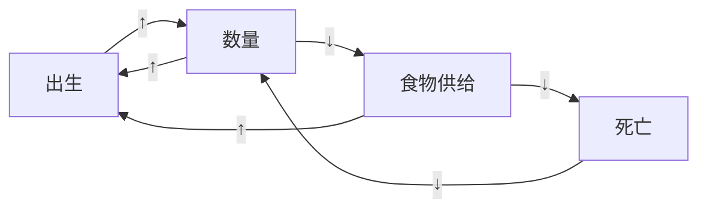

## 序言

人类生态学是一门研究【人类】与【环境】间相互作用的科学。

## 前言

在20世纪60年代和70年代，【生物生态学家】被人口爆炸及其对环境产生的破坏性影响所警醒，他们使用“人类生态学”一词以强调【人类】像其他【动物】一样，【受限】于【生态环境】。

## 1 绪论

【生态学】是一门探讨【生命体】与【环境】之间关系的科学。【人类生态学】则是一门描述人类与环境之间关系的科学。在【人类生态学】中，【环境】被视为一种【生态系统】。【生态系统】所指定的范围有：空气、土壤、水、生物体，也包括所有人类创造的物质结构。

P6：在印度，几千年来人们一直靠砍伐树枝和灌木丛来提供做饭所需的【燃料】。只有在人口相对较少的情况下，才不对环境构成威胁。但是这种情况随着【过去50年印度人口的激增】而发生变化。因为人们砍伐了太多的树木当作做饭用的燃料，所以最近几年森林大量减少，现在已经没有足够的树木来满足所有人的使用需求了。人们不得不让他们的小孩去寻找其他可燃物，如更小的树枝、农作物秸秆和牛粪来应对这类“能源危机”。收集燃料使得孩子对于家庭更为重要，因此，父母需要生更多的孩子，最终导致人口增长并进一步引发燃料需求的增加。

## 2 生物群落和反馈系统

【负反馈】提供了稳定性，所有生态系统和社会系统都有很多【负反馈】循环，保持系统的每一部分都在正常范围，从而能让整个系统继续正常运行。【正反馈】刺激着变化，对于我们周围世界环境问题的突然出现和其他快速变化，【正反馈】是有一定责任的。

P17：现在地球已经被人类充斥，【指数型的生物群落增长】开始受到关注。

P18：指数型增长是一个正反馈的例子。（如下图所示，假设每个个体的生育率不变，则数量增加导致出生增加，出生增加导致数量增加。直至前提即生育率发生变化）

P19：正反馈并不只发生在植物和动物群落，在人类社会系统也很常见。存在于个人或团体之间的友好或敌对关系的相互促进就是一个正反馈的例子。不良的正反馈是所谓的“恶性循环”。

P22：种群调节是用负反馈进行调节，其对环境资源的使用保持在环境承载能力的限度之内。由于维持数量的资源是有限的，没有种群能长期超过环境的承载能力。

P25：每一生态系统和【人类社会系统】都存在大量正反馈与负反馈循环。

## 3 人类系统

P28：根据考古发现，大约300万年前原始人类（能人）出现在非洲，他 们使用简单的石器工具。至少100万年前人类（直立人）在欧洲和亚 洲开始扩张。大约130万年前现代人种（智人）在非洲出现，并且此后很多年一直生活在非洲。智人扩展到欧洲、亚洲和澳洲大约是在4万—5万年前。 众所周知，生活在西半球的原始人类是在大约13000年前从亚洲迁移过去的。智人至少已经延续了6万代，那个时期整个地球的人口可能都不到1000万人。大约一万年前，在世界的一些地区人口开始增加，但一直到距今300年前，增长都比较缓慢。到公元1700年，世界大约有6亿人。在1700年以后，经过12代的繁衍，人口已成倍地增加至60亿。

P29：现代人类的身体和心理能力，还有他们在生态系统中的地位，早在几万年前人类作为狩猎采集者时就确立了。在人类生活的自然生态系统中，包含名目繁多的植物和动物，其中只有一些适合作为人类的食物。凭借【狩猎】和【采集】技术，人类只能捕获生态系统中的一小部分作为食物供自己消费。【农业革命】改变了一切，它使人们能够创建自己的小型生态系统来生产粮食。大约【12000年前】农业在中东地区初现雏形。

P30：【农业革命】始于【中东】地区，因为该地区可供种植的植物和可供驯养的动物最多。在世界上所有的物种中只有几百种植物和数十种动物适合【驯化】，它们几乎都是【5000年以前】才被驯化的。在过去的5000年中，世界上没有新的作物或牲畜被驯化，未来也不用期待。在世界上的一些地区，如澳大利亚和撒哈拉以南的非洲，几乎没有动植物可被驯养。从别的地区带来被驯化的动植物以后，这里的农业才开始。

P33：自工业革命后，承载力更大、更持续的发展使得地球的人口在过去250年里成倍地增长。

![[Pasted image 20240614094232.png]]

P38：既然动物的种群受到它们的食物供应的限制，为什么大多数野生动物看起来很健康而且营养充足？答案在于，许多动物种群数量低于其环境承载力。承载力是一个上限，即对于所有生物种群来说食物供应是一个限制。但常见的方式是通过生态力量将种群数量调控在食物供应的限制之内，而不是通过使其遭受营养不良或者饥饿的方式。食肉动物如狼和山狮捕食鹿，使鹿的数量减少到低于其承载力。（鹿不是因饥饿死，而是被狼吃掉。在人类早期社会中，人不是被饿死的，而是被吃掉的。）

P38：当鸟为繁衍而交配时，每种鸟都会选择一个广阔的地域范围以便远离同种鸟类所选择的地方。由于进化的结果，鸟类选择的地方足够大，它能为繁衍后代和哺育幼仔提供充足的食物空间。如果一个种群的鸟没有足够的空间，那么相对空间来说多出的鸟就不会再有地方交配繁衍。（对于择偶的挑剔是控制种群数量的一种方法。现在社会上大龄剩女对择偶要求的苛刻，表面上是笑料，实则是存在于各种生物种群的调控种群数量的本能）

P40：领土纷争在人口调节上发挥长期作用。

P41：人口过剩【最严重】的后果是对生态系统中食物的大量需求。当人口超过其承载力，每个人都不会有足够的食物。

P43：过去因宝贵的【自然资源】的纠纷已引起多次【战争】，预计未来对有限资源的争夺会更加剧烈。（这句话解释了世界上为什么存在 #战争 。另外联想到，财富向少数人集中也是控制人口的一种方式）

## 4 作为复杂适应性系统的生态系统和社会系统

P52：每一种植物、动物或者微生物都在食物网中扮演某一特定角色——生态位(ecological niche),这一角色主要由物种在食物网（例如生物群落的某种物种以其他物种为食，同时也为另外的物种提供食物）中的位置决定。

P54：一升普通土壤包含数十亿个细菌。

P55：生物进化基于基因突变。只有在少数情况下，足够有利的基因突变才能让物种在自然选择中幸存下来。人类文化也同样存在进化。文化突变是新理念。当新的理念与其他文化相适应并被证明有用的时候，它们就得以幸存。一个理念是否能够幸存取决于【环境】。

P56：原态稳定(homeo-stasis)指的是数以百计的【负反馈】使得健康身体的每一部分维持原状；但是一旦人生病或者受伤，身体【状态】就会发生改变。【状态】是特定时刻身体的情况——体温、血压、血糖浓度、荷尔蒙浓度、呼吸频率以及其他【数以百计】的项目。

P56：如果一个身体健康的人经历一场外部干扰，譬如说疾病或者受伤，干扰会使得小球沿着山坡向上运动直至不健康状态(B)。通常身体将消除感染或是修复损伤，直至身体复原。这时小球将滚回山坡底部，身体再度回到如A所示的健康状态。无论疾病还是健康，身体都处于图中“活着”的状态(“活着”的【稳定域】)，这是【原态稳定】使得它如此。还有另外一个【稳定域】：“死亡”。严重的疾病或者受伤将改变身体状态，小球被推至山坡顶部，越过“活着”的【稳定域】到达“死亡”区间(C)。

P57：当一个人的健康随着年龄增长而衰弱，山坡的形状也逐渐改变，使得山坡底部逐渐抬升，趋向“活着”与“死亡”的边界(D)。臀部受伤、流感或是肺炎这样的疾病很少能夺取年轻人的生命，对于老年人来说却可能是致命一击。

## 5 生态系统组织

P65：植物无法跑或躲，但是它们在其他方面进化以躲避被捕食。许多植物营养价值很低以至于不值得被吃。一些植物种类含有对动物的消化产生反应的化学物质；其他一些物种有毒或是被刺保护。

P66：电视机由大量电子元件组成，每一个元件都被精确地设置。如果一台电视机的电子元件是随机选取并组合的，它不会良好地工作。它或者是不能显示图像，或者是插电后烧掉。生态系统同样需要选择组成部分，它们在生物进化过程中相互适应，以便精确配合。

P66：每一个系统元件的行为都受到其他元件行为的制约，这是电视机和生态系统运作的基础。尽管从理论上来说，电视机中的每一个电子元件都能够获得大范围的电流，每个电子元件的电流还是受到其他元件的【制约】。结果，通过电视机的电流受到产生图像的有序设计的限制。【图像】是电视机的一个【显性属性】。

P67：生态系统也受到同样的限制。尽管所有的植物、动物和微生物都有繁殖无数后代的能力，种群数量还是会受到食物供给、自然天敌和其他生态力的制约。然而，生态系统和电视机之间还是存在重大区别的。生态系统比电视机有更高水平的可重复性（复制），使得其有更大的依赖性和弹性。因为电视机以经济性为设计原则，每个功能只有一个元件。如果这个元件缺少，电视机就无法工作。在生态系统中，不同有机体有一定比例的功能重复性。例如，某种动物能够吃好几种食物，如果其中一种濒危，它将转向吃数量丰富的其他食物。（电视机是一个系统，里面每个零件都有其作用。在社会系统里，如果一个人在工作中一直摸鱼，不发挥任何作用，会怎样？其实好像问题不大，因为富二代不需要做任何事情就能活得很好。）

P68：当土壤中水分适度的时候，植物生长得最好；太多的水分会将微生物和植物根部需要的空气挤出；太少的水分会限制植物的生长。

（政治、文化、社会、婚姻家庭、法律、经济、科技、人类情感、心理学、医学，似乎都是后继与人类生态学之后的。人类生态学是因，前述若干项是果）

## 6 生态演替

顶级群落早晚都会毁于某种干扰，这就是衰亡。大多数动植物物种从这个地方消失，随之而来的是重组过程。由于此时许多生态位是空缺的，如果这个地方有适宜的自然环境，生物群落有合适的食物来源，新进人的物种面临的竞争就少，生存也会变得简单。（生存变得简单，这就是所谓的幸福的真谛）

P92：在全世界范围内，每年约有50000平方公里的草地变为沙漠。其原因是复杂多样的，但过度放牧经常是主要原因。为何结果如此惨重，人们还在草地上过度放牧？主要原因是【人口过剩】。

P95：日本传统的里山(satoyama) 系统（字面意思为“村/山”）是可持续的景观管理的一个案例，几个世纪以来这个系统提供了乡村生活的基本画面。村民每年都会把椎树和桦树幼苗砍光，以使它们不能长到橡树的上方。用这样的办法他们在几个世纪的时间内保持橡树林作为景观拼接体的主要部分。

P99：1900年前后，美国森林协会由于林务官不理解经常性森林火灾的价值，出台了一项保护森林免遭火灾的政策。他们不想让森林中的任何一棵树毁于火灾。在80年的时间里，他们总是尽快扑灭所有的林火。由于这么长时间以来都没有经常性的小火灾来释放落叶覆盖层，导致越来越多的落叶覆盖层堆积在地上。到1980年，森林中的落叶覆盖层堆积到了一定程度，越来越易受到火灾影响了。现在森林火灾变得很难控制，特别是在美国西部广大的干旱地区。森林协会越想保护森林不受火灾影响，问题就变得越糟糕，因为每场火灾都变得更难扑灭，而且可以摧毁巨大区域内的自然环境。森林保护的代价变得越来越昂贵，因为需要用大量的消防队员、救火车和飞机来洒水。尽管作了许多努力，数千平方千米的森林有时还是会被一场火灾摧毁。（因为火灾而利益受损的人，只能说是运气不好。或者他们的父辈对前景太乐观使得把他们生了出来）（我们的 #工作 做的事，到底有多少是真正有意义的呢？）

## 7 人类社会系统和生态系统的共同进化和相互适应

P110：工业革命使得机器代替人类和动物劳动成为可能，比如进行土地耕作和作物收割，欧洲的农业随之发生了变化。

## 8 生态系统的服务功能

能量存在六个基本形式：

1. 辐射能（太阳光、无线电波、X射线、红外线）；
2. 化学能（比如电池或碳链）；
3. 机械能（运动）；
4. 电能（电子运动）；
5. 核能（原子内部的能量）；
6. 热能（原子和分子的运动）。

【热力学第二定律】的一个重要推论是：【宇宙】中的【一切系统】，无论是物理系统还是化学系统，都需要【能量】的输入才能使其持续运作。

P122：能量在某一级【食物链】中可供下一级【食物链】消费的比例被称为【食物链效率】。它的计算方法是用食物中的能量减去呼吸作用消耗的能量。【食物链效率】通常在10%到50%之间。

P129：有些人假设，供需关系这只无形的手能够保护可再生资源不被过度开发。然而，当过度捕捞导致有商业价值的鱼类被“杂鱼”取代时，就算捕捞完全停止，那些有价值的鱼可能再也不会出现了。

## 9 理解自然

在每一个社会中，宗教信仰都是建立世界观和规范人们行为的有力工具。原始社会对自然的理解带着敬畏和崇拜，他们的信仰认为人类是自然不可分割的一部分。（一些宗教观念虽然表面上是迷信的，实际上却蕴含着真理。比如人与自然的关系）

P137：宗教是社会利用世代积累的智慧形成的一种价值观、感知和行为方式的概括。它在社会感知、人际关系和人与自然关系方面扮演了重要角色。宗教传达了人类对大于自身的事物的敬畏和崇拜。宗教信仰是一种价值的来源，它告知我们什么是生命中重要的部分。同时，宗教提供了一种道德符号——正确和错误的区分准则与行为准则，它们通过情感上令人信服的信条、标志和仪式进行不断强化从而使其非常有效。这种道德符号对人类与自然相互作用的重要性体现在一种平衡上，不仅促进个人需求和他人需求之间的平衡，也促进短期需求和长远考虑之间的平衡，比如对子孙后代的关注。（对宗教的正确认识）

P138：【神灵宗教（万物有灵论）】在现代科技发展以前，人们利用【神灵】的存在解释自然。神灵这种不可见的存在，通过控制天气、疾病和其他重要的自然现象来影响人类。所谓【神灵】与现代科学有着巨大的差别，是因为【神灵】有着人性，而科学却是客观地、技术地解释自然现象。虽然如此，科学的解释仍然在某些方面与神灵有着惊人的相似。虽然科学让自然的许多功能变得“可见”（比如病毒和细菌可以导致疾病，DNA在基因和蛋白质构造中的作用），现代科学的许多概念仍然像【神灵】一般不可见。不可见的理论构造，如重力领域、电磁学领域和亚原子粒子领域，在预测方面有着惊人的能力，然而科学家却并不知道上述领域究竟是什么样的或者它们为何如此运作。最初，【神灵】是所有【宗教】的主要部分，对于【神灵】的信仰在所有社会中普遍存在，无关【信仰】本身；直到【神灵】被【现代科学】取代。许多部族社会的【宗教】依然基于【神灵】（例如日本的神道教），并在现代社会中仍然占有重要的地位。

P140：尊重传统的美国土著住民在成年时将会选择某种特殊的动物作为守护灵，这个守护灵将成为他毕生的向导。（这使得人们保护动物，从而避免竭泽而渔）（在一些宗教活动中，人们打扮的美美的，进行各种娱乐活动，其本质是提供一个借口让人们开心娱乐）

P141：对于【印度教】众来说，地球上的一切生命都是神圣的，都是他们的神灵毗湿奴的某种表现形式。宇宙是一个广大无边的有意识的人，宇宙的每个部分（土地、植物、动物、人类）都有意识，并且每个部分都是相连的。所有的生物都有与人类一样的灵魂。当人类死亡后，他们的灵魂将会投胎转世到植物、动物或者其他人身上。（ #宗教 注重人与自然的关系。宗教中的许多观点从人类生态学的角度看来是有益的）

P142：【佛教】的一个核心哲学思想是：【痛苦】的根源是人类的【欲求不满】。抑制【欲望】是快乐的关键所在。对自然资源的利用则仅限于满足人类对食物、衣着、住所和医疗等的基本需求。另一个【佛教】的主要思想是尊敬、同情和爱世上的所有生命。动物不应该被残杀，植物也仅仅在满足基本食物需求的时候才被收割。

P142：【风水】是中国南方的神灵宗教，为人们如何使用土地提供指导。【破坏景致】的行为被严格【禁止】，因为他们将冒犯“龙”或者其他强大的神灵。

P142：【道教】强调自然是超越理解的神秘存在。人们应尽可能少地改变自然，努力通过适应自然的节奏和流动获取能量，而非控制和主宰自然。

P144：基督教崇尚最少消耗的简单日常生活。

P145：伊斯兰教由先知穆罕默德于1300年前创建，并受到犹太教和基督教的强烈影响。伊斯兰教相信仁慈并富于同情心的【神】【创造】了这个有秩序的【宇宙】。（宗教可以轻松解答科学未能解答的问题：宇宙是怎么来的？）

P146：人类在生产资料方面完全依赖自然。因此（人们）有理由对自然是如何运作的保持敏感，并力求人类活动与自然保持和谐。

## 10 不可持续的人类与生态系统的相互作用

P157：开放获取式的资源很容易被过度开采，因为没人负责控制它们的使用强度。这种情况下的过度开采被称为【公共资源的悲剧】。个人利益的最大化并不等于群体利益的最大化。例如被汽车尾气所污染的大气层就是一种公共资源。一辆机动车所造成的空气污染微乎其微，但是一个拥挤城市所有汽车的尾气加起来就可能成为一场危害健康的灾难。

P162：只有当一个社会的农业系统产出的剩余超过了那些生产粮食的家庭本身的需要时，城市这个更大更复杂的生态系统才会形成。多余的粮食允许城市中的人们分化出多种多样的非农职业——劳动分工正是形成社会复杂性的核心。对于现代社会而言，一个典型的大城市应当拥有超过10000个不同的职业。

P163：一个复杂文明的社会系统由于自身过于复杂，以至于难以继续有效率地运行。当社会复杂性超过最大限度时，更多的复杂性带来生产力的下降。当一个社会的复杂性超过最适宜度时，通常它就会开始经历严重的环境问题，并开始衰退。

P166：复杂社会的兴衰并不只是古代文明的故事。现代城市生态系统的兴衰经历了复杂的系统循环，在空间尺度上从街区发展到小型城市、大城市再到巨型城市群以及整个文明。居民或商业活动的搬迁会引起一个街区的成长。几十年后，同样的街区会衰退，因为居民和商业活动搬到了另一个更有竞争力的街区。在更长的时间范围内整个城市也会发生同样模式的变迁。

## 11 可持续的人类与生态系统的相互作用

P177：一个成功利用公共所有资源的案例：日本传统乡村的森林管理……每个村庄控制着森林【使用权】，决定谁来使用森林以及如何使用……村庄里的每个家庭都有权利使用森林，森林利用的规则是由村庄委员会和来自家庭的代表共同决定的……每个村庄都会发展它们自己的确保规则实施的方式……对于【破坏规则】的人每个村庄有它们自己的【惩罚】措施。森林看护常常以沉默和简单的方式对待偶尔的违规，或者对犯规者进行小量的【经济处罚】。如果违规行为非常严重，那么看护将没收非法收获以及规则破坏者使用的所有设备或者马匹。规则破坏者不得不支付罚款以便领回他们的设备和马匹。罚款的数额取决于违规的严重程度、规则破坏者快速改正错误的意愿以及他是否存在违规的前科。（这个村庄就是一个小社会，包含了社会运行中的种种要点）

P195：1997年《京都议定书》确立了工业化国家在未来10年减少5%的二氧化碳排放的全球目标。

## 12 生态可持续发展案例

P200：登革出血热是1950年后人们才知道的一种“突发的”疾病。它不是由单独的病毒种类引起的，而是因为【登革热病毒】有四种不同的种类，感染一种病毒后会获得对这种病毒的终身免疫；但同时也就产生了一些抗体，提高了感染其他三种病毒的机会。有一种蚊子被称为埃及伊蚊(Aedes aegypti),它是登革热和黄热病菌的主要传播媒介。随着1943年DDT的出现，登革出血热的流行在很大程度上被抑制住了。DDT带来的巨大成功是短暂的，因为进化出了抗药性的蚊子，它们开始迅速在世界各地传播开来。针对登革热的疫苗或药物还没有问世；预防它们的唯一途径是远离蚊子。全世界范围内每年有5000万到1亿人感染登革热。每年有几百万严重的登革热病例和大约50万登革出血热病例。

P210：在越南，登革出血热是一个很严重的问题。（越南的风水不如中国好）

（全书完，20240614）