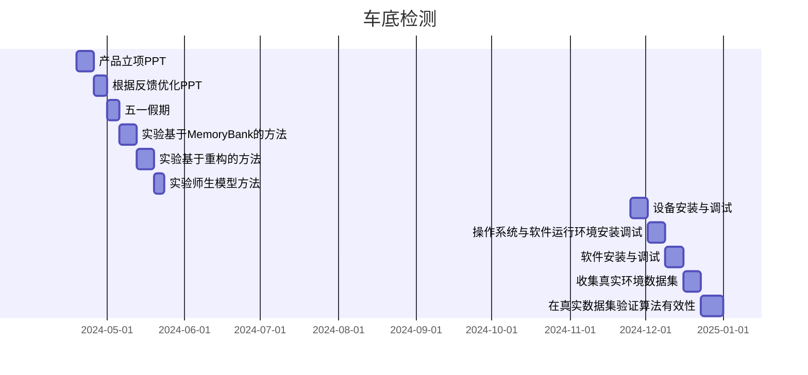

```mermaid
gantt
	title 车底检测
	dateFormat YYYY-MM-DD
	产品立项PPT : 2024-04-19, 2024-04-26
	根据反馈优化PPT : 2024-04-26, 2024-05-01
	五一假期 : 2024-05-01, 2024-05-06
	实验基于MemoryBank的方法 : 2024-05-06, 2024-05-13
	实验基于重构的方法 : 2024-05-13, 2024-05-20
	实验师生模型方法 : 2024-05-20, 2024-05-24
	设备安装与调试 : 2024-11-25, 2024-12-02
	操作系统与软件运行环境安装调试 : 2024-12-02, 2024-12-09
	软件安装与调试 : 2024-12-09, 2024-12-16
	收集真实环境数据集 : 2024-12-16, 2024-12-23
	在真实数据集验证算法有效性 : 2024-12-23, 2025-01-01
```

```timeline
tags=test startDate=1700 endDate=2030 fivHeight=600 minDate=200
```