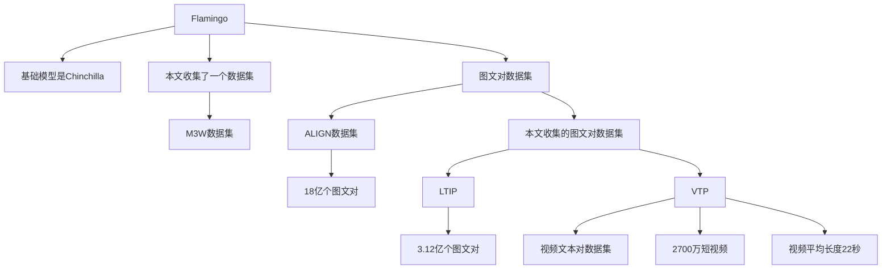

[[2204.14198 Flamingo.pdf]]
#### 术语英汉对译
Few-Shot In-Context Learning：小样本上下文学习
Few-Shot Adaption：小样本适应
In-Context Examples：上下文示例
#### Related work
##### Language modelling and few-shot adaptation
执行小样本适应的方法有：
1. 增加小的适应模块
2. 微调LLM的一小部分
3. 在提示中展示上下文示例
4. 通过梯度下降优化提示

