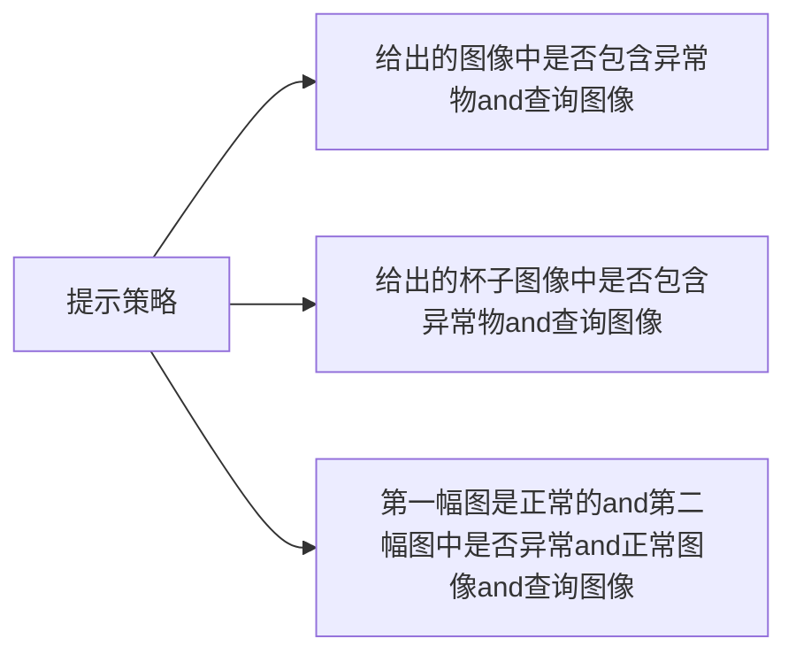

[[2403.11083 Customizing Visual-Language Foundation Models for Multi-modal Anomaly Detection and Reasoning.pdf]]
https://github.com/Xiaohao-Xu/Customizable-VLM
#### 参考文献
[[A Survey on Visual Anomaly Detection]]
