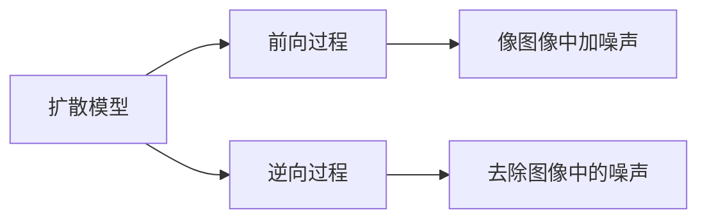
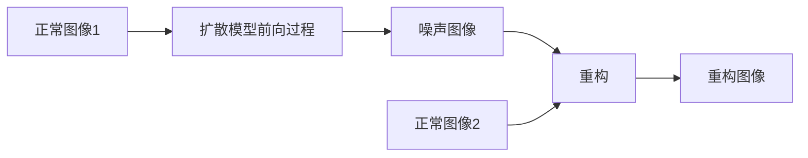

## 摘要
  
传统的**基于重建的方法**在**异常检测**中难以取得竞争性的性能。在本文中，我们介绍了一种新颖的**去噪过程**，称为去噪扩散异常检测（DDAD），用于基于**目标图像**的图像重建。这确保了一个连贯的恢复，与**目标图像**密切相似。我们的异常检测框架采用了条件机制，其中**目标图像**被设置为**输入图像**，以引导去噪过程，从而实现无缺陷的重建同时保持正常模式。然后，通过像素级和特征级的**输入图像**和**重建图像**的比较来定位异常。最后，为了增强特征级比较的效果，我们引入了一种域自适应方法，利用我们的条件去噪过程生成的几乎相同的示例来微调预训练的特征提取器。DDAD的真实性在包括MVTec和VisA基准数据集在内的各种数据集上得到了证明，分别实现了99.8%和98.9%的图像级AUROC的最新成果。源代码可在GitHub上获得。

## 1. 简介 

异常检测涉及识别和定位数据中与名义观察不一致的实例。检测分布外数据是工业 [4, 55]、医学 [23, 54] 和视频监控 [27] 等许多领域的一项关键任务。在监督环境中，模型在包含正常和异常示例的数据集上进行训练。然而，异常情况通常是不可预见的，并且这些模型在推理过程中常常遇到困难。相反，无监督方法仅对名义样本的分布进行建模，以将异常检测为偏离名义分布的模式。因此，它们不限于一组有限的异常。

基于表示的方法[6,7,9,16,36,47]依赖于从预训练的神经网络中提取的特征来定义标称样本的相似性度量并通过最近邻策略来解决问题。

基于重建的方法 [1,8,26] 仅从名义训练示例中学习生成模型。此类模型学习标称样本的整个分布，但无法生成偏离该分布的样本。这允许通过将**异常输入**与其预测的无异常重建进行比较来检测异常。然而，过去的方法存在重建质量较差或标称分布覆盖范围不足的问题，这两种情况都会导致重建图像与输入图像之间的比较错误。

最近，扩散模型 [21, 41] 作为多产的深度生成模型而受到欢迎。**本文重新审视基于重建的异常检测框架，利用扩散模型的潜力来生成令人印象深刻的异常图像重建**。在本文中，我们表明普通扩散模型不适用于异常检测任务。因此，我们做出以下贡献。

首先，我们提出了一种调节机制，指导去噪过程修正每个**扰动图像**，直到它接近目标图像。这种调节机制将 MVTec [4] 和 VisA [55] 上的图像 AUROC 分别从 85.7% 提高到 92.4%，从 87.0% 提高到 94.1%。

其次，我们发现重建和输入图像的像素级和特征级比较的组合提高了检测和定位精度。

第三，我们引入了一种无监督域适应技术，将预训练特征提取器的域转移到当前的问题。为此，我们的去噪管道会生成与目标图像相似的图像。然后通过最小化提取的特征与两个图像的距离来微调预训练的特征提取器。为了避免预训练网络的灾难性遗忘，我们还包括来自冻结特征提取器的蒸馏损失。我们的领域适应技术在重建过程中赋予名义变化不变性，同时保留通用性并学习新领域。这种适应域的特征比较进一步将 MVTec 和 VisA 上的图像 AUROC 提升至 99.8% 和 98.9%，计算准确的异常检测热图。

请注意，重建类似于输入的预期标称近似值。在电缆类别中，错误放置的绿色电缆已被模型纠正为蓝色电缆。这种校正后的图像可能会为该行业修复缺陷或工人培训提供进一步的好处。不仅传递基于重建的方法，还传递基于最先进（SOTA）表示的模型。我们还引入了 DDAD 的压缩版本，表示为 DDAD-S，专为资源有限的应用程序而定制。 

## 2. 相关工作

### 基于表示的方法

过去一直使用自监督学习来学习图像特征[13,31,33]，通常通过解决辅助任务来实现。在异常检测中，[14, 18]已经证明高质量的特征有助于异常样本的检测。 DN2 [2] 已成功采用简单的 ResNet [17]（在 Imagenet [38] 上进行预训练）来提取信息特征。最近的方法，例如 SPADE [6] 使用标称提取特征的内存库，PaDiM [7] 使用局部约束的特征包，PatchCore [36] 使用内存库和邻域感知的补丁级特征，CFLOW 和 FastFlow [16, 47] 使用归一化流 [11, 25]，US 和 RD4AD [5, 9] 使用知识蒸馏方法 [19] 进行异常检测。所有这些都依赖于预训练的特征提取器，而不适应当前问题的领域。当预训练的特征提取器无法提供信息丰富的特征时，这些模型可能会失败。

在这项工作中，我们利用[36]提出的局部感知补丁特征来改进输入图像及其在推理时的重建的比较。我们提出了一种方法来转移上述模型中使用的特征提取器的当前领域的知识，从而实现卓越的性能。

### 基于重建的方法 

异常检测的初始框架是基于以下基本概念开发的：在标称样本上训练的生成模型能够学会准确地重建标称数据，同时无法重建异常。异常数据通常显着偏离学习模式，导致推理时异常重建效果不佳。早期的工作[30]应用变分自动编码器（VAE）[26]来检测皮肤病图像中的异常。然而，重建是模糊的，并且异常现象没有被充分消除。此后提出了各种技术，[3] 使用基于结构相似性（SSIM）的感知损失来改进学习。 [39]部署一个生成模型作为新颖性检测器，端到端连接到第二个网络，增强内部样本和扭曲的异常值。 [34]使用对抗性自动编码器来有效计算由内点分布生成的样本的可能性。然而，这些方法只能进行一类分类，不能定位异常。 

Ganomaly [1] 使用条件 GAN [15, 32]，优于之前最先进的模型。 [35, 50] 使用有区别的端到端可训练表面异常范例来检测和定位异常。这些模型依赖于合成异常进行训练。最近，去噪扩散模型在图像和音频生成中越来越受欢迎 [21, 41]。在医学领域，去噪扩散模型已被用于检测脑肿瘤[45]。 AnoDDPM [46] 表明，这些模型在医学领域的异常检测方面优于 GAN。 

## 3. 背景

去噪扩散模型[21, 41]是生成模型，受非平衡热力学启发，旨在学习与数据分布q(x)非常相似的分布pθ(x)。

**扩散模型**通过在每个时间步 $t$ 逐渐添加**噪声** $\epsilon \sim \mathcal{N}(0, \textbf{I})$ 生成潜在噪声变量 $\textbf{x}_1, \cdots, \textbf{x}_T$，其维度与输入数据 x ∼ q(x)相同。这导致 $\textbf{x}_T$ 是完全正态分布的噪声，均值为 0，方差为 1。

给定预定义的方差表 β1 < β2 < ... < βT，其中 βt ∈ (0, 1)，经过一系列 T 步骤的**前向过程**定义如下： q(x1:T |x) = Y (t≥1) q(xt|xt − 1), q(xt|xt − 1) = N (xt; p 1 − β txt − 1, β tI)。 (1) 

根据高斯分布的可加性原理，合并多个高斯分布会得到高斯分布。因此，通过扰动**输入图像** $\textbf{x}$，可以在任意时间步 $t$ 直接计算 $\textbf{x}_t$，即 q(xt|x) = N (xt; √ αtx,(1 − α t)I)，其中α t = Qt i=1(1 − β i）。

尽管将噪声引入**输入图像** $\textbf{x}$ 很容易，但消除这种扰动本质上是具有挑战性的。这在 DDPM [20] 中被称为**逆向或去噪过程**，由参数化函数 p θ (xt − 1|xt) = N (xt − 1; µθ (xt, t), β tI) 定义，其中平均值为使用可学习函数ϵ (t) θ (xt) 导出。 DDPM 建议培训目标 || ϵ (t) θ (xt) − ϵ ||2 来训练模型。

去噪扩散隐式模型 (DDIM) [42] 通过采用非马尔可夫采样过程来加速 DDPM。 DDIM 使用隐式密度模型，而不是 DDPM 中使用的显式密度模型。 DDIM通过定义新的方差表建议采样过程 qσ(xt − 1|xt, x)。基于xt = √ α tx + √ 1 − α t ϵ ，可以如下预测去噪观测值 x0： f (t) θ (xt) := (xt − √ 1 − αt 。 ϵ (t) θ (xt))/ √ αt。 (2) 定义生成过程 p (t) θ (xt − 1|xt) = q σ (xt − 1|xt, f(t) θ (xt))，相应地可得 xt − 1 = √ α t − 1f (t) θ (xt)+q 1 − α t − 1 − σ 2 t 。 ϵ (t) θ (xt)+σt ϵ t, (3) 其中σt决定了采样过程的随机性，可以生成新的样本。 [44] 引入了扩散模型和分数匹配 [43] 之间的联系，并导出了一个基于分数的函数来估计每个时间步长应该发生的偏差，以生成噪声较小的图像。可以写成： ∇ xt log p θ (xt) = − 1 √ 1 − α ϵ (t) θ (xt), (4) 其中[10]使用此属性引入了分类器引导机制。同样，我们利用基于分数的函数在下一节中介绍我们的条件去噪过程。请注意，在本文中，我们将 $\textbf{x}$ 称为**输入图像**，将 $\textbf{x}_0$ 称为其**重建图像**。 

## 4. 方法 

在本节中，我们详细介绍我们的 DDAD 框架。我们首先提出我们提出的重建调节机制。然后我们解释如何使用它来消除异常，同时保留名义信息。然后，我们提出了一种稳健的方法来将重建图像与输入进行比较，从而实现准确的异常定位。 DDAD 的概述如图 2 所示。 

### 4.1 用于重建的条件去噪过程

给定**目标图像** (target image) $\textbf{y}$ 和**扰动图像**(peturbed image) $\textbf{x}_t$，我们的目标是逐步对 $\textbf{x}_t$ 进行去噪，以得到与 $\textbf{y}$ 非常相似的图像。为此，我们在**目标图像**上调节得分函数，以获得后验得分函数∇ xt log p θ (xt|y)。然而，直接计算后验得分函数具有挑战性，因为  $\textbf{x}_t$ 和 $\textbf{y}$ 不包含相同的信噪比。为了应对这一挑战，我们假设如果**重建图像** $\textbf{x}_0$ 与**目标图像** $\textbf{y}$ 相似，那么向**目标图像** $\textbf{y}$ 添加与**扰动图像** $\textbf{x}_t$ 相同的噪声将导致 xt ∼ yt。这有助于在每个去噪步骤中引导 xt 朝向 yt。

为了计算 $\textbf{y}_t$，我们将经过训练的扩散模型预测的 $\epsilon_\theta^{(t)}(\textbf{x}_t)$ 添加到**目标图像** $\textbf{y}$ 中。接下来，通过用 yt 替换 $\textbf{y}$ 来修改条件，得到∇ xt log p θ (xt|yt) 来指导去噪过程。根据贝叶斯规则，可分解为： ∇ xt log p θ (xt|yt) = ∇ xt log p θ (xt) + ∇ xt log p θ (yt|xt)。 (5) 

在许多情况下，计算条件得分（或似然）∇xt log pθ(yt|xt) 是棘手的。然而，一旦计算出yt，就可以直接计算这个似然。直观地说，似然∇xt log pθ(yt|xt) 可以被视为在每个去噪步骤中，由xt偏离yt的修正得分。知道xt和yt都由相同的噪声组成，这种偏离仅在图像（信号）级别存在。因此，可以通过yt − xt计算出偏差，并更新调整后的噪声项ϵˆ如下：

在推理时，扰动输入图像后，去噪过程以同一**输入图像** $\textbf{x}$ 为条件，以进行无异常重建。

最后，通过像素和特征匹配将**重建图像** $\textbf{x}_0$ 与**输入图像** $\textbf{x}$ 进行比较，以生成准确的异常定位。

条件得分（或可能性） ∇ xt log p θ (yt|xt) 是棘手的。然而，计算 yt 允许直接计算这种可能性。直观上，似然度∇ xt log p θ (yt|xt) 可以看作是每个去噪步骤中 xt 与 yt 发生偏差的校正分数。知道 xt 和 yt 都包含相同的噪声，这种偏差仅存在于图像（信号）级别。因此，散度可以通过 yt − xt计算，调整后的噪声项ϵ ˆ 更新如下： ϵ ˆ = ϵ (t) θ (xt) − w √ 1 − α t(yt − xt), (6) 其中 w 控制调节的功率。给定ϵ ˆ，新的预测 ˆf (t) θ (xt) 使用等式计算。 2. 最后，通过去噪过程计算出噪声较小的图像 xt − 1 如下： xt − 1 = √ α t − 1 ˆ f (t) θ (xt) + q 1 − α t − 1 − σ 2 t ϵ ˆ+ σt ϵ t。 (7) 我们的重建过程的总结如算法 1 所示。

### 4.2 异常检测的重建

对于异常检测任务，**目标图像** (target image) $\textbf{y}$ 被设置为**输入图像** $\textbf{x}$ 。这使得以 $\textbf{y}$ 为条件的去噪过程能够生成 $\textbf{x}$ 的无异常近似值。由于模型仅在标称数据上进行训练，因此异常区域位于 pθ(x) 的低概率密度中。因此，在去噪过程中，异常部分的重建落后于正常部分。在整个轨迹上，早期的步骤侧重于图像的抽象图片，而后面的步骤旨在重建细粒度的细节。由于异常大多出现在精细水平上，因此可以将起始去噪时间步长设置为早于完全噪声，即 T ' < T，其中存在足够量的信噪比。请注意，该模型是在完整的轨迹上进行训练的。我们将模型标记为 DDAD-n，其中 n 指去噪迭代次数。 

### 4.3 异常评分

在最简单的情况下，我们可以通过输入与其重建之间的像素级比较来检测和定位异常。然而，仅比较两个图像的像素距离可能无法捕获所有异常，例如戳破的部分或凹痕，从而不存在可见的颜色变化。因此，我们另外计算深度神经网络提取的图像特征之间的距离，以捕获感知相似性 [12, 52]。特征对边缘和纹理的变化很敏感，逐像素比较可能会失败，但它们通常对轻微的变换具有鲁棒性。我们发现，同时使用图像和特征级别比较可以产生最精确的异常定位。给定**重建图像** $\textbf{x}_0$ 和**目标图像** (target image) $\textbf{y}$,  我们定义像素距离函数 Dp 和特征距离函数 Df 来**导出异常热图**。 Dp是根据像素空间中的L1范数计算的。在特征层面，类似于 PatchCore [36] 和 PaDiM [7]，我们利用自适应平均池来空间平滑每个单独的特征图。给定补丁内的特征聚合在单个表示中，从而产生与输入特征相同的维度。最后，利用余弦相似度将 Df 定义为： Df (x0, y) = X j∈J (1 − cos( Φ j (x0), Φ j (y))), (8) 其中Φ [17, 48]指的是预训练的特征提取器，j ∈ J 是所考虑的层的集合。我们仅使用 j ∈ {2, 3} 来保留所使用特征的通用性[36]。最后，我们对像素距离 Dp 进行归一化，以与特征距离 Df 共享相同的上限。因此，最终的异常得分函数是像素和特征距离的组合： Danomaly = v max(Df ) max(Dp) Dp + Df ， (9) 其中 v 控制像素距离的重要性。 

### 4.4 域适应 

在 4.3 节中，我们使用预训练的特征提取器对**输入图像**与其**重建图像**进行特征比较。然而，这些网络是在 ImageNet 上训练的，不能很好地适应异常检测任务和特定类别的特定领域特征。我们提出了一种新颖的无监督域适应技术，通过融合来自两个几乎相同的图像的不同提取层。这有助于网络对重建过程中可能发生的名义变化变得不可知，同时了解问题的领域。为了实现这一点，我们首先从**训练数据集**中采样随机图像 $\textbf{x}$ 并用噪声扰乱它以获得 $\textbf{x}_t$。类似地，我们从**训练数据集**中随机选择**目标图像** (target image) $\textbf{y}$。给定训练有素的去噪模型 θ，将噪声图像 $\textbf{x}_t$ 去噪至 $\textbf{x}_0$ 以近似**目标图像** (target image) $\textbf{y}$。然后从重建的目标图像中提取特征，表示为phi j (x0) 和phi j (y)。假设x0∼y ，它们的特征应该是相似的。因此，通过最小化提取特征之间的距离来对网络进行微调。基于余弦相似度的损失函数 LSimilarity 用于第 j 个空间分辨率块的每个最终激活层。这会将预训练模型phi传输到域适应网络phi ˆ。然而，我们观察到，在学习新数据集的模式时，网络的泛化能力在多次迭代后会减弱。为了缓解这个问题，我们结合了来自冻结特征提取器 的蒸馏损失，它反映了域适应之前网络的状态。这种蒸馏损失可以防止特征提取器在适应新领域的过程中失去其通用性。因此，域适应损失LDA可以表示为： LDA = LSimilarity(x0, y) + λDLLDL(x0, y) = X j∈J (1 − cos( phi j (x0), phi j (y)) ) + λDLX j ∈ J 其中 λDL 决定了 LDL 蒸馏损失的显着性。对于我们的实验，J 设置为 {1, 2, 3}。由此产生的特征提取器能够适应重建过程中的轻微变化。在附录第 10.3 节中，我们强调了它在使模型对对象的标称变化和重建中背景中的虚假异常具有鲁棒性方面的作用。 

## 5. 实验 

### 5.1 数据集和评估指标 

我们在三个数据集上证明了 DDAD 的完整性：MVTec、VisA 和 MTD。我们的模型分别在 MVTec 和 VisA 中正确地将所有样本分类为 15 个类别中的 11 个类别和 12 个类别中的 4 个类别。 MVTec 异常检测基准 [4] 是一个广为人知的工业数据集，包含 15 个类别、5 个纹理和 10 个对象。每个类别都包含用于训练的无异常样本和用于测试的各种异常样本，范围从小划痕到大缺失组件。

我们还在一个名为 VisA [55] 的新数据集上评估我们的模型。该数据集的大小是 MVTec 的两倍，包含 9,621 张正常图像和 1,200 张异常高分辨率图像。该数据集展示了放置在零星位置的复杂结构的对象以及一张图像中的多个对象。异常情况包括划痕、凹痕、色斑、裂纹和结构缺陷。

我们还对磁砖缺陷 (MTD) 数据集 [22] 进行了实验。该数据集是一个单类别数据集，包含 925 个标称训练图像和 5 个不同类型缺陷的子类别，总共 392 个测试图像。

我们使用 80% 的无缺陷图像作为训练集。对于 MVTec 和 VisA 数据集，我们在大小为 256 × 256 的图像上训练**去噪网络**，为了进行比较，图像被裁剪为 224 × 224。没有数据增强应用于任何数据集，因为增强变换可能会伪装成异常。我们利用接收器操作员特征区域 (AUROC) 指标来评估模型的有效性，在图像和像素级别。对于图像 AUROC，我们确定跨像素的最大异常得分，并将其指定为图像的整体异常得分。然后使用一类分类来计算图像 AUROC 以进行异常检测。

对于像素级，除了像素 AUROC 之外，我们还采用每区域重叠 (PRO) 指标 [5] 对定位性能进行更全面的评估。 PRO 分数同等对待不同大小的异常区域，使其成为比像素 AUROC 更稳健的指标。 

### 5.2 实验设置

为了训练我们的**去噪模型**，我们采用了[10]中介绍的修改后的UNet框架。对于我们的紧凑模型 DDAD-S，我们将基本通道从 64 个减少到 32 个，注意力层的数量从 4 个减少到 2 个。虽然 DDAD 包含 3200 万个参数，但 DDAD-S 仅包含 800 万个参数。这种减少不仅加速了训练和推理，而且还保持了与我们更大的模型相当的性能。因此，DDAD-S 被证明是资源有限的生产线中边缘设备的更可行的选择。附录第 7 节中提供了完整的实现细节。此外，附录第 8 节中介绍了两个超参数 w 和 v 的值的选择。请注意，虽然模型是使用 T = 1000 进行训练的，但我们根据经验确定了 T ′ = 250作为最佳噪声时间步长。在我们的研究背景下，这种选择在信号和噪声之间取得了有利的平衡。 

### 5.3. 实验结果和讨论 

MVTec、VisA 和 MTD 数据集上的异常检测结果分别如表 1、表 2 和表 3 所示。输入图像 输入图像 重建 按特征比较 按像素比较组合 图 3. 顶部：调节参数对重建结果的影响。底部：第一行说明了逐像素比较被证明无效的场景，而第二行则展示了逐特征比较的失败。事实证明，组合可以在这两种情况下实现准确的检测。我们提出的框架 DDAD 优于所有现有方法，不仅是基于重建的方法，而且还优于基于表示的方法，在所有数据集中实现了最高的图像 AUROC。所提出的扩散模型的使用不仅能够实现异常检测和定位，而且还能够基于生成建模重建异常，这是一个长期存在的想法，但在异常检测方面取得的成功有限。在图 4 中，我们演示了框架的每个模块对 MVTec 数据集的影响。使用 VisA 进行的消融已添加到附录第 9 节中。我们已经表明，单独的普通扩散模型不足以将基于重建的方法提升到竞争水平。我们观察到，应用调节所有结果均显示在 MVTec [4] 数据集上。

与基于像素比较的无条件去噪过程相比，91.2 92.7 机制将异常检测和定位分别提高了 6.7% 和 4.2%。这表明我们的指导有能力提高重建质量。此外，使用基于扩散的域自适应使特征比较提高了 8.2% 和 4.8%，像素和特征级别的组合使异常检测和定位的最终性能分别提高了 1.2% 和 0.7%。附录第 12 节讨论了使用像素和特征比较的综合分析理由。表 4 中列出了 PRO 指标上的 DDAD 性能。DDAD 在 VisA 上实现了 SOTA 结果，并在 PaDiM [7] 和 PatchCore [36 上取得了竞争性结果] 在 MVTec 中。与图像级性能相比，像素级性能较差可归因于初始去噪点 T ' = 250，这对重建大型缺失组件（例如晶体管类别中的一些样本）提出了更大的挑战。然而，从较早的时间步骤开始会在重建中引入歧义并导致推理时间增加。模型的一些失效模式在附录第 13.1 节中给出。图 1 和图 5 显示了重建和异常分割获得的定性结果。请注意，VisA 和 MVTec 数据集的各种样本中的异常定位非常准确。该模型的重建输出特别令人印象深刻，因为它们不仅分割异常区域，而且还将它们转换为名义对应区域。例如，该模型可以重新生成晶体管上缺失的链接、擦除电路板上的瑕疵以及重新创建 PCB 上缺失的组件。这些重建在工业环境中具有重要价值，因为它们为工人提供了宝贵的见解，使他们能够识别缺陷并可能解决它们。图 3 还定性分析了超参数 w 增加时调节的影响，强调 w 值越高，重建中的调节效果越明显。此外，该图还包括特征方面和像素方面的比较的定性消融。更详细的定量和定性结果包含在附录中。 5.4.推理时间 VisA 数据集的准确性和计算时间之间的权衡如表 5 所示。在测试的 7 个输入图像重建 GT 热图中 输入图像重建 GT 热图 图 5。第一行和第二行描述“金属螺母”上的样本， “胶囊”、“晶体管”和“网格”选自 MVTec [4]。第三行和第四行描绘了选自 VisA [55] 的“pcb4”、“口香糖”、“pcb3”和“胶囊”样本。方法中，DDAD-10 通过利用 10 次迭代并提供最有利的结果而脱颖而出。然而，DDAD-5 因其更快的推理时间而成为一个有吸引力的选择，这非常重要，尤其是在工业应用中。尽管扩散模型因推理缓慢而闻名，但我们的方法与各种基于表示的模型仍然具有很强的竞争力。我们独特的调节机制可以通过更少的降噪步骤获得有竞争力的结果。即使使用压缩去噪网络（DDAD-S），这种趋势仍然存在。我们完整的 DDAD 模型在推理过程中需要 0.79GB 内存，而 DDAD-S 仅需要 0.59GB（包括特征提取器的内存使用量）。

# 6. 结论 

我们引入了去噪扩散异常检测（DDAD），这是一种新的基于重建的异常检测方法。我们的模型利用最近扩散模型令人印象深刻的生成能力来执行异常检测。我们设计了一个条件去噪过程来生成与目标图像非常相似的无异常图像。此外，我们提出了一种基于像素和特征匹配的图像比较方法，以实现准确的异常定位。最后，我们引入了一种新技术，利用我们的去噪模型使预训练的神经网络适应问题的领域，以进行表达特征提取。尽管 DDAD 是一种基于重建的方法，但它在基准数据集（即 MVTec、VisA 和 MTD）上取得了最先进的结果。局限性和未来的工作。在这项工作中，我们证明了我们的贡献提高了推理速度，同时保持了同等的异常检测性能。尽管如此，我们相信异常定位仍有改进的空间。动态选择去噪起点或抽象到潜在空间进行训练等干预措施是未来工作中值得探索的有希望的途径。

## 11. 目前基于扩散的异常检测模型的比较分析

在本节中，我们将我们的模型与利用去噪扩散模型进行异常检测的类似方法进行比较。我们展示了我们架构的一个独特方面，使其与其他模型有所区别，并展示了卓越的性能。

AnoDDPM[46]证明了从完整的马尔可夫链开始并非必要。此外，他们证明了多尺度的单纯形噪声会导致更好的重建。

然而，用**单纯形噪声**替换**高斯噪声**会导致推理时间变慢。一般而言，采样**单纯形噪声**的时间复杂度为O(n^2)，通常比采样**高斯噪声**的时间复杂度O(1)更高，这是由于其固有的复杂性。虽然单纯形噪声的时间复杂度通常是以每个样本的操作数来讨论的，但由于实现细节和维度的不同，它会有所变化，而使用传统方法生成**高斯噪声**通常被认为是常数时间O(1)的每个样本。为了避免这种替换，我们引入了一种条件机制，使我们能够从较高的时间步骤开始。这样可以重建位于低分布中的组件，同时保留图像的名义部分。

DiffusionAD[51]与本文同时开发，采用两个子网络进行去噪和分割，灵感来自[[DRAEM]]，展示了**扩散模型**在异常检测中胜过VAEs的成功。虽然单个去噪步骤加速了过程，但它使其类似于VAEs，直接从噪声到信号，区别在于在这种情况下，起点是噪声到信号的比例。此外，他们依赖于外部合成异常，可能降低了对未知异常的鲁棒性。根据结果，DDAD在VisA数据集的图像AUROC指标上的表现优于1.1%。像素AUROC的结果尚未公布。

基于分数的扰动鲁棒性[40]从几何角度制定了这个问题。其思想基于这样一个假设：偏离正常数据流形的样本不能像正常样本那样恢复。因此，对数似然梯度导致异常的识别。与DiffusionAD和DRAEM不同，基于分数的扰动鲁棒性不依赖于任何外部数据，使其对各种异常具有鲁棒性。然而，这种方法在异常分割和定位方面无法超越基于表示的模型。根据结果，DDAD在MVTec数据集的图像AUROC和像素AUROC指标上的表现分别优于2.1%和0.7%。

卢等人[29]利用后验分布和估计分布之间的KL散度作为像素级别的异常分数。此外，特征重建的均方误差作为特征级别的分数。该模型依赖于预训练的特征提取器，这可能无法适应问题域。此外，其结果与基于表示的模型不竞争。DDAD在MVTec数据集的像素AUROC指标上的表现优于1.4%。图像AUROC的结果尚未公布。