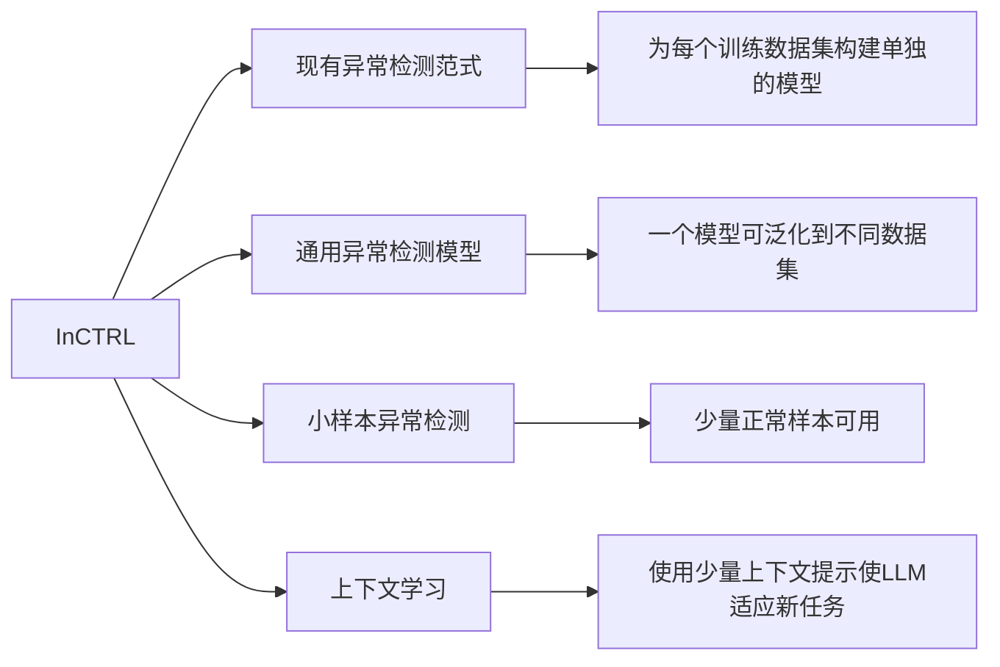

- Toward Generalist Anomaly Detection via In-context Residual Learning with Few-shot Sample Prompts
- [mala-lab/InCTRL: Official implementation of CVPR'24 paper 'Toward Generalist Anomaly Detection via In-context Residual Learning with Few-shot Sample Prompts'. (github.com)](https://github.com/mala-lab/InCTRL)
- CVPR2024
- [[2403.06495 InCTRL.pdf]]
- 基于CLIP的小样本上下文学习
#### 术语对译
- In-Context Learning：上下文学习
- In-Context Prompts：上下文提示
#### 参考文献
[[A Survey on Visual Anomaly Detection]]
