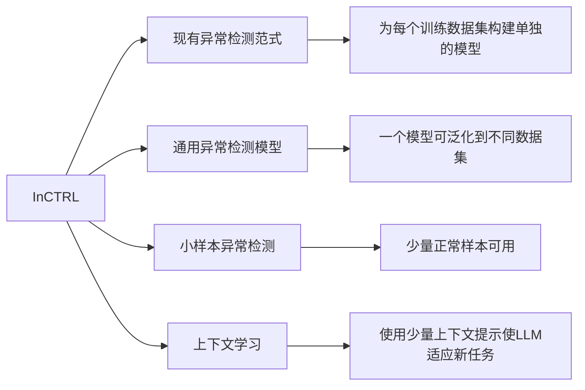

#### 术语对译
- In-Context Learning：上下文学习
- In-Context Prompts：上下文提示
#### 参考文献
[[A Survey on Visual Anomaly Detection]]

```mermaid
graph LR;
	InCTRL-->现有异常检测范式-->为每个训练数据集构建单独的模型;
	InCTRL-->通用异常检测模型-->一个模型可泛化到不同数据集;
	InCTRL-->小样本异常检测-->少量正常样本可用;
	InCTRL-->上下文学习-->使用少量上下文提示使LLM适应新任务
```